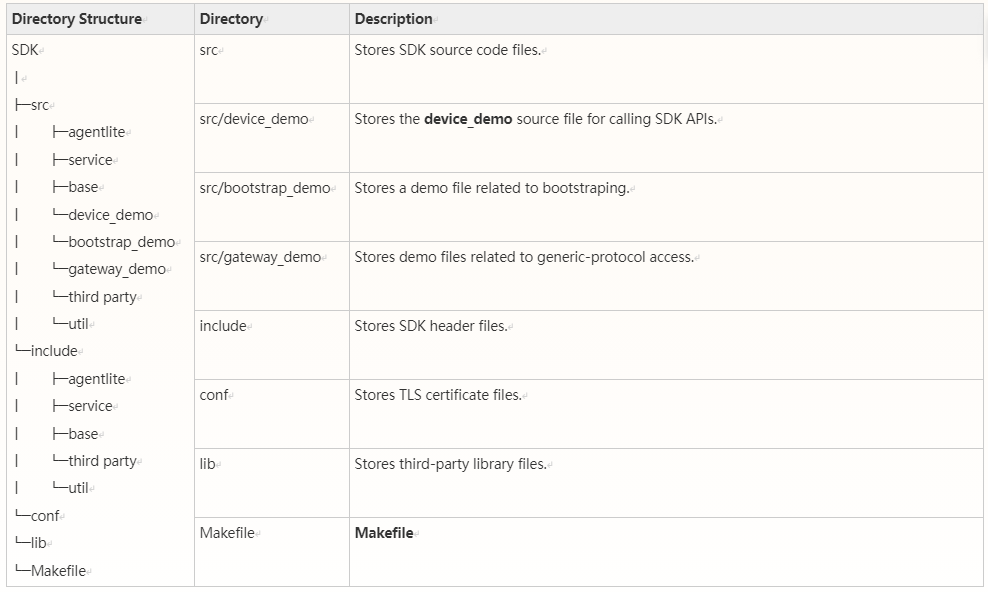
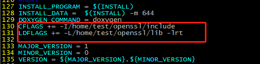
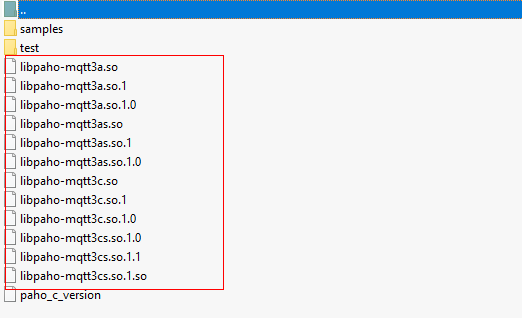
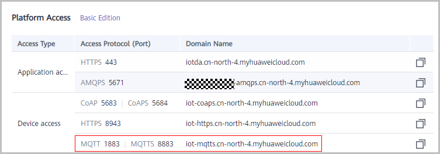
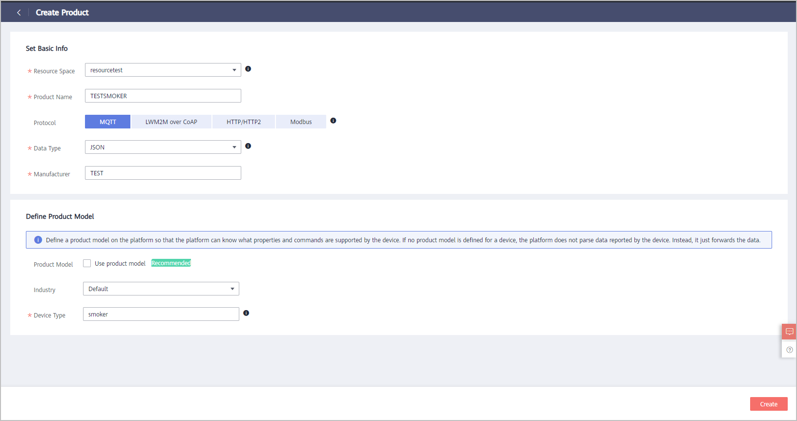
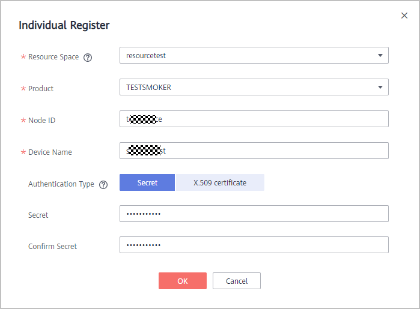
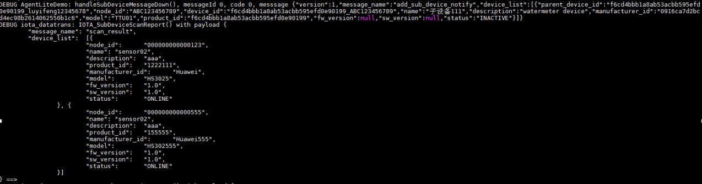
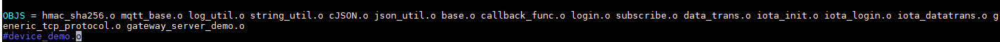
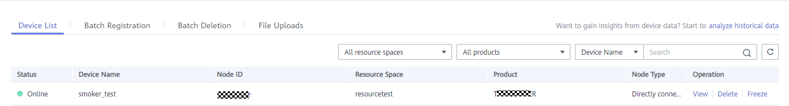
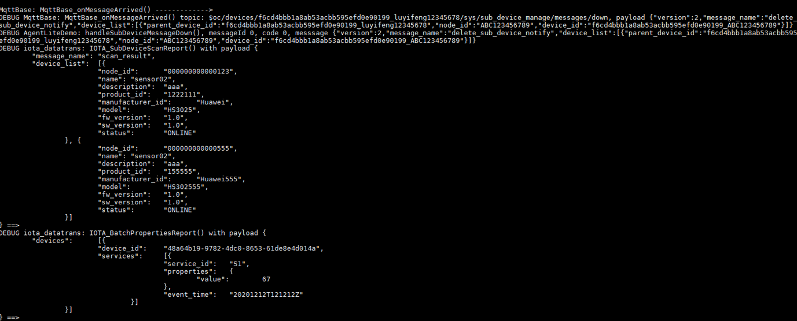

   English | [简体中文](./README_CN.md) 

# huaweicloud-iot-device-sdk-c Development Guide

# Contents

- [1 Change History](#0)
- [2 About This Document](#1)
- [3 SDK Overview](#2)
- [4 Preparations](#3)
  * [4.1 Environment Requirements](#0)
  * [4.2 Compiling Library Files](#1)
  * [4.3 Uploading a Product Model and Registering a Device](#2)
- [5 Typical Access Scenarios](#4)
  * [5.1 Directly Connected Device](#3)
  * [5.2 Generic Protocol](#4)
  * [5.3 Bootstrap](#5)
- [6 SDK APIs](#5)
  * [6.1 Setting Callback Functions for Printing Logs](#6)
  * [6.2 Initializing the SDK](#7)
  * [6.3 Setting Parameters for Binding Devices](#8)
  * [6.4 Setting Callback Functions](#9)
  * [6.5 Authenticating a Device](#10)
  * [6.6 Reporting Device Messages/Properties](#11)
  * [6.7 Receiving Device Messages/Commands/Properties](#12)
  * [6.8 Reporting Child Device Data](#13)
- [7 Generating an SDK Library File](#6)
- [8 Open-Source Protocols](#7)


<h1 id="0">1 Change History</h1>
+ V1.5.0: Implicit subscription was added.
+ V1.4.0: Compressed message and property reporting were added.
+ V1.3.0: SDK downstream payload structure encapsulation was added.
+ V1.2.0: Bootstrap access was added.
+ V1.0.0: The generic-protocol access was added.

Click <a href="https://github.com/huaweicloud/huaweicloud-iot-device-sdk-c/releases" target="_blank">here</a> to download earlier versions of source code.


<h1 id="1">2 About This Document</h1>
This document uses an example to describe how to use iot-device-sdk-cSharp (SDK for short) to quickly connect MQTT devices to the HUAWEI CLOUD IoT platform.

<h1 id="2">3 SDK Overview</h1>
The SDK is designed for embedded devices with powerful computing and storage capabilities. You can call SDK APIs to implement communication between devices and the platform. The SDK currently supports:

- Product model: reporting device messages/properties/events and receiving the platform's commands/messages/events/requests for setting properties

- Child device message forwarding and child device management

- Over-the-air (OTA) upgrades

- Secret authentication and certificate authentication for device access

- Topic customization

- Device shadow query

- Custom log collection

**SDK Directory Structure**



<h1 id="3">4 Preparations</h1>
<h2 id="0">4.1 Environment Requirements</h2>
* Linux operating system
* GCC (V4.8 or later)

<h2 id="1">4.2 Compiling Library Files</h2>
The SDK depends on the OpenSSL, Paho, and zlib libraries. If you have your own compilation chains, compile these library files.

- **Compiling the OpenSSL Library**

1. Visit the <a href="https://www.openssl.org/source " target="_blank">OpenSSL website</a> and download the latest version. (This document uses openssl-1.1.1d.tar.gz as an example.)

2. Upload the OpenSSL package to a directory (for example, **/home/test**) on the Linux compiler.

3. Run the **tar -zxvf openssl-1.1.1d.tar.gz** command to decompress the package.


4. Run the **cd openssl-1.1.1d** command to access the OpenSSL source code directory.

5. Run the **./config shared --prefix=/home/test/openssl --openssldir=/home/test/openssl/ssl** command to generate a **Makefile**.
     **prefix** is a custom installation directory, **openssldir** is a custom directory that stores configuration files, and **shared** is used to generate a dynamic link library (.so library).

        If the compilation goes wrong, add **no-asm** to the configuration command, indicating that no assembly code is used.
      ./config  no-asm shared --prefix=/home/test/openssl --openssldir=/home/test/openssl/ssl 


6. In the OpenSSL source code directory, run the **make depend** command to add dependencies.

7. Run the **make** command to start compilation.

8. Run the **make install** command to install OpenSSL.

    In the OpenSSL installation directory (**home/test/openssl**), find the **lib** folder, which stores the library files (**libcrypto.so.1.1** and **libssl.so.1.1**) and soft links (**libcrypto.so** and **libssl.so**).
8. Copy these files to the **lib** folder of the SDK and copy the **openssl** folder in the **home/test/openssl/include** directory to the **include** folder of the SDK.
   

        


- **Compiling the Paho Library**
  
  1. Click <a href="https://github.com/eclipse/paho.mqtt.c">here</a> to download the **paho.mqtt.c** source code.
  
  2. Decompress the package and upload it to the Linux compiler.
  
  3. Run the **vim Makefile** command to edit **Makefile**.
     
  4. Run the **:set nu** command to display the number of lines.
  
  5. Add **CFLAGS += -I/home/test/openssl/include** and **LDFLAGS += -L/home/test/openssl/lib -lrt** to the end of line 129. (The **/home/test/openssl/include** directory stores OpenSSL header files, and the **/home/test/openssl/lib** directory stores OpenSSL library files, as customized in [4.2 Compiling Library Files](#1))
  
        
      
  6. Change the addresses in lines 195, 197, 199, and 201 as follows.
      
  
  7. Run the **make clean** command.
  
  8. Run the **make** command.
     
     After the compilation is complete, check the compiled libraries in the **build/output** directory.
     
  
   9. Copy the Paho library.
        Currently, the SDK uses only **libpaho-mqtt3as**. Copy the **libpaho-mqtt3as.so** and **libpaho-mqtt3as.so.1** files to the **lib** folder of the SDK, and copy the header files (MQTTAsync.h, MQTTClient.h, MQTTClientPersistence.h, MQTTProperties.h, MQTTReasonCodes.h, and MQTTSubscribeOpts.h) in the **src** folder of the Paho source code directory to the **include/base** directory of the SDK.
  
- **Compiling the zlib Library**

1. Download the [zlib source code package](https://github.com/madler/zlib/archive/v1.2.11.zip).
2. Run the **unzip zlib-1.2.11.zip** command to decompress the package.
3. Run the **cd zlib-1.2.11** command to access the source code directory.

4. Run the **./configure** command to generate a **Makefile**.

5. Run the **Makefile**.

6. Copy .so library files.
   Copy the **libz.so**, **libz.so.1**, and **libz.so.1.2.11** files generated in the source code directory to the **lib** folder of the SDK.

<h2 id="2">4.3 Uploading a Product Model and Registering a Device</h2>
Upload the developed product model to the console and register a new device.

1. Visit [IoT Device Access (IoTDA)](https://www.huaweicloud.com/en-us/product/iothub.html) and click **Use Now** to access the IoTDA console.

2. View the MQTTS device access address, and save it. 

3. On the IoTDA console, choose **Products** in the navigation pane, and click **Create Product** in the upper right corner. On the displayed page, specify the product name, protocol, data type, manufacturer, industry, and device type, and click **Create**.

   - Set **Protocol** to **MQTT**.

   - Set **Data Type** to **JSON**. 

4. After the product is created, click **View** to access its details. On the **Model Definition** page, click **Import Local Profile** to upload the developed product model.

5. In the navigation pane, choose **Device** > **All Devices**. On the page displayed, click **Individual Register** in the upper right corner. On the page displayed, set the device registration parameters and click **OK**. 

   After the device is registered, save the node ID, device ID, and secret.


<h1 id="4">5 Typical Access Scenarios</h1>
<h2 id="3">5.1 Directly Connected Device</h2>
Directly connected devices are allowed to access the platform using a device ID/secret, or a certificate.

- **Access Using a Device ID (Username)/Secret**

  1. Register a device on the platform and obtain the device ID and secret.

  2. Set a mode for the device to access using a secret.

     ```c
      void SetAuthConfig() {
       IOTA_ConfigSetStr(EN_IOTA_CFG_MQTT_ADDR, serverIp_);
       IOTA_ConfigSetUint(EN_IOTA_CFG_MQTT_PORT, port_);
       IOTA_ConfigSetStr(EN_IOTA_CFG_DEVICEID, username_);
       IOTA_ConfigSetStr(EN_IOTA_CFG_DEVICESECRET, password_);
       IOTA_ConfigSetUint(EN_IOTA_CFG_AUTH_MODE,  EN_IOTA_CFG_AUTH_MODE_SECRET);
      	 
          //IOTA_ConfigSetUint(EN_IOTA_CFG_AUTH_MODE, EN_IOTA_CFG_AUTH_MODE_CERT);
        //IOTA_ConfigSetStr(EN_MQTT_CFG_PRIVATE_KEY_PASSWORD, "yourPassword");
      }   
     ```
  
   3. Copy the SDK package to the Linux environment and run the **unzip huaweicloud-iot-device-sdk-c-master.zip** command to decompress the package.
  
   4. Run the **cd huaweicloud-iot-device-sdk-c-master** command to access the decompressed folder.
  
   5. Modify parameters in the **src/device_demo/device_demo.c** file:
      
  
      **serverIp**: indicates the application access address, which can be viewed on the **Overview** page of the console.
  
      **username**: indicates the device ID, which is returned after the device is registered. The MQTT protocol requires writing into a **username**.
  
      **password**: indicates the device secret, which is returned after the device is registered.
  
  6. Run the **make** command to perform compilation. (For a 32-bit operating system, delete **-m64** from **Makefile**.)
  
  7. Run the **export LD_LIBRARY_PATH=./lib/** command to load the library files.
  
  8. Run the **./MQTT_Demo.o** command. The following logs are displayed on the console: **login success** indicates that a device is authenticated. **MqttBase_onSubscribeSuccess** indicates that a topic is subscribed, **MqttBase_onPublishSuccess** indicates that device data is published.
     
     
    9. Check the running state of the device.
  
  + Gateway (online): Access the console and choose **All Devices** > **Device List** to check whether the gateway is online.
    
  + Gateway (reporting data): Access the console and choose **All Devices** > **Device List**, and click **View** to view the reported data.
    
  + Child device
    
    + A gateway receives the platform's notification of adding a child device.
    
      
    
    + A child device reports data.
    
      
    
    + Check the state of the child device.
    
         + Online: Access the console and choose **All Devices** > **Device List** to check whether the child device is online.
         + Reporting data: Access the console and choose **All Devices** > **Device List**, and click **View** to view the reported data.
  
- **Access Using a Certificate**

  1. - Create and upload a device certificate. For details, see <a href="https://support.huaweicloud.com/en-us/usermanual-iothub/iot_01_0055.html" target="_blank">Registering a Device Authenticated by an X.509 Certificate</a>.

  2. Change the certificate and secret file names to **deviceCert.pem** and **deviceCert.key** respectively, and place the two files in the **conf** directory of the SDK.

  3. Set a mode for the device to access using a certificate.
     ```c
   void SetAuthConfig() {
     IOTA_ConfigSetStr(EN_IOTA_CFG_MQTT_ADDR, serverIp_);
     IOTA_ConfigSetUint(EN_IOTA_CFG_MQTT_PORT, port_);
     IOTA_ConfigSetStr(EN_IOTA_CFG_DEVICEID, username_);
     // IOTA_ConfigSetStr(EN_IOTA_CFG_DEVICESECRET, password_);
     // IOTA_ConfigSetUint(EN_IOTA_CFG_AUTH_MODE,  EN_IOTA_CFG_AUTH_MODE_SECRET);
  	 	 
  	     
        IOTA_ConfigSetUint(EN_IOTA_CFG_AUTH_MODE, EN_IOTA_CFG_AUTH_MODE_CERT);
      IOTA_ConfigSetStr(EN_MQTT_CFG_PRIVATE_KEY_PASSWORD, "yourPassword");
      }   
     ```
    ```
  
    ```
  
  4. For details about subsequent access steps, see steps 3 to 9 in **Access Using a Device ID (Username)/Secret**.
  
       Note: You do not need to enter the secret.
   ```
  
   ```
<h2 id="4">5.2 Generic Protocol</h2>
Currently, the platform supports only standard protocols such as MQTT, HTTP, and LwM2M. For devices complying with other (third-party) protocols to access the platform, use a gateway to convert these protocols to an MQTT protocol. Click <a href=" https://support.huaweicloud.com/en-us/bestpractice-iothub/iot_bp_0009.html " target="_blank">here</a> to see the working principle.

 The SDK provides a demo of generic-protocol access (TCP). Go to the **src/gateway_demo** directory and you will see the following files:

+ **gateway_server_demo.c**: provides a demo related to a generic-protocol gateway, which is used to receive device data, decode the data, and report it to the platform. In addition, this gateway can be used to encode and deliver the platform's commands to devices.
+ **generic_tcp_protocol.c**: provides custom encoding and decoding rules of the TCP protocol, so that the data from the platform can be encoded and then sent to a device, and the device data is decoded and then sent to the platform.
+ **gateway_client_demo.c**: provides a demo related to a TCP device (simulating a client), which is used to report data and receive commands. After being decoded based on the rules defined in **generic_tcp_protocol.c**, the data is reported to the platform from the TCP device. After being encoded based on the rules defined in **generic_tcp_protocol.c**, the platform's commands are delivered to the TCP device.

** Access Procedures**


  1. Refer to [4.2 Compiling Library Files](#1) to compile the library files. (Go to the next step if the library files have been compiled.)
  
  2. Register a device and save the device ID and secret.

  3. Update the device ID and secret in **gateway_server_demo.c**.

  4. Comment out **device_demo.o** from OBJS in **Makefile** and uncomment **generic_tcp_protocol.o gateway_server_demo.o**.

     

 5. Run the **make** command to perform compilation.
 6. After the compilation is complete, run the **export LD_LIBRARY_PATH=./lib/ ** command to import the library files to the **lib** folder.
 7. Run the **./MQTT_Demo.o** command to run a gateway.
 8. Run the **gcc -o client.o gateway_client_demo.c** command to access the **src/gateway_demo** directory and compile the client.
  9. Run the **./client.o** command to run the client.
   10. Report data.

      After the client is started, enter **123** on the client console. The decoded data is displayed on the gateway console and the reported device data can be viewed on the platform.

 For details about the decoding rules, see **generic_tcp_protocol.c**.  

   

  

<h2 id="5">5.3 Bootstrap</h2>
You can provision devices to different regions. For details, see the access examples in <a href="https://support.huaweicloud.com/en-us/qs-iotps/iot_03_0006.html " target="_blank">Getting Started</a.

**Note**: The SDK has automatically implemented the bootstrap device in the example. For details, see the <a href=" https://support.huaweicloud.com/en-us/usermanual-iotps/iot_01_0007.html " target="_blank">User Guide</a.

Comment out **device_demo.o** from OBJS in **Makefile** and uncomment **bootstrap_demo.o**.


- **Compiling and Running the Program**

1. Copy the **huaweicloud-iot-device-sdk-c-master.zip** package to the Linux environment and run the **unzip huaweicloud-iot-device-sdk-c-master.zip** command to decompress the package.

2. Run the **cd huaweicloud-iot-device-sdk-c-master** command to access the folder.

3. Run the **make** command to perform compilation.

4. Run the **./MQTT_Demo.o** command to run the SDK demo.

<h1 id="5">6 SDK APIs</h1>
<h2 id="6">6.1 Setting Callback Functions for Printing Logs</h2>
The SDK provides callback functions for you to print logs. You can call the **IOTA_SetPrintLogCallback** function to set one as required.  Refer to **IOTA_SetPrintLogCallback** called by the **main()** function in **device_demo.c** (demo for short) under the **src/device_demo** folder. For details about the parameters, see **API Reference (C)**.

`void IOTA_SetPrintLogCallback(PFN_LOG_CALLBACK_HANDLER pfnLogCallbackHandler)`

To print logs on the console, refer to **vprintf(format, args)** set in the **myPrintLog** function in the demo.

To print logs to the system log file, refer to the **vsyslog(level, format, args)** set in the **myPrintLog** function in the demo. In addition, **#include "syslog.h"** and **#define _SYS_LOG** should be contained.

<h2 id="7">6.2 Initializing the SDK</h2>
Before establishing communication, call the **IOTA_Init()** function to initialize the SDK.  Refer to **IOTA_Init()** called by the **main()** function in the demo. For details about the parameters, see **API Reference (C)**.

`IOTA_Init(HW_CHAR *pcWorkPath)`

<h2 id="8">6.3 Setting Parameters for Binding Devices</h2>
Before connecting a device to the platform, set the IP address, port, device ID, and secret. Refer to **setAuthConfig()** called by the **main()** function in the following demo.

```c

void setAuthConfig(){
  IOTA_ConfigSetStr(EN_IOTA_CFG_MQTT_ADDR, serverIp_);
  IOTA_ConfigSetUint(EN_IOTA_CFG_MQTT_PORT, port_);
  IOTA_ConfigSetStr(EN_IOTA_CFG_DEVICEID, username_);
  IOTA_ConfigSetStr(EN_IOTA_CFG_DEVICESECRET, password_);
IOTA_ConfigSetUint(EN_IOTA_CFG_AUTH_MODE, EN_IOTA_CFG_AUTH_MODE_SECRET); // Secret mode
/**
  * Configuration is required in certificate mode:
  *
  * IOTA_ConfigSetUint(EN_IOTA_CFG_AUTH_MODE, EN_IOTA_CFG_AUTH_MODE_CERT);
  * IOTA_ConfigSetStr(EN_MQTT_CFG_PRIVATE_KEY_PASSWORD, "yourPassword");
* */  

  #ifdef _SYS_LOG
//IOTA_ConfigSetUint(EN_IOTA_CFG_LOG_LOCAL_NUMBER, LOG_LOCAL7);
  IOTA_ConfigSetUint(EN_IOTA_CFG_LOG_LEVEL, LOG_INFO);
  #endif

}
```

+ Obtain **serverIp** (EN_IOTA_CFG_MQTT_ADDR) and **port** (EN_IOTA_CFG_MQTT_PORT) from the IoTDA console.
+ Obtain **username** (EN_IOTA_CFG_DEVICEID) and **password** (EN_IOTA_CFG_DEVICESECRET) after the device is registered.

When **_SYS_LOG** is defined (print a log in the system file), the facility type (EN_IOTA_CFG_LOG_LOCAL_NUMBER) and display level (EN_IOTA_CFG_LOG_LEVEL) of the log can be customized as required.

<h2 id="9">6.4 Setting Callback Functions</h2>
The SDK provides callback functions for you to implement service processing logic based on different events, including device authentication, device disconnection from the platform, message subscription, publication, and receiving, and command receiving. Refer to **setMyCallbacks()** called by main() function in the following demo.

```c
void setMyCallbacks(){ 
   IOTA_SetProtocolCallback(EN_IOTA_CALLBACK_CONNECT_SUCCESS, HandleConnectSuccess);
 IOTA_SetProtocolCallback(EN_IOTA_CALLBACK_CONNECT_FAILURE, HandleConnectFailure);

 IOTA_SetProtocolCallback(EN_IOTA_CALLBACK_DISCONNECT_SUCCESS, HandleDisConnectSuccess);
 IOTA_SetProtocolCallback(EN_IOTA_CALLBACK_DISCONNECT_FAILURE, HandleDisConnectFailure);
 IOTA_SetProtocolCallback(EN_IOTA_CALLBACK_CONNECTION_LOST, HandleConnectionLost);

 IOTA_SetProtocolCallback(EN_IOTA_CALLBACK_SUBSCRIBE_SUCCESS, HandleSubscribesuccess);
 IOTA_SetProtocolCallback(EN_IOTA_CALLBACK_SUBSCRIBE_FAILURE, HandleSubscribeFailure);

 IOTA_SetProtocolCallback(EN_IOTA_CALLBACK_PUBLISH_SUCCESS, HandlePublishSuccess);
 IOTA_SetProtocolCallback(EN_IOTA_CALLBACK_PUBLISH_FAILURE, HandlePublishFailure);

 IOTA_SetMessageCallback(HandleMessageDown);
 IOTA_SetUserTopicMsgCallback(HandleUserTopicMessageDown);
 IOTA_SetCmdCallback(HandleCommandRequest);
 IOTA_SetPropSetCallback(HandlePropertiesSet);
 IOTA_SetPropGetCallback(HandlePropertiesGet);
 IOTA_SetEventCallback(HandleEventsDown);
 IOTA_SetShadowGetCallback(HandleDeviceShadowRsp);
}

```

 - The **HandleConnectSuccess** function is called when a device is authenticated.
 - The **HandleConnectFailure** function is called when a device fails to be authenticated.
 - The **HandleDisConnectSuccess** function is called when a device proactively disconnects from the platform.
 - The **HandleDisConnectFailure** function is called when a device fails to proactively disconnect from the platform.
 - The **HandleConnectionLost** function is called when the connection between a device and the platform is lost.
 - The **HandleSubscribesuccess** function is called when a message is subscribed.
 - The **HandleSubscribeFailure** function is called when a message fails to subscribe.
 - The **HandlePublishSuccess** function is called when device data is published.
 - The **HandlePublishFailure** function is called when device data fails to publish.
 - The **HandleMessageDown** function is called when a device receives the platform's transparently transmitted message (default topic), which is not parsed by the platform.
 - The **HandleUserTopicMessageDown** function is called when a device receives the platform's transparently transmitted message (custom topic), which is not parsed by the platform.
 - The **HandleCommandRequest** function is called when a device receives the platform's command.
 - The **HandlePropertiesSet** function is called when a device receives the platform's request for setting device properties.
 - The **HandlePropertiesGet** function is called when a device receives the platform's request for querying device properties.
 - The **HandleEventsDown** function is called when a device receives the platform's notification of an event (a child device addition or deletion event or an OTA event).
 - The **HandleDeviceShadowRsp** function is called when a device receives device shadow data.

<h2 id="10">6.5 Authenticating a Device</h2>
After callback functions are set, call the authentication function **HW_INT IOTA_Connect()** in the demo.  

 

After **HW_INT IOTA_Connect()** is called, the message **login success** is displayed. It is recommended that data be reported after a device is authenticated and sleeps for several seconds or process services via the callback function invoked when the device is authenticated.

You can view that the gateway is online on the console.


You can press **Ctrl + C** to stop the program. After that, you can view that the device is offline.

<h2 id="11">6.6 Reporting Device Messages/Properties</h2>
After a device is authenticated, a gateway can call SDK APIs to report device messages and properties. In addition, the gateway can report the command execution result, property setting result, and property query result. It is recommended that the interval for reporting data be greater than or equal to hundreds of milliseconds.

- **Function for reporting a device message**
  
  `HW_INT IOTA_MessageReport(HW_CHAR *object_device_id, HW_CHAR *name, HW_CHAR *id, HW_CHAR *content)`
  
  The data reported via this function is not parsed by the platform. It can be forwarded to other services or pushed to the application server. **object_device_id** indicates the device to report messages. **name** indicates the message name. **id** indicates the message ID. **content** indicates the content to report. **topicParas** indicates the parameters of a custom topic. If this parameter is set to **NULL**, the default topic of the platform is used to report data. Refer to the **Test_MessageReport** function in the demo. For details about the parameters, see **API Reference (C)**.
   ```c
 void Test_MessageReport() {
  //default topic
  // int messageId = IOTA_MessageReport(NULL, "data123", "123", "hello", NULL);
  
  //user topic
  int messageId = IOTA_MessageReport(NULL, "data123", "123", "hello", "devMsg");
  if (messageId != 0) {
     PrintfLog(EN_LOG_LEVEL_ERROR, "device_demo:   Test_MessageReport() failed, messageId %d\n", messageId);
 }
}
   ```
- **Function for reporting device properties**
  
  `HW_INT IOTA_PropertiesReport(ST_IOTA_SERVICE_DATA_INFO pServiceData[], HW_INT serviceNum)`
  
  The data reported via this function is parsed by the platform and the data in the structure must be the same as the properties defined in the product model. **ST_IOTA_SERVICE_DATA_INFO** indicates a structure array. A gateway can report multiple services at the same time. **serviceNum** indicates the number of services to report. Refer to the **Test_propertiesReport** function in the demo. For details about the parameters, see **API Reference (C)**.
  
   ```c
  void Test_propertiesReport() {
int serviceNum = 2; // Number of services to be reported by a gateway
  ST_IOTA_SERVICE_DATA_INFO services[serviceNum];
      //---------------the data of service1-------------------------------
    char *service1 = "{\"Load\":\"5\",\"ImbA_strVal\":\"6\"}";
    //   services[0].event_time = GetEventTimesStamp(); //you need to free the services[0].event_time
    services[0].event_time = NULL;
    services[0].service_id = "parameter";
    services[0].properties = service1;
  
  //---------------the data of service2-------------------------------
    char *service2 = "{\"PhV_phsA\":\"4\",\"PhV_phsB\":9}";
    // services[1].event_time =  GetEventTimesStamp(); //you need to free the services[1].event_time
    services[0].event_time = NULL;
    services[1].service_id = "analog";
    services[1].properties = service2;
  
  int messageId = IOTA_PropertiesReport(services, serviceNum);
    if(messageId != 0) {
     PrintfLog(EN_LOG_LEVEL_ERROR, "device_demo: Test_batchPropertiesReport() failed, messageId %d\n", messageId);
    }
    }
   ```

<h2 id="12">6.7 Receiving Messages/Commands/Properties</h2>
After a device is authenticated and the callback function is set, it can receive the platform's commands. (The SDK automatically subscribes to related topics.) The commands include messages commands, device property setting or query requests, and child device addition or deletion notifications. For details about the parameters, see **API Reference (C)**.

- A device receives a message (transparently transmitted message).
  
  After receiving a message, the device processes it via a callback function. For details, see the **HandleMessageDown** function in the demo. (Set the callback function in advance for processing the platform's messages.)
- A device receives the platform's command as defined in the product model.

- A device receives the platform's request for setting device properties.

 After receiving the platform's request for setting device properties, call the **IOTA_PropertiesSetResponse** function to report the response. For details, see the **HandlePropertiesSet** function in the demo. (Set the callback function in advance.)
- A device receives the platform's request for querying device properties.

 After receiving the platform's request for querying device properties, call the **IOTA_PropertiesGetResponse** function to report the device's response. For details, see the **HandlePropertiesGet** function in the demo. (Set the callback function in advance.)
- The platform notifies a gateway of child device addition.

 After receiving the notification, call the **IOTA_BatchPropertiesReport** function to report child device data (view the reported data on the console). For details, see the **HandlePropertiesGet** function in the demo. (Set the callback function in advance.)
- The platform notifies a gateway of child device deletion.


<h2 id="13">6.8 Reporting Child Device Data</h2>
A child device can report data in batch via the following function:

`HW_INT IOTA_BatchPropertiesReport(ST_IOTA_DEVICE_DATA_INFO pDeviceData[], HW_INT deviceNum, HW_INT serviceLenList[])`

The data reported via this function is parsed by the platform. The data in the structure must be the same as that defined in the product model. **ST_IOTA_DEVICE_DATA_INFO** indicates a structure array. Multiple child devices can report data at the same time and each child device can report multiple services. **deviceNum** indicates the number of child devices to report data. **serviceLenList** indicates the number of services reported by a child device. Refer to the **Test_batchPropertiesReport** function in the demo. For details about parameters, see **API Reference (C)**.

 ```
​```c
void Test_BatchPropertiesReport() {
  int deviceNum = 1;      // Number of child devices to report data
  ST_IOTA_DEVICE_DATA_INFO devices[deviceNum]; // Array hosting the structure of data to be reported by child devices
  int serviceList[deviceNum]; // Number of services to be reported by each child device
  serviceList[0] = 2;       // **device1** needs to report two services.
  // serviceList[1] = 1;    // **device2** needs to report one service.
  char *device1_service1 = "{\"Load\":\"1\",\"ImbA_strVal\":\"3\"}";     // Properties to be reported by **service1** (in JSON format)
  char *device1_service2 = "{\"PhV_phsA\":\"2\",\"PhV_phsB\":\"4\"}";// Properties to be reported by **service2** (in JSON format)
  devices[0].device_id = subDeviceId;
  devices[0].services[0].event_time = "20191209T081212Z";
  devices[0].services[0].service_id = "parameter";
  devices[0].services[0].properties = device1_service1;
  devices[0].services[1].event_time = "20191209T081212Z";
  devices[0].services[1].service_id = "analog";
  devices[0].services[1].properties = device1_service2;
  // char *device2_service1 = "{\"AA\":\"2\",\"BB\":\"4\"}";
  // devices[1].device_id = "subDevices22222";
  // devices[1].services[0].event_time = "d2s1";
  // devices[1].services[0].service_id = "device2_service11111111";
  // devices[1].services[0].properties = device2_service1;
  int messageId = IOTA_BatchPropertiesReport(devices, deviceNum, serviceList);
  if(messageId != 0) {
   printfLog(EN_LOG_LEVEL_ERROR, "device_demo: Test_BatchPropertiesReport() failed, messageId %d\n", messageId);
  }
}
 ```

- **Topic Customization**

  For details, see **API Reference (C)** in the home directory.

- **OTA Upgrades**

  For details, see **API Reference (C)** in the home directory.

- **Device Shadow Query**

  For details, see **API Reference (C)** in the home directory.
  
  <h1 id="6">7 Generating an SDK Library File</h1>
  To generate a .so file, modify the **Makefile**. You can open the file using Notepad and upload it to the Linux environment. Alternatively, you can directly run the **vim Makefile** to modify the file using in the Linux environment, press **i** to edit the file, and then run **wq!** to save the modification.
  
    1. Add **-shared -fPIC** to CFLAGS.
       
    2. Delete **device_demo.o** from OBJS.
       
    3. Change the compiled TARGET file from **MQTT_Demo.o** to **libHWMQTT.so** (the file name can be customized).
       
    4. Run the **make** command to generate the **libHWMQTT.so** file.
       

<h1 id="6">8 Open-Source Protocols</h1>
Complying with the BSD-3 open-source license agreement


