#  huaweicloud-iot-device-sdk-c 开发指南

## 目 录
<!-- TOC -->

- [1 前言](#1)
- [2 SDK简介](#2)
- [3 准备工作](#3)
	-  [3.1 环境信息](#3.1)
	-  [3.2 编译openssl库](#3.2)
	-  [3.3 编译paho库](#3.3)
	-  [3.4 上传profile及注册设备](#3.4)
- [4 快速体验](#4)
- [5 使用步骤](#5)
<!-- /TOC -->

<h1 id="1">1.前言</h1>
本文通过实例讲述huaweicloud-iot-device-sdk-c（以下简称SDK）帮助设备用MQTT协议快速连接到华为物联网平台。

<h1 id="2">2.SDK简介</h1>
SDK面向运算、存储能力较强的嵌入式终端设备，开发者通过调用SDK接口，便可实现设备与物联网平台的上下行通讯。SDK当前支持的功能有：  

- 支持物模型：设备消息/属性/事件上报，设备命令/消息/属性/事件接收

- 支持子设备消息转发、子设备管理

- 支持OTA升级

- 支持密码认证和证书认证两种设备接入方式

- 支持自定义topic

- 支持设备影子查询

- 支持自定义日志收集能力

  

**SDK目录结构**

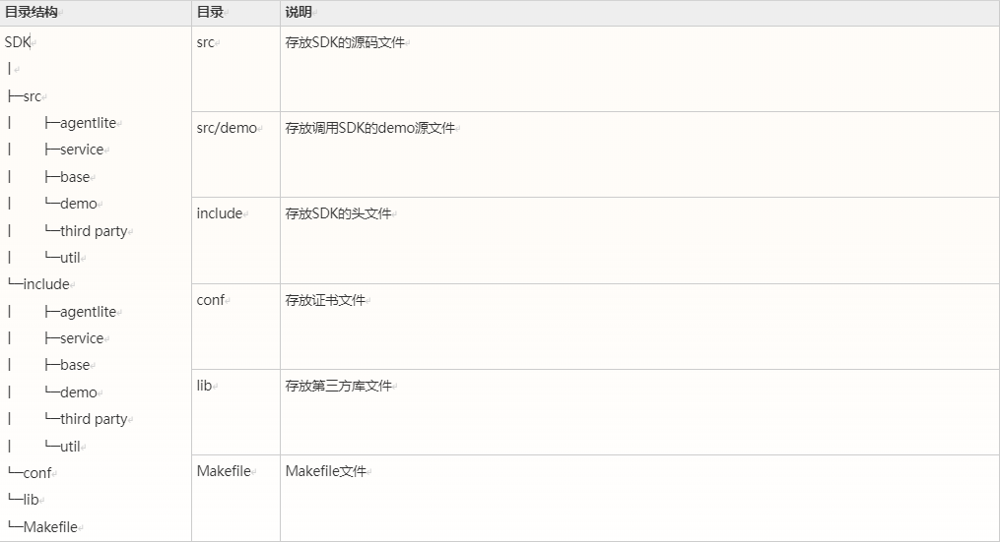

<h1 id="3">3.准备工作</h1>
<h2 id="3.1">3.1 环境信息</h2>
SDK需运行在Linux操作系统上，并安装好gcc。
<h2 id="3.2">3.2 编译openssl库</h2>  

1. 访问openssl官网<https://www.openssl.org/source/>，下载最新版本openssl（如openssl-1.1.1d.tar.gz），上传到linux编译机上（以上传到目录/home/test为例），并使用如下命令解压：  

   tar -zxvf openssl-1.1.1d.tar.gz  
   

2. 配置生成makefile文件
   执行以下命令进入openssl源码目录：

   cd openssl-1.1.1d        
   
   运行如下配置命令：  

   ./config shared --prefix=/home/test/openssl --openssldir=/home/test/openssl/ssl  
   
   其中“prefix”是自定义安装目录，“openssldir”是自定义配置文件目录，“shared”作用是生成动态链接库（即.so库）。

   - 如果编译有问题配置命令加上no-asm（表示不使用汇编代码）
     
     ./config  no-asm shared --prefix=/home/test/openssl --openssldir=/home/test/openssl/ssl
     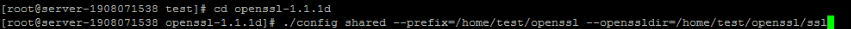

3. 编译出库。
   在openssl源码目录下，运行make depend命令添加依赖：

   make depend  

   运行make命令开始编译：

   make

   再运行如下命令进行安装：

   make install

   在配置的openssl安装目录下home/test/openssl找到lib目录，有生成的库文件：

   libcrypto.so.1.1、libssl.so.1.1和软链接libcrypto.so、libssl.so，请将这些文件拷贝到SDK的lib文件夹下。

   

<h2 id="3.3">3.3 编译paho库</h2>  

1. 访问github下载地址<https://github.com/eclipse/paho.mqtt.c>, 下载paho.mqtt.c源码。

2. 解压后上传到linux编译机。

3. 修改makefile
	- 通过如下命令进行编辑Makefile
	  
	  vim Makefile
	  
	- 显示行数
	  
	  :set nu
	
	- 在129行之后添加下面两行（[3.2](#3.2)中自定义的openssl的头文件和库文件位置）
	  
	  CFLAGS += -I/home/test/openssl/include  
	  
	  LDFLAGS += -L/home/test/openssl/lib -lrt
	  
	  
	- 把图中195行、197行、199行、201行都改成对应的地址
	  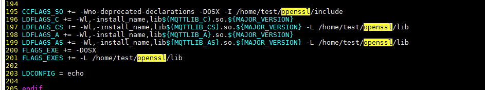
	
4. 编译
	- 执行清空命令：
	  
	  make clean
	  
	- 执行编译命令：
	  
	  make
	
5. 编译完成后，可以在build/output目录下看到编译成功的库。
	

6. 拷贝paho库文件
	当前SDK仅用到了libpaho-mqtt3as，请将文件libpaho-mqtt3as.so和libpaho-mqtt3as.so.1拷贝到SDK的lib文件夹下。
	
<h2 id="3.4">3.4 上传profile及注册设备</h2>  

1. 将已开发完成的profile（产品模型）导入到控制台，点击“产品模型”，再点击右上角的“新增产品模型”，选择从本地导入。   
	

2. 点击“设备”，选中“设备注册”，点击右上角的创建，选择刚导入的产品模型，填写设备标识码（一般是IMEI、MAC地址等），“密钥”如果不自定义，平台会自动生成。全部填写完毕后，点击确认。（此处是网关注册）
	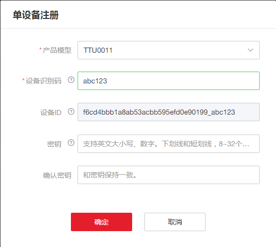

3. 保存设备ID和密钥。

	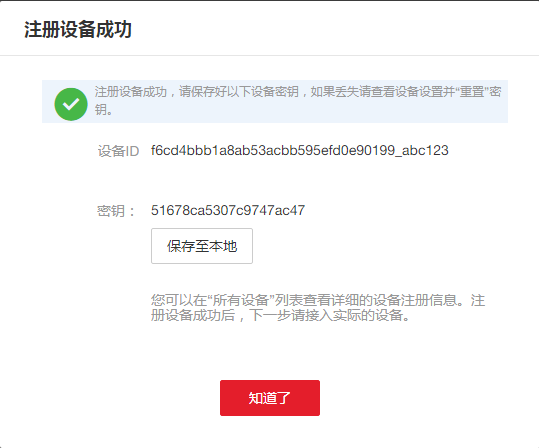

4. 点击“所有设备”，在最上方可看到该设备的状态是未激活。
	

<h1 id="4">4.快速体验</h1>  

1. 将SDK压缩包拷贝到Linux环境中，通过如下命令解压：
	
	unzip  huaweicloud-iot-device-sdk-c-master.zip
	
2. 进入到解压的文件夹下：
	
	cd huaweicloud-iot-device-sdk-c-master

3. 修改配置信息：
	需要修改src/demo/agent_lite_demo.c文件中的如下参数：
	servierIp_：平台南向IP，可在控制台的应用管理中查看。
	username_：设备ID，设备注册时返回的值。
	password_：设备密钥，设备注册时返回的值。
	

4. 执行make命令进行编译（如果是32位的操作系统，请删除掉Makefile中的"-m64"）：

	make
	
5. 运行：	
	- 加载库文件
	
	  export LD_LIBRARY_PATH=./lib/

	- 执行如下命令：
	
	  ./MQTT_Demo.o
	
	  在控制台上可以看到很多打印的日志：
	  “login success”表示设备鉴权成功   
	  
	  “MqttBase_onSubscribeSuccess”表示订阅成功   
	  
	  “MqttBase_onPublishSuccess”表示发布数据成功   
	  
	  

6. 查看设备运行情况：
	- 网关设备在线：
	  
	- 网关上报数据
	  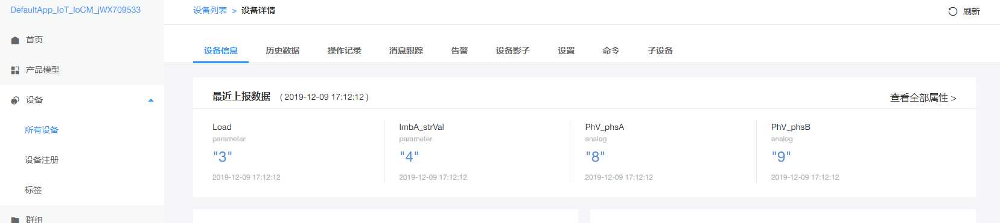
	- 子设备
	  - 接收平台下发的新增子设备通知
	    
	  - 子设备上报数据
	    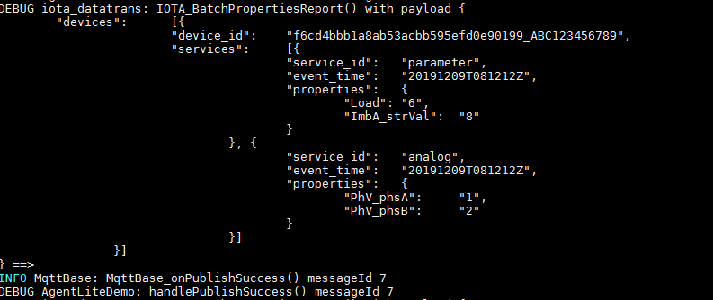
	  - 查看子设备状态
	    - 子设备在线
	      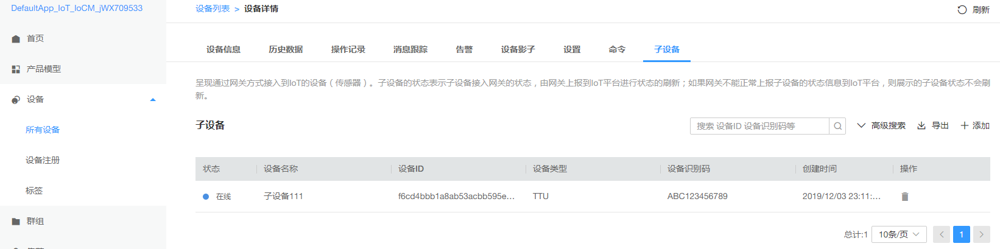
	    - 子设备上报数据
	      
	  
<h1 id="5">5.使用步骤</h1>  

以下是部分接口的使用指导，详细的功能请参考主目录下的**API文档**。  

- **设置日志回调函数**
  

SDK以日志回调函数的方式供开发者使用，开发者可以根据自己的需求调用IOTA_SetPrintLogCallback函数设置。具体API接口的参数使用请参考SDK API接口文档。可参考demo（在src/demo文件夹下agent_lite_demo.c）中main()方法对IOTA_SetPrintLogCallback函数的调用。

  `void IOTA_SetPrintLogCallback(PFN_LOG_CALLBACK_HANDLER pfnLogCallbackHandler)`

  - 如果需要打印在控制台，可以参考demo中的myPrintLog函数中设置的vprintf(format, args);
  - 如果需要打印到系统日志文件中，可以参考demo中的myPrintLog函数中设置的vsyslog(level, format, args)函数。同时需要引入头文件#include "syslog.h"，并且定义宏#define _SYS_LOG。
  
- **初始化**
  

在发起业务前，需要先初始化Agent Lite相关资源，调用API接口IOTA_Init()，初始化Agent Lite资源。具体API接口的参数使用请参考Agent Lite API接口文档。可参考demo中main()方法对IOTA_Init()的调用。

`IOTA_Init(HW_CHAR *pcWorkPath)`

- **设备绑定配置**
  

设备连接到IoT平台之前，需配置平台的地址、端口、设备Id及设备密钥。可以参考demo中main()方法中调用的setAuthConfig()函数。

```c

void setAuthConfig(){
  IOTA_ConfigSetStr(EN_IOTA_CFG_MQTT_ADDR, serverIp_);
  IOTA_ConfigSetUint(EN_IOTA_CFG_MQTT_PORT, port_);
  IOTA_ConfigSetStr(EN_IOTA_CFG_DEVICEID, username_);
  IOTA_ConfigSetStr(EN_IOTA_CFG_DEVICESECRET, password_);
//IOTA_ConfigSetUint(EN_IOTA_CFG_AUTH_MODE,  EN_IOTA_CFG_AUTH_MODE_CERT); //证书模式
  IOTA_ConfigSetUint(EN_IOTA_CFG_AUTH_MODE,     EN_IOTA_CFG_AUTH_MODE_SECRET); //密码模式

  #ifdef _SYS_LOG
//IOTA_ConfigSetUint(EN_IOTA_CFG_LOG_LOCAL_NUMBER, LOG_LOCAL7);
  IOTA_ConfigSetUint(EN_IOTA_CFG_LOG_LEVEL, LOG_INFO);
  #endif

}
```

平台的IP（EN_IOTA_CFG_MQTT_ADDR）、端口（EN_IOTA_CFG_MQTT_PORT）可以在SP portal的应用对接信息中获取；   

设备ID（EN_IOTA_CFG_DEVICEID）、设备密钥（EN_IOTA_CFG_DEVICESECRET）是注册设备的时候返回的。   

当定义了_SYS_LOG（日志打印在系统文件中）时，日志的facility类型（EN_IOTA_CFG_LOG_LOCAL_NUMBER）、日志的显示级别（EN_IOTA_CFG_LOG_LEVEL）可以按需自定义。

- **回调函数配置**
  

SDK针对设备鉴权成功/失败、设备断链成功/失败、设备订阅消息成功/失败、设备发布消息成功/失败、设备接收消息/命令等动作，以回调函数的方式供开发者调用，开发者可以针对不同的事件设置回调函数来实现业务处理逻辑。可以参考demo中main()方法中调用的setMyCallbacks()函数。

```c
void setAuthConfig() {
  IOTA_ConfigSetStr(EN_IOTA_CFG_MQTT_ADDR, serverIp_);
  IOTA_ConfigSetUint(EN_IOTA_CFG_MQTT_PORT, port_);
  IOTA_ConfigSetStr(EN_IOTA_CFG_DEVICEID, username_);
  IOTA_ConfigSetStr(EN_IOTA_CFG_DEVICESECRET, password_);`
//    IOTA_ConfigSetUint(EN_IOTA_CFG_AUTH_MODE, EN_IOTA_CFG_AUTH_MODE_CERT); //证书模式`
  IOTA_ConfigSetUint(EN_IOTA_CFG_AUTH_MODE, EN_IOTA_CFG_AUTH_MODE_SECRET); //密码模式`

#ifdef _SYS_LOG
//  IOTA_ConfigSetUint(EN_IOTA_CFG_LOG_LOCAL_NUMBER, LOG_LOCAL7);
  IOTA_ConfigSetUint(EN_IOTA_CFG_LOG_LEVEL, LOG_INFO);
#endif
}
```

平台的IP（EN_IOTA_CFG_MQTT_ADDR）、端口（EN_IOTA_CFG_MQTT_PORT）可以在SP portal的应用对接信息中获取；   

设备ID（EN_IOTA_CFG_DEVICEID）、设备密钥（EN_IOTA_CFG_DEVICESECRET）是注册设备的时候返回的。  

当定义了_SYS_LOG（日志打印在系统文件中）时，日志的facility类型（EN_IOTA_CFG_LOG_LOCAL_NUMBER）、日志的显示级别（EN_IOTA_CFG_LOG_LEVEL）可以按需自定义。  

SDK针对设备鉴权成功/失败、设备断链成功/失败、设备订阅消息成功/失败、设备发布消息成功/失败、设备接收消息/命令等动作，以回调函数的方式供开发者调用，开发者可以针对不同的事件设置回调函数来实现业务处理逻辑。可以参考demo中main()方法中调用的setMyCallbacks()函数。

```c
void setMyCallbacks(){	
  IOTA_SetCallback(EN_IOTA_CALLBACK_CONNECT_SUCCESS, HandleAuthSuccess);
  IOTA_SetCallback(EN_IOTA_CALLBACK_CONNECT_FAILURE, HandleAuthFailure);
  IOTA_SetCallback(EN_IOTA_CALLBACK_DISCONNECT_SUCCESS, HandleDisAuthSuccess);
  IOTA_SetCallback(EN_IOTA_CALLBACK_DISCONNECT_FAILURE, HandleDisAuthFailure);
  IOTA_SetCallback(EN_IOTA_CALLBACK_CONNECTION_LOST, HandleConnectionLost);	
  IOTA_SetCallback(EN_IOTA_CALLBACK_SUBSCRIBE_SUCCESS, HandleSubscribesuccess);	
  IOTA_SetCallback(EN_IOTA_CALLBACK_SUBSCRIBE_FAILURE, HandleSubscribeFailure);	
  IOTA_SetCallback(EN_IOTA_CALLBACK_PUBLISH_SUCCESS, HandlePublishSuccess);	
  IOTA_SetCallback(EN_IOTA_CALLBACK_PUBLISH_FAILURE, HandlePublishFailure);     
  IOTA_SetCallback(EN_IOTA_CALLBACK_MESSAGE_DOWN, HandleMessageDown); 
  IOTA_SetCallbackWithTopic(EN_IOTA_CALLBACK_COMMAND_REQUEST, HandleCommandRequest);   
  IOTA_SetCallbackWithTopic(EN_IOTA_CALLBACK_PROPERTIES_SET, HandlePropertiesSet);     
  IOTA_SetCallbackWithTopic(EN_IOTA_CALLBACK_PROPERTIES_GET, HandlePropertiesGet);       
  IOTA_SetCallback(EN_IOTA_CALLBACK_EVENT_DOWN, HandleEventsDown);  
  IOTA_SetCallbackWithTopic(EN_IOTA_CALLBACK_USER_TOPIC, HandleUserTopicMessageDown);       
  IOTA_SetCallbackWithTopic(EN_IOTA_CALLBACK_DEVICE_SHADOW, HandleDeviceShadowRsp);
}
```

	- 鉴权成功（EN_IOTA_CALLBACK_CONNECT_SUCCESS）后，将调用HandleAuthSuccess函数；  
	- 鉴权失败（EN_IOTA_CALLBACK_CONNECT_FAILURE）后，将调用HandleAuthFailure函数；  
	- 设备主动断链成功（EN_IOTA_CALLBACK_DISCONNECT_SUCCESS）后，将调用HandleDisAuthSuccess函数；
	- 设备主动断链失败（EN_IOTA_CALLBACK_DISCONNECT_FAILURE）后，将调用HandleDisAuthFailure函数；
	- 链接断开（EN_IOTA_CALLBACK_CONNECTION_LOST）后，将调用HandleConnectionLost函数；
	- 订阅成功（EN_IOTA_CALLBACK_SUBSCRIBE_SUCCESS）后，将调用HandleSubscribesuccess函数；
	- 订阅失败（EN_IOTA_CALLBACK_SUBSCRIBE_FAILURE）后，将调用HandleSubscribeFailure函数；
	- 发布数据成功（EN_IOTA_CALLBACK_PUBLISH_SUCCESS）后，将调用HandlePublishSuccess函数；
	- 发布数据失败（EN_IOTA_CALLBACK_PUBLISH_FAILURE）后，将调用HandlePublishFailure函数；
	- 设备接收到平台不解析的透传消息（EN_IOTA_CALLBACK_MESSAGE_DOWN）后，将调用HandleMessageDown函数；
	- 设备接收到命令后（EN_IOTA_CALLBACK_COMMAND_REQUEST）后，将调用HandleCommandRequest函数；
	- 设备接收到属性设置命令（EN_IOTA_CALLBACK_PROPERTIES_SET）后，将调用HandlePropertiesSet函数；
	- 设备接收到属性查询命令（EN_IOTA_CALLBACK_PROPERTIES_GET）后，将调用HandlePropertiesGet函数；
	- 设备接收到事件（子设备、OTA）相关命令（EN_IOTA_CALLBACK_EVENT_DOWN）后，将调用HandleEventsDown函数；
	- 设备接收到自定义TOPIC消息（EN_IOTA_CALLBACK_EVENT_DOWN）后，将调用HandleEventsDown函数；
	- 设备接收到设备影子数据（EN_IOTA_CALLBACK_DEVICE_SHADOW）后，将调用HandleDeviceShadowRsp函数；

- **设备鉴权**
  
  回调函数设置完毕后，可以调用鉴权函数。可以参考demo中对该接口的调用：
  
  HW_INT IOTA_Connect()
  
  鉴权接口调用成功后，会打印“login success”的字样（建议鉴权成功后再进行数据上报，可以鉴权后sleep几秒钟，或者在鉴权成功的回调函数里进行业务处理）：
  
  同时，在控制台界面上可以看到网关设备已经在线：
  
可以通过ctrl + c停止程序运行，程序停止后，可以在控制台界面上查看设备已离线。
  
- **设备消息/属性上报**
  
  设备鉴权通过后，网关设备可以调用SDK的“设备消息上报”和“设备属性上报”接口上报数据，同时网关可以上报命令响应结果，主要包括“平台命令下发响应”、“平台设置设备属性响应”、“平台查询设备属性响应”。
  
  - 设备消息上报接口：
    
    `HW_INT IOTA_MessageReport(HW_CHAR *object_device_id, HW_CHAR *name, HW_CHAR *id, HW_CHAR *content)`
    
    通过该接口上报的数据平台不解析，数据可以转发到其他服务或者推送到应用服务器。object_device_id为需要上报的设备，name为消息名称，id为消息ID，content为上报的内容，topicParas是自定义topic的参数，NULL是用平台默认的topic上报数据。具体参数说明请查看API文档，可以参考demo中Test_MessageReport函数对该接口的调用。
    
```c
 void Test_MessageReport() {
  //default topic
  // int messageId = IOTA_MessageReport(NULL, "data123", "123", "hello", NULL);
  
  //user topic
  int messageId = IOTA_MessageReport(NULL, "data123", "123", "hello", "devMsg");
  if (messageId != 0) {
  	  PrintfLog(EN_LOG_LEVEL_ERROR, "AgentLiteDemo:   Test_MessageReport() failed, messageId %d\n", messageId);
	}
}
```

  - 设备属性上报接口：
    
    `HW_INT IOTA_PropertiesReport(ST_IOTA_SERVICE_DATA_INFO pServiceData[], HW_INT serviceNum)`
    
    通过该接口上报的数据平台会解析，并且结构体中的数据需跟profile中定义的属性保持一致，ST_IOTA_SERVICE_DATA_INFO为结构体数组，可以同时上报多个服务，serviceNum为上报的服务个数。入参具体说明请参考API文档，demo中的Test_propertiesReport函数演示了对该接口的调用方法。
    
```c
void Test_propertiesReport() {
  int serviceNum = 2;//网关要上报的service个数
  ST_IOTA_SERVICE_DATA_INFO services[serviceNum];

  //---------------the data of service1-------------------------------
  char *service1 = "{\"Load\":\"5\",\"ImbA_strVal\":\"6\"}";
  //   services[0].event_time = GetEventTimesStamp();
  services[0].event_time = NULL;
  services[0].service_id = "parameter";
  services[0].properties = service1;

  //---------------the data of service2-------------------------------
  char *service2 = "{\"PhV_phsA\":\"4\",\"PhV_phsB\":9}";
  //	services[1].event_time =  GetEventTimesStamp();
  services[0].event_time = NULL;
  services[1].service_id = "analog";
services[1].properties = service2;

  int messageId = IOTA_PropertiesReport(services, serviceNum);
  if(messageId != 0) {
  	PrintfLog(EN_LOG_LEVEL_ERROR, "AgentLiteDemo: Test_batchPropertiesReport() failed, messageId %d\n", messageId);
  }
}
```

- **设备接收消息/命令/属性**
  
  设备鉴权通过并且配置了相关回调函数后，可以接受平台命令（SDK已自动实现相关TOPIC的订阅）。主要有如下命令：设备消息下发、平台命令下发、平台设置设备属性、平台查询设备属性、平台通知网关新增子设备、平台通知网关删除子设备（参数具体说明请参考API文档）。
  
  - 设备接收消息下发（透传的消息）
	  
	  设备收到消息后可以通过回调函数进行命令处理，可以参考demo中HandleMessageDown函数（需在回调函数配置中提前设置，下行消息的处理均需要提前设置回调函数）。
  
  - 设备接收命令下发（profile中定义的命令）：
  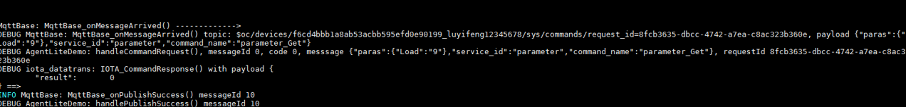
    
  - 设备接收平台属性设置
	
	收到命令后可以通过回调函数进行命令处理。当收到平台下发的设置设备属性命令时，可以调用IOTA_PropertiesSetResponse接口主动上报结果，请参考demo中HandlePropertiesSet函数（需在回调函数配置中提前设置）。

  - 设备接收平台属性查询
	
	收到命令后可以通过回调函数进行命令处理。当收到平台下发的查询设备属性命令时，可以调用IOTA_PropertiesGetResponse接口主动上报结果，请参考demo中HandlePropertiesGet函数（需在回调函数配置中提前设置）。
	
  - 平台通知网关新增子设备
	
	收到命令后可以通过回调函数进行命令处理。当收到平台下发的新增子设备通知时，可以调用IOTA_BatchPropertiesReport接口给子设备上报数据（请查看子设备数据上报），请参考demo中HandleEventsDown函数（需在回调函数配置中提前设置）。
	
- 平台通知网关删除子设备
  
  
- **子设备数据上报**
  
  子设备可以通过网关批量设备属性上报接口进行数据上报，接口如下：
  
  `HW_INT IOTA_BatchPropertiesReport(ST_IOTA_DEVICE_DATA_INFO pDeviceData[], HW_INT deviceNum, HW_INT serviceLenList[])`
  
  通过该接口上报的数据平台会解析，并且结构体中的数据需跟profile中定义的属性保持一致，ST_IOTA_DEVICE_DATA_INFO为结构体数组，可以同时上报多个子设备数据，每个子设备可以上报多个服务，deviceNum为上报的子设备个数，serviceLenList为每个子设备上报的服务个数。入参具体说明请参考API文档，demo中的Test_batchPropertiesReport函数演示了对该接口的调用方法。

```c
void Test_BatchPropertiesReport() {
  int deviceNum = 1;      //要上报的子设备的个数
  ST_IOTA_DEVICE_DATA_INFO devices[deviceNum]; //子设备要上报的结构体数组
  int serviceList[deviceNum];  //对应存储每个子设备要上报的服务个数
  serviceList[0] = 2;       //子设备一要上报两个服务
  //	serviceList[1] = 1;		  //子设备二要上报一个服务
  char *device1_service1 = "{\"Load\":\"1\",\"ImbA_strVal\":\"3\"}";     //    service1要上报的属性数据，必须是json格式
  char *device1_service2 = "{\"PhV_phsA\":\"2\",\"PhV_phsB\":\"4\"}";//service2要上报的属性数据，必须是json格式
  devices[0].device_id = subDeviceId;
  devices[0].services[0].event_time = "20191209T081212Z";
  devices[0].services[0].service_id = "parameter";
  devices[0].services[0].properties = device1_service1;
  devices[0].services[1].event_time = "20191209T081212Z";
  devices[0].services[1].service_id = "analog";
  devices[0].services[1].properties = device1_service2;
  //	char *device2_service1 = "{\"AA\":\"2\",\"BB\":\"4\"}";
  //	devices[1].device_id = "subDevices22222";
  //	devices[1].services[0].event_time = "d2s1";
  //	devices[1].services[0].service_id = "device2_service11111111";
  //	devices[1].services[0].properties = device2_service1;
  int messageId = IOTA_BatchPropertiesReport(devices, deviceNum, serviceList);
  if(messageId != 0) {
  	printfLog(EN_LOG_LEVEL_ERROR, "AgentLiteDemo: Test_BatchPropertiesReport() failed, messageId %d\n", messageId);
  }
}
```

- **自定义tpoic**

  请参考主目录下的**API文档**。

- **ota升级**

  请参考主目录下的**API文档**。

- **设备影子查询**

  请参考主目录下的**API文档**。

- **编译并运行程序**
1. 将huaweicloud-iot-device-sdk-c-master.zip压缩包拷贝到Linux环境中，通过如下命令解压：
	
	unzip  huaweicloud-iot-device-sdk-c-master.zip
	
2. 进入到文件夹下：
	
	cd huaweicloud-iot-device-sdk-c-master
	
3. 执行make命令进行编译：
	
	make
	
4. 运行SDK Demo
	
	./MQTT_Demo.o
	
- **生成SDK库文件**
  
  如果想生成so文件，可以修改Makefile的内容（可以本地用记事本打开后上传到Linux环境，也可以在Linux环境上直接通过"vim Makefile"修改，按"i"键编辑，编辑完毕后用"wq!”保存）:
  
  - 在CFLAGS中添加-shared -fPIC
    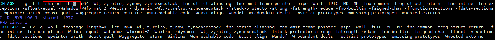
  - 把OBJS中的AgentLiteDemo.o删除掉
    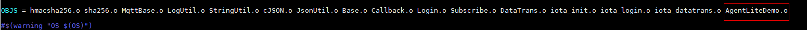
  - 把编译后的TARGET文件由MQTT_Demo.o修改为libHWMQTT.so（名称可以自定义）
    
  - 修改完毕后执行make即可生成libHWMQTT.so文件  
    
    


## 开源协议

* 遵循BSD-3开源许可协议


