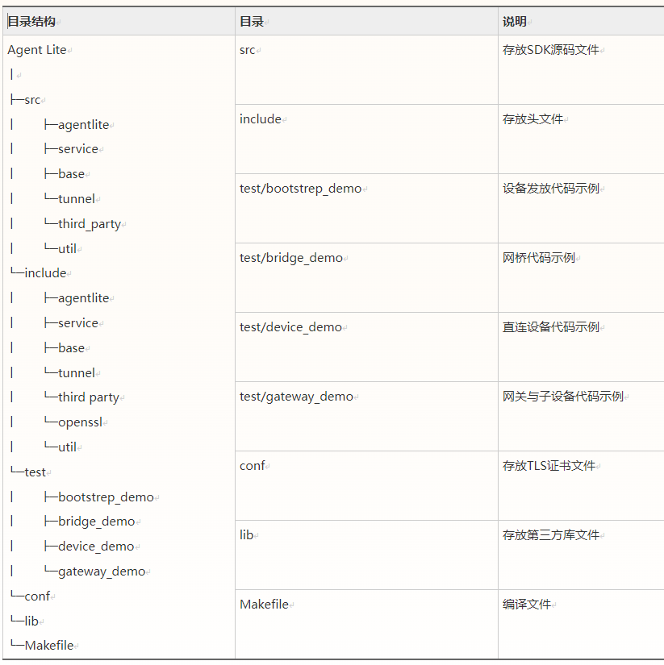

[English](./README.md) | [简体中文](./README_CN.md)

# huaweicloud-iot-device-sdk-c Development Guide
- [0.Version update instructions](#0)
- [1.Preface](#1)
- [2.SDK Introduction](#2)
  - [2.1 Function Support](#2.1)
  - [2.2 SDK directory structure](#2.2)
- [3.Preparation](#3.)
  - [3.1 Environmental information](#3.1)
  - [3.2 Compile openssl library](#3.2)
  - [3.3 Compile paho library](#3.3)
  - [3.4 Compile zlib library](#3.4)
  - [3.5 Compile Huawei security function library](#3.5)
  - [3.6 Compile libssh library](#3.6)
  - [3.7 Compile libnopoll library](#3.7)
  - [3.8 Compile curl library](#3.8)
  - [3.9 Upload profile and register device](#3.9)
- [4.Quick experience](#4)
- [5.Device initialization](#5)
  - [5.1 Underlying data initialization](#5.1)
  - [5.2 Set log printing function](#5.2)
  - [5.3 Initialization connection parameters](#5.3)
  - [5.4 Callback function configuration](#5.4)
  - [5.5 Device Authentication](#5.5)
  - [5.6 Subscribe to Topic](#5.6)
  - [5.7 Compile and run the program](#5.7)
- [6.SDK function](#6)
  - [6.1 Generate SDK library files](#6.1)
  - [6.2 Device Access](#6.2)
  - [6.3 Device message reporting and delivery](#6.3)
  - [6.4 Attribute reporting and distribution](#6.4)
  - [6.5 Command issuance](#6.5)
  - [6.6 Disconnection and reconnection](#6.6)
  - [6.7 Device Shadow](#6.7)
  - [6.8 Time synchronization](#6.8)
  - [6.9 Software and firmware upgrade (OTA)](#6.9)
  - [6.10 File upload\download](#6.10)
  - [6.11 Pan-Protocol & Bridge](#6.11)
  - [6.12 National secret TLS access](#6.12)
  - [6.13 Exception storage](#6.13)
  -  [6.14 MQTT5.0](#6.14)
  - [6.15 MQTT_DEBUG function](#6.15)
  - [6.16 Gateways and Subdevices](#6.16)
  - [6.17 Remote configuration](#6.17)
  - [6.18 Anomaly Detection](#6.18)
  - [6.19 Softbus function](#6.19)
  - [6.20 Log upload](#6.20)
  - [6.21 Client-side rule engine](#6.21)
  - [6.22 Remote login](#6.22)
  - [6.23 Edge M2M function](#6.23)
  - [6.24 gn compile](#6.24)
  - [6.25 Use global variables to configure connection parameters](#6.25)
  - [6.26 Equipment issuance](#6.26)
- [7.Open Source Agreement](#7)

<h1 id = "0">0. Version update instructions</h1>

| Version number | Change type | Function description |
| ------ | -------- | ------------------------------------------------------------ |
| 1.2.0 | Function enhancement | Added SDK test code and demo to optimize code usage. |
| 1.1.5 | Function enhancement | New usage examples |
| 1.1.4 | Function enhancement | Update OTA upgrade transmission format |
| 1.1.3 | Function enhancement | Update conf\rootcert.pem certificate and add log upload |
| 1.1.2 | New features | Added rule engine, M2M, gn compiled files, anomaly detection, log printing timestamp, MQTT_DEBUG, national secret algorithm, remote configuration, end-cloud secure communication (soft bus) functions |
| 1.1.1 | New features | Added SSH remote operation and maintenance function |
| 1.1.0 | New features | Add MQTT5.0 function, optimize code, fix memory overflow problem |
| 1.0.1 | Function enhancement | Added scenarios where mqtts does not verify the platform public key, TLS version is V1.2, and added message storage samples |
| 0.9.0 | New features | Add gateway update sub-device status interface |
| 0.8.0 | Function enhancement | Replace the new access domain name (iot-mqtts.cn-north-4.myhuaweicloud.com) and root certificate. &lt;br/&gt;If the device uses the old domain name (iot-acc.cn-north-4.myhuaweicloud.com) to access, please use the v0.5.0 version of the SDK |
| 0.5.0 | Function enhancement | The sdk is preset with the device access address and the CA certificate supporting the Huawei IoT platform, and supports docking with the Huawei Cloud IoT platform. |

*2023/07/22*

<h1 id = "1">1 Introduction</h1>

This article uses examples to describe how huaweicloud-iot-device-sdk-c (hereinafter referred to as SDK) helps devices quickly connect to the Huawei IoT platform using the MQTT protocol.

<h1 id = "2">2.SDK Introduction</h1>

<h2 id = "2.1">2.1 Function support</h2>

The SDK is oriented to embedded terminal devices with strong computing and storage capabilities. Developers can achieve uplink and downlink communication between the device and the IoT platform by calling the SDK interface. The functions currently supported by the SDK are:  

| Function | Description |
| ------------------------------------------- | ------------------------------------------------------------ |
| [Device Access](#6.2) | As a client, use the MQTT protocol to connect to the Huawei Cloud Platform. It is divided into two authentication methods: certificate authentication and key authentication. |
| [Disconnection and reconnection](#6.6) | When the device's link is disconnected due to network instability or other reasons, the device will reconnect at intervals until the connection is successful. |
| [Message reporting](#6.3) | Used by devices to report customized data to the platform, and the platform forwards the messages reported by the device to the application server or other Huawei Cloud cloud services for storage and processing. |
| [Attribute Reporting](#6.4) | Used by the device to report attribute data to the platform in the format defined in the product model. |
| [Command delivery](#6.5) | Used by the platform to deliver device control commands to the device. After the platform issues a command, the device needs to return the execution result of the command to the platform in a timely manner. |
| [Device Shadow](#6.6) | Used to store the online status of the device, the device attribute value last reported by the device, and the configuration expected to be delivered by the application server. |
| [Software and Firmware (OTA) Upgrade](#6.9) | Used to download the OTA upgrade package in conjunction with the platform. |
| [Time Synchronization](#6.8) | The device initiates a time synchronization request to the platform. |
| [Gateway and sub-device](#6.16) | Gateway device: A device directly connected to the platform through the protocol supported by the platform. Sub-device: For devices that do not implement the TCP/IP protocol stack, since they cannot communicate directly with the IoT platform, they need to forward data through the gateway. Currently, only devices directly connected to the platform through the mqtt protocol are supported as gateway devices. |
| [File Upload/Download](#6.10) | The device is supported to upload operation logs, configuration information and other files to the platform, which facilitates users to perform log analysis, fault location, device data backup, etc. |
| [Anomaly Detection](#6.18) | Provides security detection capabilities to continuously detect security threats to the device. Including: 1. Memory leak detection 2. Abnormal port detection 3. CPU usage detection 4. Disk space detection 5. Battery power detection |
| [Rule Engine](#6.21) | Through conditional triggering and based on preset rules, it triggers collaborative reactions of multiple devices to achieve device linkage and intelligent control. Currently, the IoT platform supports two types of linkage rules: cloud rules and client-side rules. |
| [MQTT5.0](#6.14) | The MQTT5.0 version protocol adds new MQTT5.0 features: comparison data, Clean Start and Session Expiry Interval, payload identification and content type, topic alias, user Attributes. |
| [National Secret Algorithm](#6.12) | A TLS encryption algorithm. |
| [Remote Configuration](#6.17) | Provides remote configuration function, which allows users to remotely update the system parameters, operating parameters and other configuration information of the device without interrupting the operation of the device. |
| [Remote Login](#6.22) | Supports remote SSH login to the device through the console. You can enter the commands supported by the device on the console for function debugging and problem location, thereby conveniently realizing device management and remote operation and maintenance |
| [Pan-Protocol Access](#6.11) | When third-party protocols other than HTTP, MQTT, LWM2M, etc. are accessed, protocol conversion needs to be completed outside the platform. It is recommended to use a gateway to complete protocol conversion and convert third-party protocols into MQTT protocols. |
| [Softbus](#6.19) | When using Hongmeng system. Through the device group delivered by the platform, the devices can realize the interconnection of things through the soft bus. IoTDA can manage security groups and issue credit identification for communication between group members. |
| [Equipment Provisioning](#6.26) | Divided into certificate authentication and key authentication. It is mainly used to distribute to different offices and instances and dynamically complete the initial configuration of different batches of equipment. The released data can be accessed through the device for data transmission. |

<h2 id = "2.2">SDK directory structure</h2>



<h1 id = "3">3. Preparation work</h1>

<h2 id = "3.1">3.1 Environmental information</h2>

The SDK needs to run on the Linux operating system, and gcc must be installed (version 4.8 and above is recommended). The SDK relies on the openssl library and paho library. If the developer has his own compilation chain, he needs to compile the openssl/paho library files by himself. Please refer to Chapter 3.2/3.3 for general gcc compilation steps for Linux.   

<h2 id = "3.2">3.2 Compile openssl library</h2>

1. Visit [openssl official website](https://www.openssl.org/source), download openssl (it is recommended to use openssl-1.1.1h.tar.gz, there is an openssl installation package in the ./generatingLib directory), and upload it to Linux compiler (take uploading to the directory /home/test as an example), and use the following command to decompress:  

   ```shell
   tar -zxvf openssl-1.1.1d.tar.gz 
   ```
   
   

2. Configure and generate makefile files
   Execute the following command to enter the openssl source code directory:

   ```shell
   cd openssl-1.1.1d
   ```

   Run the following configuration command:

   ```shell
   ./config shared --prefix=/home/test/openssl --openssldir=/home/test/openssl/ssl 
   ```

   Among them, "prefix" is a custom installation directory, "openssldir" is a custom configuration file directory, and "shared" is used to generate a dynamic link library (i.e. .so library).

   If there is a problem with compilation, add no-asm to the configuration command (indicating that assembly code is not used)

   ```shell
   ./config  no-asm shared --prefix=/home/test/openssl --openssldir=/home/test/openssl/ssl
   ```
   
   


3. Compile and export the library.
   In the openssl source code directory, run the make depend command to add dependencies:

   ```shell
   make depend
   ```

   Run the make command to start compilation:

   ```sh
   make
   ```

   Then run the following command to install:

   ```shell
   make install
   ```

   Find the lib directory in the configured openssl installation directory home/test/openssl, and there is a generated library file:

   libcrypto.so.1.1, libssl.so.1.1 and soft links libcrypto.so, libssl.so, please copy these files to the lib folder of the SDK (also copy the openssl folder under home/test/openssl/include to the include directory of the SDK).
   
   
   
4. If you need to use the national secret TLS, you can visit [national secret version openssl] (https://github.com/jntass/TASSL-1.1.1). The installation method is the same as the native openssl. This version is currently based on openssl1.1.1s, is compatible with various native interfaces of openssl, and still supports international TLS.

<h2 id = "3.3">3.3 Compile paho library</h2>

1. Visit the github download address https://github.com/eclipse/paho.mqtt.c and download the source code of paho.mqtt.c (it is recommended to download the Source code (tar.gz) of the release version 1.3.9 and earlier. file, if you use the latest version, the number of lines in the adapted file below may change, and the header files that need to be copied will be added according to the latest version).

2. Unzip and upload to the linux compiler.

3. Modify makefile
	- Edit the Makefile with the following command
	  
	  ```sh
	  vim Makefile
	  ```
	  
	- Show number of rows
	  
	  ```shell
	  :set now
	  ```
	  
	- Add the following two lines after "DOXYGEN_COMMAND" (the locations of the customized openssl header files and library files in [3.2](#3.2))
	  
	  ```makefile
	  CFLAGS += -I/home/test/openssl/include  
	  LDFLAGS += -L/home/test/openssl/lib -lrt 
	  ```
	  
	  
	  
	- Add openssl header file references to CCFLAGS_SO, library file references to LDFLAGS_CS, LDFLAGS_AS and FLAGS_EXES (with the update of the paho version, some versions will add this reference by default, and there is no need to modify it at this time)
	  
	
4. Compile
	- Execute clear command:
	  
	  ```shell
	  make clean
	  ```
	  
	- Execute compilation command:
	  
	  ```shell
	  make
	  ```
	
5. After compilation is completed, you can see the successfully compiled library in the build/output directory.
	

6. Copy the paho library file
	The current SDK only uses libpaho-mqtt3as. Please copy the files libpaho-mqtt3as.so, libpaho-mqtt3as.so.1 and libpaho-mqtt3as.so.1.3 to the lib folder of the SDK (at the same time, copy the src file in the paho source code directory Copy the header files in the folder (MQTTAsync.h/MQTTClient.h/MQTTClientPersistence.h/MQTTProperties.h/MQTTReasonCodes.h/MQTTSubscribeOpts.h) to the include/base directory of the SDK. Note: Some paho versions will have MQTTExportDeclarations. h header file, it is recommended to add all MQTT-related header files).

<h2 id = "3.4">3.4 Compile zlib library</h2>

1. Download the zlib source code https://github.com/madler/zlib/archive/v1.2.11.zip
	Unzip it with the following command:
   
   ```shell
   unzip zlib-1.2.11.zip
   ```
   
2. Enter the source code directory:

	```shell
	cd  zlib-1.2.11
	```
	
3. Configure and generate makefiles

   ```shell
   ./configure
   ```

4. Execute the makefile

   ```shell
   make
   ```

5. Copy the so library file
    Copy the libz.so, libz.so.1, and libz.so.1.2.11 generated in the source code directory to the lib folder of the SDK.	
    				

<h2 id = "3.5">3.5 Compile Huawei security function library</h2>

1. Download the security function library source code https://gitee.com/openeuler/libboundscheck.git

2. Enter the directory at the same level as the source code makefile and execute the makefile.

   ```shell
   make
   ```

3. Copy the so library file
    Copy libboundscheck.so in the lib folder generated in the source code directory to the lib folder of the SDK.

<h2 id = "3.6">3.6 Compile libssh library</h2>

1. Download the libssh source code https://www.libssh.org/files/0.10/libssh-0.10.4.tar.xz
	Unzip it with the following command:
   
   ```shell
   tar xvf libssh-0.10.4.tar.xz
   ```
   
2. Enter the source code directory:

	```shell
	cd libssh-0.10.4
	```
	
3. Compile library files:

    ```shell
    mkdir build
    cd build
    cmake ..
    make
    ```

4. Install the library:

    ```shell
    sudo make install  
    ```

5. Copy the so library files and header files
    Copy the libssh.so, libssh.so.4, and libssh.so.4.9.4 generated in the build/lib folder in the source directory to the lib folder of the SDK.
   Copy the entire header file directory of libssh under /usr/local/include to the include folder of sdk.

<h2 id = "3.7">3.7 Compile libnopoll library</h2>

1. Download the nopoll source code http://www.aspl.es/nopoll/downloads/nopoll-0.4.8.b429.tar.gz
	Unzip it with the following command:
   
   	tar xzvf nopoll-0.4.8.b429.tar.gz
   
2. Enter the source code directory:

	```shell
	cd nopoll-0.4.8.b429
	```
	
3. Compile and install

   ```shell
   ./configure
   make
   sudo make install
   pkg-config nopoll --cflags
   pkg-config nopoll --libs  
   ```

4. Copy the so library file
    Using the path obtained in the previous step, copy libnopoll.so libnopoll.so.0 libnopoll.so.0.0.0 generated under the source code directory src/.libs to the lib folder of the SDK.
   Copy the entire header file directory of nopoll under /usr/local/include to the include folder of sdk.

<h2 id = "3.8">3.8 Compile curl library</h2>
Execute the following command in the generatingLib directory. Note that after --with-openssl, replace it with your own openssl installation path:

```shell 
    curl https://github.com/curl/curl/releases/download/curl-8_4_0/curl-8.4.0.tar.gz | tar -xzvf - &amp;&amp;
    cd curl-8.4.0 &amp;&amp;
    ./configure --with-openssl=/home/test/openssl &amp;&amp;
    make &amp;&amp;
    make install &amp;&amp;
    cp -r /usr/local/include/curl ../../include
    cp /usr/local/lib/libcurl.so* ../../lib
    cp /usr/local/lib64/libcurl.so* ../../lib
```

<h2 id = "3.9">3.9 Upload profile and register device</h2>

1. Profile (product model) definition, specific details can be found at: [Problems related to object model](https://support.huaweicloud.com/iothub_faq/iot_faq_01000.html).

2. Details of the registered device can be found at: [Registering Device](https://support.huaweicloud.com/usermanual-iothub/iot_01_0031.html).
	
	Click "Devices" -> "All Devices", click "Register Device" in the upper right corner, select the "Resource Space" where the product is located, select the product created above, fill in the device identification code (usually IMEI, MAC address, etc.), customize If "device name" and "key" are not customized, the platform will automatically generate them. After filling in everything, click "OK".

3. You can directly copy the device secret key. Click "Save and Close" to automatically download the device ID and device secret key to the local computer in the form of txt text.

4. In the IoTDA console interface. Click "Devices" -> "All Devices", and you can see at the top that the status of the device is inactive. When the device goes online once, it exits the inactive state.

<h1 id = "4">4. Quick experience</h1>

1. Copy the SDK compressed package to the Linux environment and decompress it through the following command:
	
	```shell
	unzip  huaweicloud-iot-device-sdk-c-master.zip
	```
	
2. Go to the unzipped folder:

   ```shell
    cd huaweicloud-iot-device-sdk-c-master
   ```

3. Modify configuration information:
    You need to modify the following parameters in the src/device_demo/device_demo.c file:  
    g_serverIp: Platform MQTT southbound IP, which can be viewed in "Overview" -> "Access Information" in the IoTDA console.
   g_username: The MQTT protocol requires username. The default device ID of the IoT platform is username. The device ID is the value returned when the device is registered.
   g_password: device key, the value returned when the device is registered.
    
   
4. Execute the command to compile. It is recommended to use Makefile for compilation:

   4.1 Compile with Makefile:

   ```shell
   make (if it is a 32-bit operating system, please delete "-m64" in the Makefile)
   ```

   4.2 Compile with gn, first install gn and ninja tools, and then compile:

   ```shell
   gn gen -C out
   ninja -C out
   cd out
   ```

5. Run:

    5.1 Load library files

    ```shell
     export LD_LIBRARY_PATH=./lib/
    ```

    5.2 Execute the following command:

    ```shell
    ./MQTT_Demo
    ```

      You can see a lot of printed logs on the console:
      “login success” indicates that device authentication is successful   

      "MqttBase_onSubscribeSuccess" indicates that the subscription is successful   

      "MqttBase_onPublishSuccess" indicates that the data is published successfully   

      

6. Check the operation status of the equipment:
  - Directly connected devices are online: Available in Devices -> All Devices in the platform console interface. You can see the device status in . When it is online, the device is online successfully.

<h1 id = "5">5. Device initialization</h1>

Directly connected device connection demo visible code: ./demos/device_demo/basic_test.c. Certificate acquisition: [Certificate Resources](https://support.huaweicloud.com/devg-iothub/iot_02_1004.html#section3).

<h2 id = "5.1">5.1 Initialization of underlying data</h2>

Before initiating business, you need to initialize Agent Lite related resources and call the API interface IOTA_Init(HW_CHAR *workPath) to initialize Agent Lite resources. The CA certificate storage path is: ${workPath}/rootcert.pem. For specific API interface parameter usage, please refer to the Agent Lite API interface document. Please refer to the main() method's call to IOTA_Init() in the demo.

```c
/* 
 * The CA certificate address is set to: ./conf/rootcert.pem
 * Device public key path: ./conf/deviceCert.pem
 * Device private key path: ./conf/deviceCert.key
 */
 IOTA_Init("."); 
```

In the ./include/base/mqtt_base.h file, there are MQTT connection related parameters:

```c
#define DEFAULT_QOS						1 // Default communication quality (Qos)
#define DEFAULT_KEEP_ALIVE_INTERVAL		120 // Connection heartbeat duration unit s
#define DEFAULT_CONNECT_TIME_OUT 		30 // Maximum connection request duration unit s
#define DEFAULT_RETRYINTERVAL 			10 // Default retry interval unit s
#define MQTT_PORT 						"1883" // Default MQTT port
#define MQTTS_PORT 						"8883" // Default MQTTS port

#define MQTT_TRACE_ON                   0  // Open or not MQTT_DEBUG
#define MQTT_TRACE_LEVEL                MQTTASYNC_TRACE_MINIMUM  // Please select according to your needs TraceLevel
#define MAX_BUFFERED_MESSAGES           3 // Maximum number of broken chain storage entries
```

<h2 id = "5.2">5.2 Set the log printing function</h2>

The SDK is used by developers in the form of log callback functions. Developers can call the IOTA_SetPrintLogCallback function to set up according to their own needs. For specific API interface parameter usage, please refer to the SDK API interface documentation.

```c
void IOTA_SetPrintLogCallback(PFN_LOG_CALLBACK_HANDLER pfnLogCallbackHandler)
```

- If you need to print on the console, you can refer to vprintf(format, args) set in the myPrintLog function in the demo;
- If you need to print to the system log file, you can refer to the vsyslog(level, format, args) function set in the myPrintLog function in the demo. At the same time, you need to introduce the header file #include "syslog.h" and define the macro #define _SYS_LOG.

```c
static void MyPrintLog(int level, char *format, va_list args)
{
    vprintf(format, args);
    /*
     * if you want to printf log in system log files,you can do this:
     * vsyslog(level, format, args);
     */
}

void main() {
	IOTA_SetPrintLogCallback(MyPrintLog); // Set log printing
}
```


<h2 id = "5.3">5.3 Initialize connection parameters</h2>

Before a device is connected to the IoT platform, the platform's address, port, device ID, and device key need to be configured. You can refer to the setAuthConfig() function called in the main() method in the demo.

```c
  void setAuthConfig(){
      
    IOTA_ConnectConfigSet(${access domain name\ip}, ${port}, ${device id}, ${password});
    IOTA_ConfigSetUint(EN_IOTA_CFG_AUTH_MODE, EN_IOTA_CFG_AUTH_MODE_SECRET); //Key mode
    // Do not check timestamp
    IOTA_ConfigSetUint(EN_IOTA_CFG_CHECK_STAMP_METHOD, EN_IOTA_CFG_CHECK_STAMP_OFF); 
   /**
    * Configuration is required in certificate mode:
    *
    * IOTA_ConfigSetUint(EN_IOTA_CFG_AUTH_MODE, EN_IOTA_CFG_AUTH_MODE_CERT);
    * IOTA_ConfigSetStr(EN_MQTT_CFG_PRIVATE_KEY_PASSWORD, "yourPassword");
    */  
  
  }
```

- IOTA_ConnectConfigSet(${access domain name\ip}, ${port}, ${device id}, ${original unencrypted password}) The connection parameters can be obtained from the application docking information of the SP portal;
- The authentication mode (EN_IOTA_CFG_AUTH_MODE) can be set to:
  1. Key authentication (EN_IOTA_CFG_AUTH_MODE_SECRET).
  2. Certificate authentication (EN_IOTA_CFG_AUTH_MODE_CERT).
- The timestamp check method (EN_IOTA_CFG_CHECK_STAMP_METHOD) can be set to:
  1. Do not verify the timestamp (EN_IOTA_CFG_CHECK_STAMP_OFF).
  2. 使用sha256（EN_IOTA_CFG_CHECK_STAMP_SHA256）。
  3. National secret sm3 (EN_IOTA_CFG_CHECK_STAMP_SM3) verification.
- When _SYS_LOG is defined (the log is printed in the system file), the facility type of the log (EN_IOTA_CFG_LOG_LOCAL_NUMBER) and the display level of the log (EN_IOTA_CFG_LOG_LEVEL) can be customized as needed.


<h2 id = "5.4">5.4 Callback function configuration</h2>

The SDK provides callback functions for developers to call for actions such as success/failure of device authentication, success/failure of device disconnection, success/failure of device subscription messages, success/failure of device publishing messages, and device reception of messages/commands. Developers Callback functions can be set for different events to implement business processing logic.

```c
  void setMyCallbacks(){
    IOTA_SetProtocolCallback(EN_IOTA_CALLBACK_CONNECT_SUCCESS, HandleConnectSuccess);
  	IOTA_SetProtocolCallback(EN_IOTA_CALLBACK_CONNECT_FAILURE, HandleConnectFailure);
  
  	IOTA_SetProtocolCallback(EN_IOTA_CALLBACK_DISCONNECT_SUCCESS, HandleDisConnectSuccess);
  	IOTA_SetProtocolCallback(EN_IOTA_CALLBACK_DISCONNECT_FAILURE, HandleDisConnectFailure);
  	IOTA_SetProtocolCallback(EN_IOTA_CALLBACK_CONNECTION_LOST, HandleConnectionLost);
  
  	IOTA_SetProtocolCallback(EN_IOTA_CALLBACK_SUBSCRIBE_SUCCESS, HandleSubscribesuccess);
  	IOTA_SetProtocolCallback(EN_IOTA_CALLBACK_SUBSCRIBE_FAILURE, HandleSubscribeFailure);
  
  	IOTA_SetProtocolCallback(EN_IOTA_CALLBACK_PUBLISH_SUCCESS, HandlePublishSuccess);
  	IOTA_SetProtocolCallback(EN_IOTA_CALLBACK_PUBLISH_FAILURE, HandlePublishFailure);
  
  	IOTA_SetMessageCallback(HandleMessageDown);
    // It is recommended to use this API, which can handle custom format messages
  	IOTA_SetRawMessageCallback(HandleRawMessageDown);
  	IOTA_SetUserTopicMsgCallback(HandleUserTopicMessageDown);
    // It is recommended to use this API, which can handle custom format messages
  	IOTA_SetUserTopicRawMsgCallback(HandleUserTopicRawMessageDown);
    IOTA_SetUndefinedMessageCallback(HandletUndefinedMessageDown);
  
  	IOTA_SetCmdCallback(HandleCommandRequest);
  	IOTA_SetPropSetCallback(HandlePropertiesSet);
  	IOTA_SetPropGetCallback(HandlePropertiesGet);
  	IOTA_SetEventCallback(HandleEventsDown);
  	IOTA_SetShadowGetCallback(HandleDeviceShadowRsp);
  }
```

```C
  // Connect related
  - After successful authentication, the HandleConnectSuccess function will be called;  
  - After authentication fails, the HandleConnectFailure function will be called;  
  - After the device actively disconnects successfully, the HandleDisConnectSuccess function will be called;
  - After the device fails to actively disconnect, the HandleDisConnectFailure function will be called;
  - After the link is disconnected, the HandleConnectionLost function will be called;
  // Subscribe related
  - After the subscription is successful, the HandleSubscribesuccess function will be called;
  - After the subscription fails, the HandleSubscribeFailure function will be called;
  // Publish related
  - After the data is published successfully, the HandlePublishSuccess function will be called;
  - After failure to publish data, the HandlePublishFailure function will be called;
  // Message related
  - After the device receives a transparent message (default topic) that is not parsed by the platform, it will call the HandleRawMessageDown function; if the message conforms to the system format, it will also call HandleMessageDown;
  - After the device receives a transparent message (including /user/custom topic) that is not parsed by the platform, it will call the HandleUserTopicMessageDown function; if the message conforms to the system format, it will also call HandleUserTopicMessageDown;
  - After the device receives a transparent message that is not parsed by the platform (non-custom topic starting with oc), it will call the HandletUndefinedMessageDown function.
  // Attributes and commands related
  - After the device receives the command, it will call the HandleCommandRequest function;
  - After the device receives the property setting command, it will call the HandlePropertiesSet function;
  - After the device receives the property query command, it will call the HandlePropertiesGet function;
  // event related
  - After the device receives event (sub-device, OTA) related commands, it will call the HandleEventsDown function;
  - After the device receives the device shadow data, it will call the HandleDeviceShadowRsp function;
```

<h2 id = "5.5">5.5 Device Authentication</h2>

After the callback function is set, the authentication function can be called. You can refer to the call to this interface in ./demos/device_demo/basic_test.c:

```c
int ret = IOTA_Connect();
     if (ret != 0) {
        PrintfLog(EN_LOG_LEVEL_ERROR, "basic_test: IOTA_Connect() error, Auth failed, result %d\n", ret);
    }
```

After the authentication interface is called successfully, the words "login success" will be printed (it is recommended to report data after successful authentication. You can sleep for a few seconds after authentication, or perform business processing in the callback function of successful authentication):

You can stop the program by ctrl + c. After the program is stopped, you can wait for up to 1.5 heartbeats. You can check on the console interface that the device is offline.

<h2 id = "5.6">5.6 Subscribe to Topic</h2>

When the connection is successful, Huawei Cloud Platform will automatically subscribe to the system topic with qos (communication quality) of 0. To use a custom topic, you need to call the subscribe from function to subscribe to the topic.

- Subscribe to all [System Topic](https://support.huaweicloud.com/api-iothub/iot_06_v5_3004.html):

  ```c
  void SubscribeAllQos(int qos);
  ```

- Subscribe to [custom topic](https://support.huaweicloud.com/usermanual-iothub/iot_02_9999.html):

  ```c
  int IOTA_SubscribeTopic(char *topic, int qos);
  ```

  If you subscribe to a topic with the topic "test/sdk/c" and a communication quality of 1:

  ```c
  IOTA_SubscribeTopic("test/sdk/c", 1);
  ```

It is worth noting that when the device is disconnected and reconnected, the customer needs to subscribe to the custom topic again. You can write code in the callback function after the connection is successful and subscribe again. The following are examples:

```c
static void HandleConnectSuccess(EN_IOTA_MQTT_PROTOCOL_RSP *rsp)
{
    PrintfLog(EN_LOG_LEVEL_INFO, "device_demo: handleConnectSuccess(), login success\n");
    // You can subscribe to the required topics here
}

void main(int argc, char **argv)
{
    // connect success callback
    IOTA_SetProtocolCallback(EN_IOTA_CALLBACK_CONNECT_SUCCESS, HandleConnectSuccess);
    //Build link
    int ret = IOTA_Connect();
    if (ret != 0) {
        PrintfLog(EN_LOG_LEVEL_ERROR, "error, Auth failed, result %d\n", ret);
        return -1;
    }
    while(1);
}
```

<h2 id = "5.7">5.7 Compile and run the program</h2>

1. Copy the huaweicloud-iot-device-sdk-c-master.zip compressed package to the Linux environment and decompress it with the following command:

   unzip  huaweicloud-iot-device-sdk-c-master.zip

2. Go to the folder:

   cd huaweicloud-iot-device-sdk-c-master

3. Execute the make command to compile:

   make

    ps: If you compile the demo in the "./demos/" file, you can run make ${demo name}, such as make device_demo. If you need to compile all demos, please use the command make all to compile.
   
4. Run SDK Demo

   ./MQTT_Demo
   
   ps: If you run the demo in the ./demos/ file, enter ./{file name} in the SDK root directory.

<h1 id = "6">6.SDK function</h1>

The following is the usage guide for some interfaces. For detailed functions, please refer to the **API documentation** in the main directory.  

<h2 id = "6.1">6.1 Generate SDK library file</h2>

If you want to generate an so file, you can modify the contents of the Makefile (you can open it locally with Notepad and upload it to the Linux environment, or you can modify it directly through "vim Makefile" on the Linux environment, press the "i" key to edit, and use " wq!" save):

- Add -shared -fPIC to CFLAGS. At the same time, delete -pie -fPIE in CFLAGS.
  

- Modify the compiled TARGET file from MQTT_Demo to libHWMQTT.so (the name can be customized)
  

- After modification, execute make to generate the libHWMQTT.so file  

  


<h2 id = "6.2">6.2 Device access</h2>

When a device is connected to the IoT platform, it is divided into device key authentication and certificate authentication. It is necessary to configure the platform's address (${address}), port (${port}), device Id (${deviceId}) and device key\certificate private key (${password}, ${deviceKyePassword}). Demo usage example: [./demos/device_demo/basic_test.c](./demos/device_demo/basic_test.c).

Reference documents: [Key Authentication](https://support.huaweicloud.com/intl/en-us/usermanual-iothub/iot_01_0019.html), [Certificate Authentication](https://support.huaweicloud.com/intl/en-us/usermanual-iothub/iot_01_0019.html ).

Demo compilation and running:

```c
Modify the connection parameters in basic_test.c:
// You can get the access address from IoT Console "Overview" -> "Access Information"
char *g_address = "XXXX"; 
char *g_port = "8883";
char *g_deviceId = "device id";
char *g_password = "Device Key";
    
Run in the root directory:
    make device_demo
    ./basic_test
```

- Device key authentication:

  ```c
  //--------------------------------Key authentication----------------- --------------------------
  void mqttDeviceSecretInit(char *address, char *port, char *deviceId, char *password) {
  
      IOTA_Init("."); //The certificate address is set to: ./conf/rootcert.pem
      IOTA_SetPrintLogCallback(MyPrintLog); //Set the log printing method
   
      // When the loading connection parameter is 1883, it is the MQTT protocol, and when 8883, it is the MQTTS protocol.
      IOTA_ConnectConfigSet(address, port, deviceId, password);
      //Set the authentication method to key authentication
      IOTA_ConfigSetUint(EN_IOTA_CFG_AUTH_MODE, EN_IOTA_CFG_AUTH_MODE_SECRET);
  
      //Set the connection callback function
      IOTA_SetProtocolCallback(EN_IOTA_CALLBACK_CONNECT_FAILURE, HandleConnectFailure);
      IOTA_SetProtocolCallback(EN_IOTA_CALLBACK_CONNECTION_LOST, HandleConnectFailure);
  }
  
  void main(int argc, char **argv) {
      //Key authentication initialization
      mqttDeviceSecretInit(g_address, g_port, g_deviceId, g_password); 
  }
  ```
  
- Device certificate authentication:

  Huawei IoT platform supports devices to use their own X.509 certificates for device access authentication. Please refer to the access steps:

  1. For certificate production and upload, please refer to: [X.509 Certificate Authentication](https://support.huaweicloud.com/intl/en-us/bestpractice-iothub/iot_bp_0077.html).
  2. SDK needs to be set:

    - Change the certificate/key name to deviceCert.pem/deviceCert.key and place it in the conf directory of the SDK.
    - To set the device to certificate access mode, please refer to the mqttDeviceCertInit function in the demo:

  ```c
  //------------------- Certificate Authentication ------------------
  void mqttDeviceCertInit(char *address, char *port, char *deviceId, char *deviceKyePassword) {
  
      // Modify the device certificate/key name to: deviceCert.pem/deviceCert.key and place it in the conf directory of the SDK.
      IOTA_Init("."); 
      //Set the log printing method
      IOTA_SetPrintLogCallback(MyPrintLog); 
   
      //Load connection parameters MQTTS protocol
      IOTA_ConnectConfigSet(address, port, deviceId, NULL);
      //Set the authentication method to certificate authentication
      IOTA_ConfigSetUint(EN_IOTA_CFG_AUTH_MODE, EN_IOTA_CFG_AUTH_MODE_CERT);
      IOTA_ConfigSetUint(EN_IOTA_CFG_PRIVATE_KEY_PASSWORD, deviceKyePassword);
  
      //Set the connection callback function
      IOTA_SetProtocolCallback(EN_IOTA_CALLBACK_CONNECT_FAILURE, HandleConnectFailure);
      IOTA_SetProtocolCallback(EN_IOTA_CALLBACK_CONNECTION_LOST, HandleConnectFailure);
  }
  
  void main(int argc, char **argv) {
      //Certificate authentication initialization
      char *deviceKyePassword = ""; // Please enter the device private key password
      mqttDeviceCertInit(g_address, g_port, g_deviceId, g_deviceKyePassword); 
  }
  ```
  
- Connection callback function:

    - After successful authentication, the HandleConnectSuccess function will be called;  
    - After authentication fails, the HandleConnectFailure function will be called;  
    - After the device actively disconnects successfully, the HandleDisConnectSuccess function will be called;
    - After the device fails to actively disconnect, the HandleDisConnectFailure function will be called;
    - After the link is disconnected, the HandleConnectionLost function will be called;
    
    ```c
      // Set the callback function for successful device link establishment
      IOTA_SetProtocolCallback(EN_IOTA_CALLBACK_CONNECT_SUCCESS, HandleConnectSuccess);
      // Set the callback function for device authentication failure
      IOTA_SetProtocolCallback(EN_IOTA_CALLBACK_CONNECT_FAILURE, HandleConnectFailure);
      // Set the callback function for device disconnection success
      IOTA_SetProtocolCallback(EN_IOTA_CALLBACK_DISCONNECT_SUCCESS, HandleDisConnectSuccess);
      // Set the callback function for device disconnection failure
      IOTA_SetProtocolCallback(EN_IOTA_CALLBACK_DISCONNECT_FAILURE, HandleDisConnectFailure);
      // Set the callback function after inactive disconnection after successful connection
      IOTA_SetProtocolCallback(EN_IOTA_CALLBACK_CONNECTION_LOST, HandleConnectionLost);
    ```

- Topic subscription:

    Topic subscription is required if the device link is successfully established or the device is re-established (disconnected and reconnected). It is recommended to perform this in the callback function after the link is successfully established.

  ```c
  static void SubscribeDeviceTpoic(void)
  {
      SubscribeAllQos(1);
  }
  
  static void HandleConnectSuccess(EN_IOTA_MQTT_PROTOCOL_RSP *rsp)
  {
      (void)rsp;
      PrintfLog(EN_LOG_LEVEL_INFO, "HandleConnectSuccess(), login success\n");
      /* Connection successful, subscribe */
      SubscribeDeviceTpoic();
  }
  
  void main(int argc, char **argv) {
      ...
      // Set the connection success callback function
      IOTA_SetProtocolCallback(EN_IOTA_CALLBACK_CONNECT_SUCCESS, HandleConnectSuccess);
      ...
  }
  ```

- Equipment disconnection:

  ```c
  void main(int argc, char **argv) {
      ...
      // Broken link
      IOTA_Destroy();
  }
  ```

<h2 id = "6.3">6.3 Device message reporting and delivery</h2>

After the device is authenticated, you can call the "Device Message Reporting" interface of the SDK to report data.

Reference documents: [Message reporting](https://support.huaweicloud.com/intl/en-us/usermanual-iothub/iot_01_0324.html), [Message delivery](https://support.huaweicloud.com/intl/en-us/usermanual-iothub/iot_01_0332.html).

Demo example: [./demos/device_demo/message_test.c](./demos/device_demo/message_test.c). How to use Demo is as follows:

```c
Modify the connection parameters in message_test.c:
// You can get the access address from IoT Console "Overview" -> "Access Information"
char *g_address = "XXXX"; 
char *g_port = "8883";
char *g_deviceId = "device id"; // Please enter the device id
char *g_password = "Device Key"; // Please enter the device password during key authentication
    
Run in the root directory:
    make device_demo
    ./message_test
```

- Customized Topic message reporting and distribution:

  Topics and messages in custom formats can be reported through this interface. Data received by the platform can be forwarded to other services or pushed to application servers.

  - Customized Topic message reporting:

    `HW_API_FUNC HW_INT IOTA_RawTopicMessageReport(HW_CHAR *topic, HW_CHAR *payload, int qos, void *context);`

    Topic is a customer-defined topic; payload is the content to be reported; qos is the communication quality, and the platform supports 0 or 1. You can refer to the call to this function and this interface in the demo.

    ```c
    // ----------------- Custom topic message reporting --------------------------------
      void allCustomMessage() 
      {
          //Subscribe topic to massge/test, Qos communication quality is 1
          IOTA_SubscribeTopic("massge/test", 1);
          //Report to the connected device a message with topic "message/test", qos 1, and message content "hello!"
          int messageId = IOTA_RawTopicMessageReport("message/test", "hello!", 1 NULL);
          if (messageId != 0) {
              PrintfLog(EN_LOG_LEVEL_ERROR, "allCustomMassage() failed, messageId %d\n", messageId);
          }
          TimeSleep(3000);
    }
    ```

  - The platform sends customized messages:

    `HW_API_FUNC HW_VOID IOTA_SetUndefinedMessageCallback(PFN_MESSAGE_CALLBACK_HANDLER callbackHandler);`

    This callback function will be triggered when the Topic has been subscribed but is not set by the platform. If it is a custom message starting with $oc/devices/{device_id}/user/ set by the platform, this function will not be triggered, but the function pointer set in IOTA_SetUserTopicMsgCallback() will be triggered instead. For specific usage, please refer to the call to this function and this interface in the demo.

    ```c
    static void HandletUndefinedMessageDown(EN_IOTA_UNDEFINED_MESSAGE *rsp)
    {
       if (rsp == NULL) {
            return;
        }
        PrintfLog(EN_LOG_LEVEL_INFO, "%s(), content: %s\n", __FUNCTION__,  rsp->payload);
    }
    
    int main(int argc, char **argv)
    {
          ...
            //Message delivery callback function registration
          IOTA_SetUndefinedMessageCallback(HandletUndefinedMessageDown);
            ...
    }
    ```

- System Topic message reporting and distribution:

  Topics and messages in system format can be reported through this interface. Data received by the platform can be forwarded to other services or pushed to application servers.

  - System message reporting:

    `HW_API_FUNC HW_INT IOTA_MessageDataReport(ST_IOTA_MESS_REP_INFO mass, void *context);`
  
    The data reported through this interface is not parsed by the platform, and the data can be forwarded to other services or pushed to the application server. mass is a message structure, including: device id (object_device_id) that needs to be reported, message name (name), message ID (id), and reported content (content); topicParas is a parameter of a custom topic. When it is NULL, the platform default is used. Topic reports data. For specific parameter descriptions, please see [API documentation](https://support.huaweicloud.com/intl/en-us/api-iothub/iot_06_v5_3016.html). You can refer to the call to this function and this interface in the demo.
  
    ```c
    void basicMassage() 
    {
        // Subscribe to system topic
        SubscribeAll(); 
        //Report a message with ID 123 to the connected device, the message content is "hello!"
        ST_IOTA_MESS_REP_INFO mass = {NULL, "name", "id", "hello!", "test"};
        int messageId = IOTA_MessageDataReport(mass, NULL);
        if (messageId != 0) {
            PrintfLog(EN_LOG_LEVEL_ERROR, "basicMassage() failed, messageId %d\n", messageId);
        }
        TimeSleep(3000);
    }
    ```
  
  - The platform issues system messages:
  
    `HW_API_FUNC HW_VOID IOTA_SetMessageCallback(PFN_MESSAGE_CALLBACK_HANDLER callbackHandler);`
  
    The callbackHandler is a function pointer. This function will be run when the system delivers a message with the topic: $oc/devices/{device_id}/sys/messages/down. For specific parameter descriptions, please see [API documentation](https://support.huaweicloud.com/intl/en-us/api-iothub/iot_06_v5_3017.html). You can refer to the call to this function and this interface in the demo.
  
    ```C
    static void HandleMessageDown(EN_IOTA_MESSAGE *rsp, void *mqttv5)
    {
        if (rsp == NULL) {
            return;
        }
        PrintfLog(EN_LOG_LEVEL_INFO, "%s(), content: %s\n", __FUNCTION__,  rsp->content);
        PrintfLog(EN_LOG_LEVEL_INFO, "%s(), id: %s\n", __FUNCTION__, rsp->id);
        PrintfLog(EN_LOG_LEVEL_INFO, "%s(), name: %s\n", __FUNCTION__,  rsp->name);
        PrintfLog(EN_LOG_LEVEL_INFO, "%s(), objectDeviceId: %s\n", __FUNCTION__, rsp->object_device_id);
    }
    
    int main(int argc, char **argv)
    {
          ...
          //Message delivery callback function registration
          IOTA_SetMessageCallback(HandleMessageDown);
            ...
    }
    ```
  
    
  
  

<h2 id = "6.4">6.4 Attribute reporting and distribution</h2>

After the device is authenticated, you can call the "Device Attribute Report" interface of the SDK to report data.

Reference documents: [Device attribute reporting](https://support.huaweicloud.com/intl/en-us/usermanual-iothub/iot_01_0326.html), [Platform attribute delivery](https://support.huaweicloud.com/intl/en-us/usermanual-iothub/iot_01_0337.html).

Demo example: [./demos/device_demo/properties_test.c](./demos/device_demo/properties_test.c). How to use Demo is as follows:

  ```c
Modify the connection parameters in properties_test.c:
// You can get the access address from IoT Console "Overview" -> "Access Information"
char *g_address = "XXX"; 
char *g_port = "8883";
char *g_deviceId = "device id"; // Please enter the device id
char *g_password = "Device Key"; // Please enter the device password during key authentication
    
Run in the root directory:
    make device_demo
    ./properties_test
  ```

In the example, the object model used is the best practice [smart smoke sensor object model] (https://support.huaweicloud.com/intl/en-us/bestpractice-iothub/iot_bp_0024.html#section9). The object model can be configured according to the document:

The object model defines a service with the service ID Smoke.

A readable and writable integer (int) attribute Smoke_Value is defined in the service ID.

- Device attribute reporting interface:

  `HW_INT IOTA_PropertiesReport(ST_IOTA_SERVICE_DATA_INFO pServiceData[], HW_INT serviceNum, HW_INT compressFlag, void *context)`

  The data platform reported through this interface will be parsed, and the data in the structure must be consistent with the attributes defined in the profile. ST_IOTA_SERVICE_DATA_INFO is a structure array, which can report multiple services at the same time. serviceNum is the number of reported services. Please refer to the API documentation for specific instructions on entering parameters. The Test_propertiesReport function in the demo demonstrates how to call this interface.

  ```c
  void Test_propertiesReport() {
    int serviceNum = 1; // The number of reported services
    ST_IOTA_SERVICE_DATA_INFO services[serviceNum];
  
    //--------------- the data of service ---------------------
    char *service = "{\"Smoke_value\": 5}";
    services[0].event_time = NULL;
    services[0].service_id = "Smoke";
    services[0].properties = service;
  
    int messageId = IOTA_PropertiesReport(services, serviceNum, 0, NULL);
    if(messageId != 0) {
    	PrintfLog(EN_LOG_LEVEL_ERROR, "device_demo: Test_batchPropertiesReport() failed, messageId %d\n", messageId);
    }
  }
  ```
  
  After the report is successful, you can view the latest reported physical model value on the platform device details interface.
  
- Attribute delivery callback function interface:

  ```C
  // Platform setting attribute callback interface
  HW_API_FUNC HW_VOID IOTA_SetPropSetCallback(PFN_PROP_SET_CALLBACK_HANDLER callbackHandler);
  // The platform actively obtains the attribute callback interface
  HW_API_FUNC HW_VOID IOTA_SetPropGetCallback(PFN_PROP_GET_CALLBACK_HANDLER callbackHandler);
  ```

  The callbackHandler is a function pointer, and the function will be run when the attribute is issued. For specific parameter descriptions, please see [API documentation](https://support.huaweicloud.com/intl/en-us/api-iothub/iot_06_v5_3016.html). You can refer to the call to this function and this interface in the demo.

  ```c
  void HandlePropertiesGet(EN_IOTA_PROPERTY_GET *rsp) {
  	if (rsp == NULL) {
  		return;
  	}
      /* Developers implement platform settings here to set device properties */
  	IOTA_PropertiesSetResponse(requestId, 0, "success", NULL); //response
  }
  
  static void Test_PropGetResponse(char *requestId)
  {
      
      /* Developers implement data processing for querying device attributes here. The following is an example*/
      const int serviceNum = 1;
      ST_IOTA_SERVICE_DATA_INFO serviceProp[serviceNum];
      int messageId = IOTA_PropertiesGetResponse(requestId, serviceProp, serviceNum, NULL);
      if (messageId != 0) {
          PrintfLog(EN_LOG_LEVEL_ERROR, "Test_PropGetResponse() failed, messageId %d\n", messageId);
      }
  }
  
  void HandlePropertiesGet(EN_IOTA_PROPERTY_GET *rsp) {
  	if (rsp == NULL) {
  		return;
  	}
  
  	Test_PropGetResponse(rsp->request_id); //response
  }
  
  int main(int argc, char **argv)
  {
      ...
      // Set platform properties and set callback function registration
      IOTA_SetPropSetCallback(HandlePropertiesSet);
      IOTA_SetPropGetCallback(HandlePropertiesGet);
      ...
  }
  ```

<h2 id = "6.5">6.5 Command issuance</h2>

After the device is authenticated and the relevant callback function is configured, it can accept platform commands (the SDK has automatically implemented subscription to the relevant TOPIC). Note: The platform adopts the implicit subscription function. For downstream system topics, the device does not need to subscribe. By default, the platform subscribes to the system topic with qos 0. If you need a downstream system topic with qos 1, the device needs to call the subscription interface to subscribe.

Reference document: [Command delivery](https://support.huaweicloud.com/intl/en-us/usermanual-iothub/iot_01_0339.html).

Demo example: [./demos/device_demo/command_test.c](./demos/device_demo/command_test.c). How to use Demo is as follows:

```c
Modify the connection parameters in message_test.c:
// You can get the access address from IoT Console "Overview" -> "Access Information"
char *g_address = "XXX"; 
char *g_port = "8883";
char *g_deviceId = "device id"; // Please enter the device id
char *g_password = "Device Key"; // Please enter the device password during key authentication
    
Run in the root directory:
    make device_demo
    ./command_test
```

In the example, the object model used is the best practice [smart smoke sensor object model] (https://support.huaweicloud.com/intl/en-us/bestpractice-iothub/iot_bp_0024.html#section9). The object model can be configured according to the document:

Create a command named Smoke_Control_Beep in the object model; the command parameters issued are enumeration data of string type, named Beep; and the new command response parameter is of type int, named Beep_State.

- The device receives and sends commands (commands defined in profile): `HW_API_FUNC HW_VOID IOTA_SetCmdCallback(PFN_CMD_CALLBACK_HANDLER callbackHandler)`
    Set the command callback function through this interface. When the cloud issues a command or the client side rules trigger the execution of the command, the defined function will be called. Take the above object model as an example:

    ```c
    
  int beepState = 0; //Object model, buzzer state
  //Response to command issuance
  static void Test_CommandResponse(char *requestId)
  {
      /* Customers are asked to implement command delivery response parameters by themselves. The following is an example*/
      char pcCommandRespense[100] = {0}; // in service accumulator
      (void)sprintf_s(pcCommandRespense, sizeof(pcCommandRespense), "{\"Beep_State\": %d}", beepState); 
  
      int result_code = 0;
      char *response_name = "Smoke_Control_Beep";
  
      int messageId = IOTA_CommandResponse(requestId, result_code, response_name, pcCommandRespense, NULL);
      if (messageId != 0) {
          PrintfLog(EN_LOG_LEVEL_ERROR, "Test_CommandResponse() failed, messageId %d\n", messageId);
      }
  } 
  
  void HandleCommandRequest(EN_IOTA_COMMAND *command)
    {
        if (command == NULL) {
            return;
        }
        /* Customers are asked to implement command issuance by themselves, the following is an example*/
        if (strncmp(command->command_name, "Smoke_Control_Beep", strlen(command->service_id)) == 0) {
              cJSON *properties = cJSON_Parse(command->paras);
              cJSON *beepCjosn = cJSON_GetObjectItem(properties, "Beep");
              
              if (cJSON_IsString(beepCjosn)) {
                  char *beepV = cJSON_GetStringValue(beepCjosn);
                  beepState = strncmp(beepV, "ON", strlen(beepV)) == 0 ? 1 : 0;
                  printf("Set Command success! beepState = %d\n", beepState);
              }
              cJSON_Delete(properties);
      }
   
     Test_CommandResponse(command->request_id); //response command
    }
  ```
  
    Register callback function:
  
  ```c
      IOTA_SetCmdCallback(HandleCommandRequest);
  ```

<h2 id = "6.6">6.6 Disconnect and reconnect</h2>

When calling the IOTA_DefaultCallbackInit() function, the SDK will automatically load a disconnection and reconnection code. It can be viewed in the file [./src/agentlite/iota_defaultCallback.c](./src/agentlite/iota_defaultCallback.c).

```c
#define IOTA_DEFAULE_BACKOFF 1000 // Backoff coefficient
#define IOTA_MIN_BACKOFF 1000 // Minimum reconnection time, unit is s
#define IOTA_MAX_BACKOFF (30 * 1000) // Maximum reconnection time, unit is s
```

Default disconnection and reconnection initialization:

```c
int main(int argc, char **argv) {
    // ...
	IOTA_CallbackExampleInit();
	// ...
}
```

If customers need to implement it themselves, they can refer to the reconnection example in: [./demos/device_demo/reconnection_test.c](./demos/device_demo/reconnection_test.c).

Demo configuration &amp; running:

```c
Modify the connection parameters in reconnection_test.c:
// You can get the access address from IoT Console "Overview" -> "Access Information"
char *g_address = "XXXX"; 
char *g_port = "8883";
char *g_deviceId = "device id"; // Please enter the device id
char *g_password = "Device Key"; // Please enter the device password during key authentication
    
To run the related demo, run in the root directory:
    make device_demo
    ./reconnection_test
```

IOTA_SetProtocolCallback() can set the callback function after the link establishment fails or the link is not actively broken. When the device is disconnected, it will be reconnected in this callback function. You can sense MQTT disconnection immediately, and customers can write their own reconnection mechanism. The following is an example.

```c
void HandleConnectFailure(EN_IOTA_MQTT_PROTOCOL_RSP *rsp)
  {
      static int g_connectFailedTimes = 0;
      PrintfLog(EN_LOG_LEVEL_ERROR, "HandleConnectFailure() error, messageId %d, code %d, messsage %s\n",
          rsp->mqtt_msg_info->messageId, rsp->mqtt_msg_info->code, rsp->message);
      PrintfLog(EN_LOG_LEVEL_ERROR, "HandleConnectFailure() login again\n");

      // Backoff reconnection example
      connect_failed_times++;
      if (connect_failed_times &lt; 10) {
          TimeSleep(5000);
      } else {
          TimeSleep(25000);
      }

      int ret = IOTA_Connect();
      if (ret != 0) {
          PrintfLog(EN_LOG_LEVEL_ERROR, "HandleAuthFailure() error, login again failed, result %d\n", ret);
      }
  }

void main(int argc, char **argv) {
    ...
    //Set the connection callback function
    IOTA_SetProtocolCallback(EN_IOTA_CALLBACK_CONNECT_FAILURE, HandleConnectFailure);
    IOTA_SetProtocolCallback(EN_IOTA_CALLBACK_CONNECTION_LOST, HandleConnectFailure); 
    ...
}

```

<h2 id = "6.7">6.7 Device Shadow</h2>

 The device shadow is data in JSON format that is used to store the online status of the device and the device attribute value most recently reported by the device. The device can obtain the reported device attribute value. Device shadow sample code: [./demos/device_demo/shadow_test.c](./demos/device_demo/shadow_test.c).

```c
Modify the connection parameters in shadow_test.c:
// You can get the access address from IoT Console "Overview" -> "Access Information"
char *g_address = "XXXX"; 
char *g_port = "8883";
char *g_deviceId = "device id"; // Please enter the device id
char *g_password = "Device Key"; // Please enter the device password during key authentication
    
To run the related demo, run in the root directory:
    make device_demo
    ./shadow_test
```

- The device obtains the device shadow:

  `HW_INT IOTA_GetDeviceShadow(HW_CHAR *requestId, HW_CHAR *object_device_id, HW_CHAR *service_id, void *context)`

  Obtain the device shadow through this interface. After receiving it, the platform will deliver the latest reported attribute value. requestId is the unique identifier of the request, used to distinguish reports; object_device_id is the target device id; service_id is the object model service id. If it is NULL, all are obtained. Please refer to the API documentation for specific instructions on entering parameters. The demo demonstrates how to call this interface.

  ```c
  void main(int argc, char **argv) {
      ...
      // Obtain the device shadow identification code stored by the platform as "1232" and obtain the shadow data of all service IDs.
      IOTA_GetDeviceShadow("requestId", NULL, NULL, NULL);
      ...
  }
  ```

  The shadow device sends a callback function:

  ```c
  //----------------Shadow device sends callback function-----------------
  void HandleDeviceShadowRsp(EN_IOTA_DEVICE_SHADOW *rsp) {
  	if (rsp == NULL) {
  		return;
  	}
  	/* Users can obtain data issued by the platform here*/
  }
  
  void main(int argc, char **argv) {
      ...
       //The device obtains the platform device shadow callback function configuration
      IOTA_SetShadowGetCallback(HandleDeviceShadowRsp);
      ...
  }
  ```

- Platform settings, obtaining device shadow:

  It can be seen that in [Attribute Reporting and Delivery] (https://support.huaweicloud.com/intl/en-us/api-iothub/iot_06_v5_3010.html): the platform obtains and queries device attributes, and the platform sets device attributes.

<h2 id = "6.8">6.8 Time synchronization</h2>

The device side can obtain the time of the platform through the time synchronization function, thereby synchronizing the time of the platform and the device. Time synchronization code example: [./demos/device_demo/time_sync_test.c](./demos/device_demo/time_sync_test.c).

```c
Modify the connection parameters in time_sync_test.c:
// You can get the access address from IoT Console "Overview" -> "Access Information"
char *g_address = "XXXX"; 
char *g_port = "8883";
char *g_deviceId = "device id"; // Please enter the device id
char *g_password = "Device Key"; // Please enter the device password during key authentication
    
To run the related demo, run in the root directory:
    make device_demo
    ./time_sync_test
```

- Initiate time synchronization request:

  `HW_API_FUNC HW_INT IOTA_GetNTPTime(void *context);`

  The platform time can be obtained through this interface. context passes a pointer to the context, usually set to NULL. The following is an example of using the interface.

  ```c
  void main(int argc, char **argv) {
      ...
      // Initiate time synchronization request
      IOTA_GetNTPTime(NULL);
      ...
  }
  ```

- Time synchronization callback issued by the platform:

  `HW_API_FUNC HW_VOID IOTA_SetNtpCallback(PFN_CMD_CALLBACK_HANDLER callbackHandler)`
   Set the time synchronization callback function through this interface. When the time synchronization value issued by the cloud triggers the set function pointer, the defined function will be called. The following is an example of how to use this interface.

  ```c
  char *time_sync = NULL;
  // Event callback function
  static void HandleEventNtp(char *objectDeviceId, EN_IOTA_MQTT_MSG_INFO *mqtt_msg_info, EN_IOTA_SERVICE_EVENT *message)
  {
      if (message == NULL) {
          return;
      }
  
      PrintfLog(EN_LOG_LEVEL_INFO, "HandleEventNtp(), messageId %d\n", mqtt_msg_info->messageId);
      PrintfLog(EN_LOG_LEVEL_INFO, "HandleEventNtp(), objectDeviceId %s\n", objectDeviceId);
    
      if (message->event_type == EN_IOTA_EVENT_GET_TIME_SYNC_RESPONSE) {
  
          /* Users can write code here*/
  		time_sync = message->ntp_paras->device_real_time;
          PrintfLog(EN_LOG_LEVEL_INFO, "HandleEventNtp(), device_real_time: %lld \n",
              message->ntp_paras->device_real_time);
      }
  }
  
  void main(int argc, char **argv) {
      ...
      // Set event callback
      IOTA_SetEventCallback(HandleEventsDown);
      ...
  }
  ```

<h2 id = "6.9">6.9 Software and firmware upgrade (OTA)</h2>

Used to download the OTA upgrade package in conjunction with the platform. Software and firmware downloads have been implemented, and the platform usage documentation can be found at: [Usage Documentation](https://support.huaweicloud.com/bestpractice-iothub/iot_bp_0039.html). The relevant API interface upload parameters can be found at: [API Document](https://support.huaweicloud.com/api-iothub/iot_06_v5_3028.html).

In the SDK, you can load the OTA function with one click. This function can download the software and firmware packages issued by the platform to the root directory of the SDK, thereby realizing the download of the installation package. The interface for loading OTA with one click is:

```c
int main(int argc, char **argv) {
    // ...
	IOTA_CallbackExampleInit();
	// ...
}
```

If you need to customize the OTA upgrade code, see the OTA code example: [./demos/device_demo/ota_test.c](./demos/device_demo/ota_test.c).

Demo usage &amp; compilation:

```c
Modify the connection parameters in ota_test.c:
// You can get the access address from IoT Console "Overview" -> "Access Information"
char *g_address = "XXXX"; 
char *g_port = "8883";
char *g_deviceId = "device id"; // Please enter the device id
char *g_password = "Device Key"; // Please enter the device password during key authentication
    
To run the related demo, run in the root directory:
    make device_demo
    ./take_test
```

- The platform issues a notification to obtain version information:

  `HW_API_FUNC HW_VOID IOTA_SetEvenOtaVersionUpCallback(PFN_OTAVERSION_CALLBACK_HANDLER_SPECIFY callbackHandler)`

  This interface is used to configure the callback function for downloading platform software and firmware. When the platform sends a notification to obtain version information, the set function pointer will be run. The specific implementation can be found at: ./demos/device_demo/ota_test.c.

  ```c
  static void HandleEvenOtaVersion(char *objectDeviceId)
  {
       if (message->event_type == EN_IOTA_EVENT_VERSION_QUERY) {
           /* The platform issues a notification to obtain version information, and reports the OTA version information here*/
          // report OTA version
          Test_ReportOTAVersion(objectDeviceId);
      }
  }
  void main(int argc, char **argv) {
      ...
      // Software and firmware upgrade callback
      IOTA_SetEvenOtaVersionUpCallback(HandleEvenOtaVersion);
      ...
  }
  ```
  
- The device reports software and firmware version information:

  `HW_API_FUNC HW_INT IOTA_OTAVersionReport(ST_IOTA_OTA_VERSION_INFO otaVersionInfo, void *context)`

  This function is used to report software and firmware version information. otaVersionInfo is a structure, including software version, firmware version and other parameters. The specific usage can be found at: ./demos/device_demo/ota_test.c.

  ```c
  static void Test_ReportOTAVersion(char *object_device_id)
  {
      //The reporting parameters are: the software version is "v1.0", the firmware version is "v2.0", this device reports
      ST_IOTA_OTA_VERSION_INFO otaVersion = {NULL, "v1.0", "v2.0", NULL};
      int messageId = IOTA_OTAVersionReport(otaVersion, NULL);
      if (messageId != 0) {
          PrintfLog(EN_LOG_LEVEL_ERROR, "Test_ReportOTAVersion() failed, messageId %d\n", messageId);
      }
  }
  ```

- The IoT platform issues an upgrade notification to the device side:

  `HW_API_FUNC HW_VOID IOTA_SetEvenOtaUrlResponseCallback(PFN_OTAURL_CALLBACK_HANDLER_SPECIFY callbackHandler)`

  This interface is used to configure the callback function for downloading platform software and firmware. When the IoT platform sends an upgrade notification to the device side, the set function pointer will be run. The specific implementation method can be found at: [./demos/device_demo/ota_test.c](./demos/device_demo/ota_test.c).

  ```c
  static void HandleEvenOtaUrlResponse(char *objectDeviceId, int event_type, EN_IOTA_OTA_PARAS *ota_paras)
  {
      // The file will be downloaded to ./${filename}
      char filename[PKGNAME_MAX + 1];
      if (IOTA_GetOTAPackages_Ext(ota_paras->url, ota_paras->access_token,
              1000, ".", filename) == 0) {
          usleep(3000 * 1000);
          PrintfLog(EN_LOG_LEVEL_DEBUG, "the filename is %s\n", filename);
  
          /*  event_type = 3 firmware upgrade
           *  event_type = 4 software upgrade
           *  event_type = 13 firmware upgrade v2
           *  event_type = 14 software upgrade v2
           */
          PrintfLog(EN_LOG_LEVEL_INFO, "event_type is %d\n", event_type);
  
          // Verify file
          if (IOTA_OTAVerifySign(ota_paras->sign, ".", filename) == 0) {
              Test_ReportUpgradeStatus(0, ota_paras->version, objectDeviceId);
              return;
          }
          PrintfLog(EN_LOG_LEVEL_ERROR, "File verification failed, file may be incomplete. the filename is %s", filename);
          Test_ReportUpgradeStatus(-1, ota_paras->version, objectDeviceId);
          return;
      }
      // Return verification failed
      Test_ReportUpgradeStatus(-1, ota_paras->version, objectDeviceId);
  }
  void main(int argc, char **argv) {
      ...
      // Software and firmware upgrade callback
      IOTA_SetEvenOtaUrlResponseCallback(HandleEvenOtaUrlResponse);
      ...
  }
  ```

- Device reports upgrade status:

  `HW_API_FUNC HW_INT IOTA_OTAStatusReport(ST_IOTA_UPGRADE_STATUS_INFO otaStatusInfo, void *context)`

  This function is used to report whether the device upgrade is successful. otaStatusInfo is a structure, including result description, result return value, upgrade version and other parameters. For specific API parameter descriptions, please see: [API Document](https://support.huaweicloud.com/api-iothub/iot_06_v5_3031.html).

  ```c
  /* Input parameters: success - whether it is successful, 0 for success, 
   * otherwise for failure; version - software and firmware version; 
   * object_device_id is the device id, and when it is NULL, 
   * it defaults to this connection.
   **/
  static void Test_ReportUpgradeStatus(int i, char *version, char *object_device_id)
  {
      ST_IOTA_UPGRADE_STATUS_INFO statusInfo;
      if (i == 0) {
          statusInfo.description = "success";
          statusInfo.progress = 100;
          statusInfo.result_code = 0;
          statusInfo.version = version;
      } else {
          statusInfo.description = "failed";
          statusInfo.result_code = 1;
          statusInfo.progress = 0;
          statusInfo.version = version;
      }
  
      statusInfo.event_time = NULL;
      statusInfo.object_device_id = object_device_id;
  
      int messageId = IOTA_OTAStatusReport(statusInfo, NULL);
      if (messageId != 0) {
          PrintfLog(EN_LOG_LEVEL_ERROR, "Test_ReportUpgradeStatus() failed, messageId %d\n", messageId);
      }
  }
  ```

<h2 id = "6.10">6.10 File upload\download</h2>

The device is supported to upload operation logs, configuration information and other files to the platform, which facilitates users to perform log analysis, fault location, device data backup, etc. The platform file upload and download configuration can be found at: [File Upload](https://support.huaweicloud.com/intl/en-us/usermanual-iothub/iot_01_0033.html). The device-side API is available: [File Upload\Download API](https://support.huaweicloud.com/intl/en-us/api-iothub/iot_06_v5_3033.html).

It should be noted that this demo implements non-custom domain name OBS storage configuration.

Before using this function, you need to add a file upload OBS bucket in the IoTDA console, which can be configured in Devices -> All Devices -> File Upload.

Demo path: [./demos/device_demo/file_up_down_test.c](./demos/device_demo/file_up_down_test.c). Use &amp; compile as follows:

```c
Modify the connection parameters in file_up_down_test.c:
// You can get the access address from IoT Console "Overview" -> "Access Information"
char *g_address = "XXXX"; 
char *g_port = "8883";
char *g_deviceId = "device id"; // Please enter the device id
char *g_password = "Device Key"; // Please enter the device password during key authentication

char *uploadFilePath = "uploadFilePath.txt"; // directory of files to be uploaded
char *downloadFilePath = "downloadFilePath.txt"; // The file directory downloaded by OBS

To run the related demo, run in the root directory:
    make device_demo
    ./file_up_down_test
```

- Get file upload URL:

  `HW_API_FUNC HW_INT IOTA_GetUploadFileUrl(const ST_IOTA_UPLOAD_FILE *upload, void *context)`

  This function is used to obtain the file upload URL. upload is a structure, including the file name, file hash value, file size (if it is 0, the default is) and other parameters uploaded to OBS. For specific API parameter descriptions, please see: [API Document](https://support.huaweicloud.com/intl/en-us/api-iothub/iot_06_v5_3033.html).

  ```c
  	ST_IOTA_UPLOAD_FILE uploadFile = {NULL , NULL, 0};
      uploadFile.file_name = "hello.txt";
  	uploadFile.hash_code = NULL;
  	uploadFile.size = 0;
      IOTA_GetUploadFileUrl(&amp;uploadFile, NULL);
  ```

- Get file download URL:

  `HW_API_FUNC HW_INT IOTA_GetDownloadFileUrl(const ST_IOTA_UPLOAD_FILE *upload, void *context)`

  This function is used to obtain the file download URL. upload is a structure, including the file name, file hash value, file size (if it is 0, the default is) and other parameters uploaded to OBS. For specific API parameter descriptions, please see: [API Document](https://support.huaweicloud.com/intl/en-us/api-iothub/iot_06_v5_3036.html).

  ```c
      ST_IOTA_UPLOAD_FILE downloadFlie = {NULL , NULL, 0};
      downloadFlie.file_name = "hello.txt";
  	downloadFlie.hash_code = NULL;
  	downloadFlie.size = 0;
      IOTA_GetDownloadFileUrl(&amp;downloadFlie, NULL);
  ```

- File upload and download callback function:

  `HW_API_FUNC HW_INT IOTA_SetEvenFileManagerCallback(ST_IOTA_UPGRADE_STATUS_INFO otaStatusInfo, void *context)`

  This interface is used to configure the callback function for downloading platform software and firmware. This function will be run when the platform issues a URL for file upload and download.

  ```c
  // Event callback function
  static void HandleEventFile(char *objectDeviceId, EN_IOTA_MQTT_MSG_INFO *mqtt_msg_info, EN_IOTA_SERVICE_EVENT *message)
  {
      if (message == NULL) {
          return;
      }
  
      PrintfLog(EN_LOG_LEVEL_INFO, "HandleEventFile(), messageId %d\n", mqtt_msg_info->messageId);
      PrintfLog(EN_LOG_LEVEL_INFO, "HandleEventFile(), object_device_id %s\n", objectDeviceId);
     
      // If it is a file upload event
      if (message->event_type == EN_IOTA_EVENT_GET_UPLOAD_URL_RESPONSE) {
          // Upload to OBS through the URL issued by the platform, customers can also implement it themselves
          IOTA_UploadFile(uploadFilePath, message->file_mgr_paras->url, NULL);
      } else {
          //Download the file to the local through the URL issued by the platform, customers can also implement it by themselves
          IOTA_DownloadFile(downloadFilePath, message->file_mgr_paras->url, NULL);
          // Report file download results
          // IOTA_DownloadFileResultReport();
      }
  }
  
      // Set file upload and download callback functions
      IOTA_SetEvenFileManagerCallback(HandleEventFile);
  ```

- Report file upload results:

  `HW_API_FUNC HW_INT IOTA_DownloadFileResultReport(char *object_device_id, char *object_name, int result_code, int status_code, char *status_description)`

  This interface is used to report file upload results. Among them, object_device_id is the device id, and when it is empty, it defaults to the connected device; object_name is the file name stored in OBS; result_code is the upload result, which is 0 for success and 1 for failure; status_code is the status code returned by OBS; status_description is the description returned by OBS. . Please see the demo for specific usage.

  After successfully submitting the file, you can view the uploaded file in OBS.

- Report file download results:

  `HW_API_FUNC HW_INT IOTA_UploadFileResultReport(char *object_device_id, char *object_name, int result_code, int status_code, char *status_description)`

  This interface is used to report file download results. Among them, object_device_id is the device id, and when it is empty, it defaults to the connected device; object_name is the file name stored in OBS; result_code is the download result, 0 is successful, 1 is failed; status_code is the status code returned by OBS; status_description is the description returned by OBS .
  
  After the demo runs successfully:
  
  


<h2 id = "6.11">6.11 Pan-Protocol & Bridge</h2>

The pan-protocol demo can be found in the files in the ./demos/bridge_demo/ directory, among which [bridge_server_test.c](./demos/bridge_demo/bridge_server_test.c) is the demo related to the bridge device. If you use the pan-protocol, you can use the ProcessMessageFromClient() interface Process the incoming data, convert the incoming data into the MQTT protocol, and then communicate with the platform. The bidge_client_test.c file is an example of a TCP client. When the corresponding data is input, it will be transmitted to the gateway, which will parse it and then report it to the platform.


Configure &amp; compile demo:

```c
Modify the connection parameters in bridge_server_test.c:
// You can get the access address from IoT Console "Overview" -> "Access Information"
char *g_address = "XXXX"; 
char *g_port = "8883";
char *g_deviceId = "device id"; // Please enter the device id
char *g_password = "Device Key"; // Please enter the device password during key authentication

To run the related demo, run in the root directory:
    make bridge_demo
Open 2 thread windows and run them respectively:
    ./bidge_server_test
    ./bidge_client_test
```

Commonly used interfaces of gateways are as follows:

```c
// Bridge device login
HW_API_FUNC HW_INT IOTA_BridgeDeviceLogin(HW_CHAR *deviceId, HW_CHAR *password, HW_CHAR *requestId, void *context);

// Bridge device logout
HW_API_FUNC HW_INT IOTA_BridgeDeviceLogout(HW_CHAR *deviceId, HW_CHAR *requestId, void *context);

//Change the bridge device key
HW_API_FUNC HW_INT IOTA_BridgeDeviceResetSecret(HW_CHAR *deviceId, HW_CHAR *oldSecret, HW_CHAR *newSecret, HW_CHAR *requestId, void *context);

// Report bridge device attributes
HW_API_FUNC HW_INT IOTA_BridgeDevicePropertiesSetResponse(HW_CHAR *deviceId, HW_CHAR *requestId, HW_INT result_code, HW_CHAR *result_desc, void *context);
```

The bridge-related API interface can be found at [./include/agentlite/iota_bridge.h](./include/agentlite/iota_bridge.h). Please see the demo for specific usage.

<h2 id = "6.12">6.12 National secret TLS access</h2>

Currently, the SDK supports national security TLS access and data transmission. If you need to use national secret communication, you need to download the national secret version of openssl. For details, please refer to point 4 of [3.2 Compile openssl library] (#3.2 Compile openssl library).

To use national secret TLS, you need to patch the paho.mqtt.c-1.3.9/src/SSLSocket.c file in the paho_mqtt open source library. The patching method is as follows:

1. Unzip ./generatingLib/gmtls.patch.zip to get the patch file gmtls.patch

     unzip ./generatingLib/gmtls.patch.zip

2. Patch the paho.mqtt.c-1.3.9/src/SSLSocket.c file

     patch -b ./generatingLib/paho.mqtt.c-1.3.9/src/SSLSocket.c ./generatingLib/gmtls.patch

```c
// Use absolute path to read certificate
const char *signCert = "/volume/tassl/iot-device-sdk-c/conf/gmcert_s/CS.cert.pem";
const char *signKey = "/volume/tassl/iot-device-sdk-c/conf/gmcert_s/CS.key.pem";
const char *encCert = "/volume/tassl/iot-device-sdk-c/conf/gmcert_e/CE.cert.pem";
const char *encKey = "/volume/tassl/iot-device-sdk-c/conf/gmcert_e/CE.key.pem";
const char *caPath = "/volume/tassl/iot-device-sdk-c/conf/GMCert_GMCA01.cert.pem";
const char *passWord = NULL;
```

After applying the patch, you can check whether the above certificate path field exists in paho.mqtt.c-1.3.9/src/SSLSocket.c. If you use the password login method, you do not need to fill in the corresponding signature certificate, private key and encryption certificate, and private key path. If you use the certificate login method, you need to fill in the path of the corresponding file and use the absolute path to access. After the modification is completed, recompile the paho library.

<h2 id = "6.13">6.13 Exception storage</h2>

The SDK provides the function of sending and storing messages after disconnection. Data that fails to be reported is stored in the memory and then sent when the connection is successful. The number of stored items can be modified in: [./include/base/mqtt_base.h](./include/base/mqtt_base.h) by setting MAX_BUFFERED_MESSAGES. The default is 3. When this function is not used, it can be set to a negative number.


<h2 id = "6.14">6.14 MQTT5.0</h2>

If you want to use the MQTT5.0 protocol (default is MQTT3.1.1), you need to uncomment MQTTV5 := 1 in the file MakeFile. Usage examples can be viewed in .[/demos/device_demo/mqttV5_test.c](./demos/device_demo/mqttV5_test.c).

Run and compile demo:

```c
Modify the connection parameters in mqttV5_test.c:
// You can get the access address from IoT Console "Overview" -> "Access Information"
char *g_address = "XXXX"; 
char *g_port = "8883";
char *g_deviceId = "device id"; // Please enter the device id
char *g_password = "Device Key"; // Please enter the device password during key authentication

To run the related demo, run in the root directory:
    make device_demo
    ./mqttV5_test
```

MQTT5.0 mainly adds Payload to the message header. Supports adding user attributes, comparison data, topic aliases, fresh start logo and session expiration interval functions in the header.

- User Properties

  User Properties is actually a custom attribute that allows users to add their own metadata to MQTT messages and transmit additional custom information to expand more application scenarios.

  Usage example:

  ```c
    // v5 User Property &amp;&amp; maessage up
    static void Test_UserProperty()
    {
        MQTTV5_DATA massv5 = mqttv5_initializer;
        ST_IOTA_MESS_REP_INFO mass = {NULL, "name", "id", "content", NULL};
    
        MQTTV5_USER_PRO userProperty0;
        MQTTV5_USER_PRO userProperty1;
    
        userProperty0.key = "region";
        userProperty0.Value = "A";
        userProperty0.nex = &amp;userProperty1;
    
        userProperty1.key = "type";
        userProperty1.Value = "JSON";
        userProperty1.nex = NULL;
    
        massv5.properties = &amp;userProperty0;
        int messageId = IOTA_MessageReportV5(mass, 0, NULL, &amp;massv5);
        if (messageId != 0) {
            PrintfLog(EN_LOG_LEVEL_ERROR, "Test_UserProperty() failed, messageId %d\n", messageId);
        }
    }
  ```

- Correlation Data

  It is carried when the message is reported and can be used to identify the match between the asynchronous data request and the response. The request message carries a characteristic field, and the responder returns the received field intact when responding. When the requester receives the response message, it can match the corresponding request based on the characteristic field.

  Usage example:

  ```c
  // Report message
  static void Test_MessageReportV5()
  {
      MQTTV5_DATA massv5 = mqttv5_initializer;
      ST_IOTA_MESS_REP_INFO mass = {NULL, "name", "id", "content", NULL};
  
      // MQTTV5 publish
      massv5.properties = NULL;
      massv5.response_topic = NULL;
      massv5.correlation_data = "4321"; // Set comparison data
      massv5.contnt_type = NULL;
  
      // default topic
      int messageId = IOTA_MessageReportV5(mass, 0, NULL, &amp;massv5);
      if (messageId != 0) {
          PrintfLog(EN_LOG_LEVEL_ERROR, "Test_MessageReportV5() failed, messageId %d\n", messageId);
      }
  }
  ```

- Topic Alias

   New features related to topic names added in MQTT v5.0. It allows users to reduce long and commonly used topic names to a two-byte integer to reduce bandwidth consumption when publishing messages. It is a two-byte integer and will be encoded in the variable header part of the PUBLISH message as an attribute field. And in actual applications, it will be restricted by the "maximum length of topic alias" attribute in CONNECT messages and CONNACK messages.

   ```c
   // theme alias
   static void Test_TopicAlias()
   {
       MQTTV5_DATA massv5 = mqttv5_initializer;
       massv5.topic_alias = 1;
       
       // Map the topic "$oc/devices/{deviceId}/sys/messages/up" to 1
       ST_IOTA_MESS_REP_INFO mass = {NULL, "name", "id", "content", NULL};
       int messageId = IOTA_MessageReportV5(mass, 0, NULL, &amp;massv5);
       if (messageId != 0) {
           PrintfLog(EN_LOG_LEVEL_ERROR, "PUBLISH failed, messageId %d\n", messageId);
       }
       TimeSleep(1500);
       
       // Use topic mapping for data reporting, and the platform will automatically convert it to "$oc/devices/{deviceId}/sys/messages/up"
       messageId = IOTA_CustomTopicMessageReportV5("", "hello!", 1, NULL, &amp;massv5);
       if (messageId != 0) {
           PrintfLog(EN_LOG_LEVEL_ERROR, "PUBLISH failed, messageId %d\n", messageId);
       }
   }
   ```

- Content Type

  Among all message types in MQTT 5.0, this attribute also only exists in the will attribute of PUBLISH messages and CONNECT messages. This attribute stores a UTF-8 encoded string used to describe the content of the will message or PUBLISH message. A typical application of content types is to store MIME types. For example, text/plain represents text files, and audio/aac represents audio files.

  ```c
   //Report message
    static void Test_ContentType()
    {
        MQTTV5_DATA massv5 = mqttv5_initializer;
        ST_IOTA_MESS_REP_INFO mass = {NULL, "name", "id", "content", NULL};
    
        massv5.contnt_type = "application/json";
        int messageId = IOTA_MessageReportV5(mass, 0, NULL, &amp;massv5);
        if (messageId != 0) {
            PrintfLog(EN_LOG_LEVEL_ERROR, "Test_ContentType() failed, messageId %d\n", messageId);
        }
    }
  ```


<h2 id = "6.15">6.15 MQTT_DEBUG function</h2>

MQTT_DEBUG is used to print the underlying MQTT connection parameter LOG. If there is no underlying connection problem, it is not recommended to open it. If you want to use the MQTT_DEBUG function, you need to change the value of MQTT_TRACE_ON to 1 in the file ./include/util/mqtt_base.h.
Among them, MQTT_TRACE_LEVEL is the MQTT_DEBUG log printing level, and the default is the highest level MQTTASYNC_TRACE_MAXIMUM.

Log printing level description:


When LOG_FILE_ENABLE is 1, the log will be output to the file path set by LOG_FILE_NAME. When LOG_FILE_ENABLE is 0, log will be output directly.


<h2 ip = "6.16">6.16 Gateway and sub-devices</h2>

Gateway device: A device that connects directly to the platform through the protocols supported by the platform. Sub-device: For devices that do not implement the TCP/IP protocol stack, since they cannot communicate directly with the IoT platform, they need to forward data through the gateway. Currently, only devices directly connected to the platform through the mqtt protocol are supported as gateway devices. The platform gateway document can be found at: [Gateway and sub-device](https://support.huaweicloud.com/intl/en-us/usermanual-iothub/iot_01_0052.html); the demo can be found in SKD: ./demos/gateway_demo/ The gateway in the folder ([gateway_server_test. c](./demos/gateway_demo/gateway_server_test.c)) and subdevice ([gateway_client_test.c](./demos/gateway_demo/gateway_client_test.c)) example.

Instructions for compiling and running the demo:

```c
Modify the connection parameters in gateway_server_test.c:
  char *gIoTPlatformIp = "XXXX"; // replace with the real access address
  char *gIoTPlatformPort = "8883";
  char *gUserName = "XXXXX"; // Please enter the bridge id
  char *gPassWord = "XXXX"; // Please enter the device password during key authentication
  char *gSubProductId = "XXXX"; // Register the product ID of the sub-device

To run the related demo, run in the root directory:
    make gateway_demo
Open 2 thread windows and run them one after another:
    ./gateway_server_test
    ./gateway_client_test
```

1. **Sub-device reporting attributes**

   Sub-devices can report data through the gateway batch device attribute reporting interface. The interface is as follows:

   `HW_INT IOTA_BatchPropertiesReport(ST_IOTA_DEVICE_DATA_INFO pDeviceData[], HW_INT deviceNum, HW_INT serviceLenList[])`

   The data platform reported through this interface will be parsed, and the data in the structure must be consistent with the attributes defined in the profile. ST_IOTA_DEVICE_DATA_INFO is a structure array, which can report multiple sub-device data at the same time. Each sub-device can report multiple services, deviceNum is the number of reported sub-devices, and serviceLenList is the number of services reported by each sub-device. Please refer to the API documentation for specific instructions on input parameters. The Test_batchPropertiesReport function in the demo demonstrates how to call this interface.

   ```c
   void Test_BatchPropertiesReport() {
       int deviceNum = 1; // Number of sub-devices to be reported
       ST_IOTA_DEVICE_DATA_INFO devices[deviceNum]; // Array of structures to be reported by sub-devices
       int serviceList[deviceNum]; // Set the number of services reported by the sub-device
       serviceList[0] = 1;
   
       devices[0].device_id = subDeviceId;
       devices[0].services[0].event_time = GetEventTimesStamp();
       devices[0].services[0].service_id = "Smoke";
       devices[0].services[0].properties =  "{\"Smoke_value\": 12}");
   
       int messageId = IOTA_BatchPropertiesReport(devices, deviceNum, serviceList, 0, NULL);
       if (messageId != 0) {
           PrintfLog(EN_LOG_LEVEL_ERROR,"geteway_demo: SendReportToIoTPlatform(), report properties failed, messageId %d\n", messageId);
       }
   }
   ```

   Report data:

   

   

2. **The platform notifies the gateway to add new sub-devices**

   The sub-device created on the platform delivers data through the event interface. For details, please see the API: [Platform notification gateway adds new sub-device](https://support.huaweicloud.com/intl/en-us/api-iothub/iot_06_v5_3019.html). After receiving the data sent by the platform, the device can process commands through the callback function. Please refer to the IOTA_SetEvenSubDeviceCallback function in the demo to set the gateway callback function. The configuration interface is as follows:

   `HW_API_FUNC HW_VOID IOTA_SetEvenSubDeviceCallback(EVENT_CALLBACK_HANDLER_SPECIFY callbackHandler)`

   When the platform related to the gateway delivers data, it will run into the function configured on the interface. For example: the platform notifies the gateway that a sub-device is added, the platform notifies the gateway that a sub-device is deleted, the gateway updates the status of the sub-device, responds to a request to add a new sub-device, and the gateway requests a response to delete a sub-device. callbackHandler is a function pointer. For usage examples, please see: [./demos/gateway_demo/gateway_server_test.c](./demos/gateway_demo/gateway_server_test.c).

   ```c
   void HandleSubDeviceManagerEvents(char *objectDeviceId, EN_IOTA_MQTT_MSG_INFO *mqtt_msg_info, EN_IOTA_SERVICE_EVENT *subDeviceServices)
   {
       PrintfLog(EN_LOG_LEVEL_INFO, HandleSubDeviceManagerEvents() start\n");
       switch(subDeviceServices->event_type) {
           // add a sub device
           case EN_IOTA_EVENT_ADD_SUB_DEVICE_NOTIFY :
               AddSubDevice(subDeviceServices->paras);
               break;
   
           case EN_IOTA_EVENT_DELETE_SUB_DEVICE_NOTIFY :
               DeleteSubDevice(subDeviceServices->paras);
               break;
   
           case EN_IOTA_EVENT_UPDATE_SUB_DEVICE_RESPONSE: 
               UpdateSubDeviceResponse(subDeviceServices->gtw_update_status_paras);
               break;
   
           case EN_IOTA_EVENT_ADD_SUB_DEVICE_RESPONSE :
               AddSubDeviceResponse(subDeviceServices->gtw_add_device_paras);
               break;
   
           case EN_IOTA_EVENT_DEL_SUB_DEVICE_RESPONSE :
               DelSubDeviceResponse(subDeviceServices->gtw_del_device_paras);
               break;
       }
       PrintfLog(EN_LOG_LEVEL_INFO, "HandleSubDeviceManagerEvents() end\n");
   }
   
   void mqttDeviceSecretInit(void) {
       IOTA_SetEvenSubDeviceCallback(HandleSubDeviceManagerEvents);
   }
   ```

3. **The platform notifies the gateway to delete the sub-device**

   The sub-device deleted at the platform delivers data through the event interface. Visible API: [Platform notifies the gateway to delete the sub-device](https://support.huaweicloud.com/intl/en-us/api-iothub/iot_06_v5_3020.html). After receiving the data sent by the platform, the device can process commands through the callback function. Please refer to the IOTA_SetEvenSubDeviceCallback function in the demo to set the gateway callback function. The configuration interface is consistent with the platform notification gateway to add new sub-devices. For usage examples, please see: [./demos/gateway_demo/gateway_server_test.c](./demos/gateway_demo/gateway_server_test.c).

   ```c
   void HandleSubDeviceManagerEvents(char *objectDeviceId, EN_IOTA_MQTT_MSG_INFO *mqtt_msg_info, EN_IOTA_SERVICE_EVENT *subDeviceServices)
   {
       PrintfLog(EN_LOG_LEVEL_INFO, HandleSubDeviceManagerEvents() start\n");
       switch(subDeviceServices->event_type) {
           // add a sub device
           case EN_IOTA_EVENT_ADD_SUB_DEVICE_NOTIFY :
               AddSubDevice(subDeviceServices->paras);
               break;
   
           case EN_IOTA_EVENT_DELETE_SUB_DEVICE_NOTIFY :
               DeleteSubDevice(subDeviceServices->paras);
               break;
   
           case EN_IOTA_EVENT_UPDATE_SUB_DEVICE_RESPONSE: 
               UpdateSubDeviceResponse(subDeviceServices->gtw_update_status_paras);
               break;
   
           case EN_IOTA_EVENT_ADD_SUB_DEVICE_RESPONSE :
               AddSubDeviceResponse(subDeviceServices->gtw_add_device_paras);
               break;
   
           case EN_IOTA_EVENT_DEL_SUB_DEVICE_RESPONSE :
               DelSubDeviceResponse(subDeviceServices->gtw_del_device_paras);
               break;
       }
       PrintfLog(EN_LOG_LEVEL_INFO, "HandleSubDeviceManagerEvents() end\n");
   }
   
   void mqttDeviceSecretInit(void) {
       IOTA_SetEvenSubDeviceCallback(HandleSubDeviceManagerEvents);
   }
   ```

4. **Gateway updates sub-device status &amp; Gateway updates sub-device status response**

   The gateway can report whether the sub-device is online. It is worth noting that whether the sub-device is online is determined by the gateway. The API interface is: [Gateway updates sub-device status](https://support.huaweicloud.com/intl/en-us/api-iothub/iot_06_v5_3022.html). Ps: If the sub-device shows inactive status, you only need to go online once.

   The interface for updating sub-device status is as follows:

   `HW_API_FUNC HW_VOID IOTA_UpdateSubDeviceStatus(ST_IOTA_DEVICE_STATUSES *device_statuses, HW_INT deviceNum, void *context)`

   Among them, device_statuses is the device information structure, including sub-device id, status and other information; deviceNum is the number of reported sub-devices.

   ```c
   //Report sub-device status
   void UpdateSubDeviceStatus(char *deviceId, int isOnline)
   {
       if (deviceId == NULL) {
           PrintfLog(EN_LOG_LEVEL_ERROR, "UpdateSubDeviceStatus() failed, deviceId is NULL\n");
           return;
       }
       int deviceNum = 1;
       ST_IOTA_DEVICE_STATUSES device_statuses;
       device_statuses.event_time = GetEventTimesStamp();
       device_statuses.device_statuses[0].device_id = deviceId;
       device_statuses.device_statuses[0].status = isOnline ? "ONLINE" : "OFFLINE";
       int messageId = IOTA_UpdateSubDeviceStatus(&amp;device_statuses, deviceNum, NULL);
       if (messageId != 0) {
           PrintfLog(EN_LOG_LEVEL_ERROR, "UpdateSubDeviceStatus() failed, messageId %d\n", messageId);
       }
       MemFree(&amp;device_statuses.event_time);
   }
   ```

   Demo run:

   

   The status response shows that the platform notifies the gateway of the relevant configuration of the new sub-device.

5. **Gateway new sub-device request &amp; Gateway new sub-device request response**

   The gateway can actively create sub-devices through the interface, and the data carried can be seen in the API: [Gateway New Sub-Device Request](https://support.huaweicloud.com/intl/en-us/api-iothub/iot_06_v5_30181.html). For usage examples, see: ./demos/gateway_demo/gateway_server_test.c.

   The gateway’s new sub-device request interface is as follows:

   `HW_API_FUNC HW_INT IOTA_AddSubDevice(ST_IOTA_SUB_DEVICE_INFO *subDevicesInfo, HW_INT deviceNum, void *context)`

   Among them, subDevicesInfo is a structure that stores the information of new sub-devices, including the product ID, device identification and other information of the sub-device; deviceNum is the number of new sub-devices.

   ```c
   static void Test_GtwAddSubDevice(char *node_id, char *product_id) 
   {
       ST_IOTA_SUB_DEVICE_INFO subDeviceInfos;
       int deviceNum = 1;
   
       subDeviceInfos.deviceInfo[0].description = "description";
       subDeviceInfos.deviceInfo[0].name = NULL;
       subDeviceInfos.deviceInfo[0].device_id = NULL;
       subDeviceInfos.deviceInfo[0].extension_info = NULL;
       subDeviceInfos.deviceInfo[0].node_id = node_id;
       subDeviceInfos.deviceInfo[0].parent_device_id = NULL;
       subDeviceInfos.deviceInfo[0].product_id = product_id; 
       subDeviceInfos.event_id = NULL;
       subDeviceInfos.event_time = NULL;
   
       int messageId = IOTA_AddSubDevice(&amp;subDeviceInfos, deviceNum, NULL);
       if (messageId != 0) {
           PrintfLog(EN_LOG_LEVEL_ERROR, "Test_GtwAddSubDevice() failed, messageId %d\n", messageId);
       }
   }
   ```

   Demo run:

   

   The gateway adds a new sub-device request response, which shows that the platform notifies the gateway of the relevant configuration of the new sub-device.

6. **Gateway deletion sub-device request &amp; Gateway deletion sub-device request response**

   The gateway can actively delete sub-devices through the interface, and the data carried can be seen in the API: [Gateway deletion sub-device request](https://support.huaweicloud.com/intl/en-us/api-iothub/iot_06_v5_30183.html). For usage examples, please see: [./demos/gateway_demo/gateway_server_test.c](./demos/gateway_demo/gateway_server_test.c).

   The gateway deletion sub-device request interface is as follows:

   `HW_API_FUNC HW_INT IOTA_DelSubDevice(ST_IOTA_DEL_SUB_DEVICE *delSubDevices, HW_INT deviceNum, void *context)`

   Among them, subDevicesInfo is a structure that stores the information of sub-devices that need to be deleted, including sub-device device ID and other information; deviceNum is the number of sub-devices to be deleted.

   ```c
   static void Test_GtwDelSubDevice(char *subDeviceId)
   {
       if (subDeviceId == NULL) {
           PrintfLog(EN_LOG_LEVEL_ERROR, "Test_GtwDelSubDevice() error, subDeviceId is NULL\n");
           return;
       }
       ST_IOTA_DEL_SUB_DEVICE delSubDevices;
       int deviceNum = 1;
   
       delSubDevices.event_id = NULL;
       delSubDevices.event_time = NULL;
       delSubDevices.delSubDevice[0] = subDeviceId;
   
       int messageId = IOTA_DelSubDevice(&amp;delSubDevices, deviceNum, NULL);
       if (messageId != 0) {
           PrintfLog(EN_LOG_LEVEL_ERROR, "Test_GtwDelSubDevice() failed, messageId %d\n", messageId);
       }
   }
   ```

   The gateway deletes the sub-device request response and the platform notifies the gateway of the relevant configuration of the new sub-device.

<h2 id = "6.17">6.17 Remote configuration</h2>

Supports remote delivery of configuration parameters, and the SDK receives relevant information through event/down. Users can register a custom callback hook function through IOTA_SetDeviceConfigCallback, which will process relevant data after receiving the configuration information. Examples can be seen: [./demos/device_demo/device_config_test.c](./demos/device_demo/device_config_test.c).

Instructions for compiling and running the demo:

```c
Modify the connection parameters in device_config_test.c:
// You can get the access address from IoT Console "Overview" -> "Access Information"
char *g_address = "XXXX"; 
char *g_port = "8883";
char *g_deviceId = "device id"; // Please enter the device id
char *g_password = "Device Key"; // Please enter the device password during key authentication

To run the related demo, run in the root directory:
    make device_demo
    ./device_config_test
```

- The platform delivers remote configuration function interface:

  ```c
  HW_API_FUNC HW_VOID IOTA_SetDeviceConfigCallback(PFN_MESSAGE_CALLBACK_HANDLER callbackHandler);
  ```

  The callbackHandler is a function pointer. This function will be run when the platform delivers remote configuration. Use the document: [Device Remote Configuration](https://support.huaweicloud.com/intl/en-us/usermanual-iothub/iot_01_00302.html). For specific parameter descriptions, please see [API documentation](https://support.huaweicloud.com/intl/en-us/api-iothub/iot_0802.html). You can refer to the call to this function and this interface in the demo.

  ```C
  static int HandleDeviceConfig(JSON *cfg, char *description)
  {
      char *cfgstr = cJSON_Print(cfg);
      if (cfgstr) {
          PrintfLog(EN_LOG_LEVEL_INFO, "HandleDeviceConfig config content: %s\n", cfgstr);
      } else {
          PrintfLog(EN_LOG_LEVEL_WARNING, "HandleDeviceConfig config content is null\n");
      }
      // description is the returned execution result information
      (void)strcpy_s(description, MaxDescriptionLen, "update config success");
      MemFree(&amp;cfgstr);
      return 0; 
  }
  
  int main(int argc, char **argv)
  {
      ...
      //Remote configuration function callback function
      IOTA_SetDeviceConfigCallback(HandleDeviceConfig);
      ...
  }
  ```

<h2 id = "6.18">6.18 Anomaly detection</h2>

When users use the anomaly detection function, if the following functions are enabled: memory leak detection, abnormal port detection, CPU usage detection, disk space detection, and battery power detection, you can view the SKD sample: [./demos/device_demo/sys_hal_test.c ](./demos/device_demo/sys_hal_test.c) to obtain the test item data used. The detection data reporting cycle can be adjusted in include\agentlite\iota_datatrans.h by adjusting the macro DETECT_REPORT_FREQUENCY. The default is 10 minutes, in seconds. [Cloud platform configuration and usage instructions reference](https://support.huaweicloud.com/intl/en-us/usermanual-iothub/iot_01_0030_5.html).

Instructions for compiling and running the demo:

```c
Modify the connection parameters in device_config_test.c:
// You can get the access address from IoT Console "Overview" -> "Access Information"
char *g_address = "XXXX"; 
char *g_port = "8883";
char *g_deviceId = "device id"; // Please enter the device id
char *g_password = "Device Key"; // Please enter the device password during key authentication

To run the related demo, run in the root directory:
    make device_demo
    ./sys_hal_test
```

- Platform side: After configuring anomaly detection, the platform will issue the corresponding configuration. It will be delivered every time the device goes online. When the device reporting result triggers the alarm threshold, an alarm will be initiated.
- Device side: After receiving the configuration issued by the platform, the corresponding data will be reported at regular intervals. The specific usage method can be found in the SDK: [./demos/device_demo/sys_hal_test.c](./demos/device_demo/sys_hal_test.c).

<h2 id = "6.19">6.19 Soft bus function</h2>

Through the device group delivered by the platform, the devices can realize the interconnection of things through the soft bus. IoTDA can manage security groups and issue credit identification for communication between group members.

Enter the IoTDA console, click "Device" -> "Group" on the left, create a new subgroup, "Click Create" to create the Hongmeng Softbus, and customize the name of the Harmony Softbus.

After creating the soft bus name, bind the device, click "Bind" on the interface, select the device to be bound to the group, and then click the small semicircle in the status to synchronize the soft bus information.

Users can actively obtain device soft bus information through IOTA_GetLatestSoftBusInfo.
 When the soft bus is updated, the version will be obtained from the callback function HandlePropertiesSet issued by the shadow.

<h2 id = "6.20">6.20 Log upload</h2>

The log upload example is: [./src/device_demo/file_up_demo_test.c](./src/device_demo/file_up_demo_test.c). Modify the variable `uploadFilePath` to the log file path and enable IOTA_UploadFile(uploadFilePath, url, NULL); code . Log upload can be started, and the corresponding files will be uploaded to obs.


 The specific interface can be found at: [File Upload, Download](#6.9 File Upload\Download).

<h2 id = "6.21">6.21 Client-side rule engine</h2>

End-side rule engine example: [./demos/device_demo/device_rule_test.c](./demos/device_demo/device_rule_test.c). The default is off. To use it, you need to uncomment DEVICE_RULE_ENALBE and CONFIG_ENALBE_DEVICE_RULE_FILE_STORAGE in the Makefile.

```
# enable device rule compilation
DEVICE_RULE_ENALBE := y
CONFIG_ENALBE_DEVICE_RULE_FILE_STORAGE := y
```

Instructions for compiling and running the demo:

```c
Modify the connection parameters in device_config_test.c:
// You can get the access address from IoT Console "Overview" -> "Access Information"
char *g_address = "XXXX"; 
char *g_port = "8883";
char *g_deviceId = "device id"; // Please enter the device id
char *g_password = "Device Key"; // Please enter the device password during key authentication

To run the related demo, run in the root directory:
    make device_demo
    ./device_rule_test
```

1. Issue end-side rules.

   - To use the client-side rule engine, you need to configure it on the platform first. The specific configuration can be found at: [Device-side rule engine](https://support.huaweicloud.com/intl/en-us/usermanual-iothub/iot_01_0041.html).

   - It can be observed in the console that when the attribute is reported and `Smoke_value` is "123", the client-side rule triggers execution, thus calling `HandleCommandRequest`:
    
   

  If the command is executed across devices, the callback function IOTA_SetDeviceRuleSendMsgCallback needs to be called. The user needs to implement the following functions by himself: HandleDeviceRuleSendMsg, from which the command is parsed and executed.
     

​     

2. The client-side rule engine supports local storage

   If the device no longer has Internet access conditions after restarting, it will be unable to pull the configured device-side rules from the cloud, resulting in the loss of device-side rules. In order to ensure that the device does not affect the execution of end-side rules in this scenario, the rules configured in the cloud can be stored in a file, and the device will read the rules from the file system after restarting. This feature requires the device to support the file system. Users only need to provide a path to the interface IOTA_EnableDeviceRuleStorage (this interface is called in [./demos/device_demo/device_rule_test.c](./demos/device_demo/device_rule_test.c)) to achieve local storage of rules on the device side. As shown in the figure below, change the macro definition DEVICE_RULE_FILE_PATH value testdata.txt in include/agentlite/iota_datatrans.h to your own file storage path.

   


<h2 id = "6.22">6.22 Remote login</h2>

Before using the SSH remote login function, you need to refer to [3.6 Compile libssh library] (#3.6 Compile libssh library) and [3.7 Compile libnopoll library] (#3.7 Compile libnopoll library) to compile libssh and libnopoll libraries, and the device must be online. Platform operations can be found at: [Remote Login](https://support.huaweicloud.com/intl/en-us/usermanual-iothub/iot_01_00301.html). The SDK code implementation can be found in the SDK: [./demos/device_demo/remote_login_test.c](./demos/device_demo/remote_login_test.c).

It is worth noting that the remote login function is turned off by default in this SDK. If you want to enable this function, you need to turn on the following comments in the Makefile.

```c
  SSH_SWITCH := 1
```

Instructions for compiling and running the demo:

```c
Modify the connection parameters in device_config_test.c:
// You can get the access address from IoT Console "Overview" -> "Access Information"
char *g_address = "XXXX"; 
char *g_port = "8883";
char *g_deviceId = "device id"; // Please enter the device id
char *g_password = "Device Key"; // Please enter the device password during key authentication

To run the related demo, run in the root directory:
    make device_demo
    ./remote_login_test
```

Run the demo first, and in the IoTDA console, select "Monitoring operation and maintenance - remote login - {own online device} - enter username and password - confirm"

After the operation, ssh remote login can be achieved. You can enter commands to interact.

<h2 id = "6.23">6.23 Edge M2M functions</h2>

Currently, it is supported to use the SDK to connect to the edge IoTEdge, and the edge node completes the transfer of messages to the target device, thereby realizing the M2M function. The usage steps are as follows:

- 1. Set up edge nodes, create products, and add edge devices, refer to the following best practices:
  https://support.huaweicloud.com/bestpractice-iotedge/iotedge_bestpractice_0050.html
- 2. Replace the corresponding certificate:
  https://support.huaweicloud.com/bestpractice-iotedge/iotedge_bestpractice_0052.html

Download the plt-device-ca certificate file, copy the certificate content and replace the content in the conf/rootcert.perm file in the sdk directory.

This certificate is used by the device to verify the identity of the edge node.

- 3. Replace the port number:
  In include/base/mqtt_base.h:
  
  ```c
   #define MQTT_PORT         				"1883"
   #define MQTTS_PORT       				"8883"
  ```
  
  Replace with:
  
  ```c
   #define MQTT_PORT         				"7882"
   #define MQTTS_PORT         			"7883"
  ```
  
- 4. Test Demo:
  Replace the edge node IP and other information in src/device_demo/device_demo.c:
  
  ```c
   char *g_serverIp = "xx.xx.xx.xx"; // IP of edge node
  
   int g_port = 7883; // MQTTS port number, currently IoTEdge uses this port number by default
  
   char *g_username = "tunnelDeviceA"; // Set in step 1 above
  
   char *g_password = "xxxx"; // Set in step 1 above
  ```
  

Assume that the IDs of source device A and target device B are tunnelDeviceA and tunnelDeviceB respectively. Device A sends a "hello world" message to device B.
Call the following code in device A (demo can be called in the main function):

```c
 void Test_M2MSendMsg()
 {

   char *to = "deviceB";
   char *from = username;
   char *content = "hello deviceB";
   char *requestId = "demoIdToDeviceB";
   int messageId = IOTA_M2MSendMsg(to, from, content, requestId, NULL);
   ....
```

On the receiving end (i.e. device B), the received message will be printed in the callback function HandleM2mMessageDown:

```c
void HandleM2mMessageDown(EN_IOTA_M2M_MESSAGE *rsp)
{
 ...

  PrintfLog(EN_LOG_LEVEL_INFO, "device_demo: HandleM2mMessageDown(), requestId: %s\n", rsp->request_id);
  PrintfLog(EN_LOG_LEVEL_INFO, "device_demo: HandleM2mMessageDown(), to: %s\n", rsp->to);
  PrintfLog(EN_LOG_LEVEL_INFO, "device_demo: HandleM2mMessageDown(), from: %s\n", rsp->from);
  PrintfLog(EN_LOG_LEVEL_INFO, "device_demo: HandleM2mMessageDown(), content: %s\n", rsp->content);

  // Users can add business processing logic here, such as subsequent processing of received content
  // do sth

}
```

The following information can be printed in the terminal log:
Device A:

  DEBUG device_demo: this is m2m demo
  DEBUG iota_datatrans: IOTA_M2MSendMsg() with payload ==&gt; {
        "request_id":   "demoIdToDeviceB",
        "to":   "deviceB",
        "from": "deviceA",
        "content":      "hello deviceB"
  }
  DEBUG device_demo: Test_M2MSendMsg() ok, messageId 0

Device B:

  INFO device_demo: HandleM2mMessageDown(), requestId: demoIdToDeviceB
  INFO device_demo: HandleM2mMessageDown(), to:        deviceB
  INFO device_demo: HandleM2mMessageDown(), from:      deviceA
  INFO device_demo: HandleM2mMessageDown(), content:   hello deviceB

<h2 id = "6.24">6.24 gn compile</h2>

Gn compilation is generally used in Hongmeng systems, and the SDK integrates the gn compilation method. The specific usage is as follows:

- set up

  In the SDK directory: ./build/BUILDCONFIG.gn, you can set whether to enable the SDK function.

  ```c
  defines = [
    # Whether to enable remote login function, not used when commented (add '#' in front of "SSH_SWITCH = 1")
    "SSH_SWITCH = 1", 
    # Whether a network bridge is required, not used when commented
    "BRIDGE_SWITCH = 1",
    #Whether to enable MQTT5.0, MQTT3.1 version is used by default
    #"MQTTV5 = 1"
  ]
  ```

- compile

  Use gn to compile. First install the gn and ninja tools, and enter the following command in the root directory to compile:

  ```c
  gn gen -C out
  ninja -C out
  cd out
  ```

<h2 id = "6.25">6.25 Use global variables to configure connection parameters</h2>

The new version of the SDK supports configuring connection parameters through global variables. The configurable connection parameters are as follows. It is worth noting that they are loaded once when using IOTA_ConnectConfigSet(). To disable this feature, comment "GLOBAL_VAR_CONFIG := 1" in MakeFile.

```c
IOTDA_MQTTC_ADDRESS // Configure domain name
IOTDA_MQTTC_DEVICEID // device id
IOTDA_MQTTC_PASSWOROD // Device key
IOTDA_MQTTC_PORT // Connection port
```

Take the configuration in Linux system as an example:

```c
// Configure domain name
export IOTDA_MQTTC_ADDRESS=iot-mqtts.cn-north-4.myhuaweicloud.com
export IOTDA_MQTTC_DEVICEID=test111 
export IOTDA_MQTTC_PASSWOROD=12345678abc
export IOTDA_MQTTC_PORT=8883
// View configuration parameters
env | grep "IOTDA_MQTTC"
```

<h2 id = "6.26">6.26 Equipment issuance</h2>

The device provisioning function can provision devices to different regions.  Note: For the process, please refer to various access examples in "Quick Start". The SDK has automatically implemented the "boot device" in the examples. For detailed steps, please refer to the "User Guide" in the link. Equipment provisioning is mainly divided into two provisioning methods, namely manual registration provision and registration group provision.

 Examples of device distribution can be found in: SDK directory: ./demos/bootstrap_demo/. Among them, bootstrap_groups_test.c is issued to the registration group. bootstrap_test.c is distributed for manual registration. Before running the demo, you need to configure the corresponding distribution policy on the platform.

```c
Modify the connection parameters in bootstrap_test.c:
// Please enter the domain name issued by the device, such as: "iot-bs.cn-north-4.myhuaweicloud.com"
char *bootstrapAddress = "XXXX"; 
char *port = "8883";
char *deviceId = "device id"; // Please enter the device id
char *password = "Device Key"; // Please enter the device password during key authentication
    
If you use manual registration and distribution, run in the root directory:
    make bootstrap_demo
    ./bootstrap_test
If you use device group provisioning, run in the root directory:
    make bootstrap_demo
    ./bootstrap_groups_test
```

- Equipment provisioning Manual provisioning configuration:

  ```c
  IOTA_ConfigSetUint(EN_IOTA_CFG_BS_MODE, EN_IOTA_CFG_BS_REG); 
  ```

- Device issuance self-registration initialization configuration:

  ```c
  void main() {
  	...
  	// Device provisioning is set to registration group provisioning
      IOTA_ConfigSetUint(EN_IOTA_CFG_BS_MODE, EN_IOTA_CFG_BS_SELF_REG);
      IOTA_ConfigSetStr(EN_IOTA_CFG_BS_SCOPE_ID, scopeId);
      ...
  }
  ```

- Device issuance, acquisition and issuance IoTDA address interface:

  `HW_API_FUNC HW_INT IOTA_Bootstrap(char *baseStrategyKeyword);`

  Obtain the IoTDA access address from IoTDP through this interface. If issued for a registration group, the device key will be issued. baseStrategyKeyword is the content that needs to be reported. If static policy data is used to report the strategy, baseStrategyKeyword is the corresponding strategy identifier, which is generally set to NULL. You can refer to the call to this function and this interface in the demo.

  ```c
  void test_bootstrap(int mode) {
  	// Subscription device issues downstream topic
      IOTA_SubscribeBoostrap();
      // Obtain the IoTDA address connection, and the data sent by IoTDP is sent in the callback function
      if (IOTA_Bootstrap(NULL) &lt; 0) {
          PrintfLog(EN_LOG_LEVEL_ERROR, "test_bootstrap: IOTA_Bootstrap() error \n");
      };
  }
  ```

- Device distribution and device IoTDA address callback:

  `HW_API_FUNC HW_VOID IOTA_SetBootstrapCallback(PFN_BOOTSTRAP_CALLBACK_HANDLER callbackHandler);`

  The callbackHandler is a function pointer, and this function will be run when the device is issued. You can refer to the call to this function and this interface in the demo.

  ```c
  char *address = NULL; //Issue the returned IoTDA address, no need for the customer to fill it in
  char *password = NULL; // The registration group key issuance will return the device access password, no need for the customer to fill it in
  
  void HandleBootstrap(EN_IOTA_MQTT_PROTOCOL_RSP *rsp) {
      PrintfLog(EN_LOG_LEVEL_INFO, "HandleBootstrap(), address is %s\n", rsp->message);
      int address_length = GetSubStrIndex(rsp->message, ":") + 1;
      if (CopyStrValue(&amp;address, (const char *)rsp->message, address_length - 1) &lt; 0) {
          PrintfLog(EN_LOG_LEVEL_ERROR, "there is not enough memory here.\n");
      }
      if (CopyStrValue(&amp;password, (const char *)rsp->deviceSecret, strlen(rsp->deviceSecret)) &lt; 0) {
          PrintfLog(EN_LOG_LEVEL_ERROR, " there is not enough memory here.\n");
      }
  }
  
  void main() {
  	...
  	IOTA_SetBootstrapCallback(HandleBootstrap);
      ...
  }
  ```

 Currently, the platform uses [DigiCert Global Root CA.](https://cacerts.digicert.com/DigiCertGlobalRootCA.crt.pem) and [GlobalSign Root CA - R3](https://valid.r3.roots.globalsign.com/) Certificates issued by two authoritative CAs. The certificate in the conf directory is bound to the basic version domain name of IoTDA by default. If you need to switch to another IoTDA version, please refer to the [Certificate Resources](https://support.huaweicloud.com/intl/en-us/devg-iothub/iot_02_1004.html#section3) section of the official documentation.

<h1 id = "7">Open Source Agreement</h1>

* Comply with BSD-3 open source license agreement


