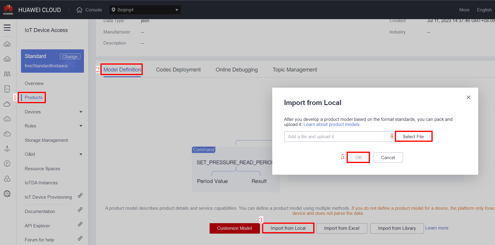
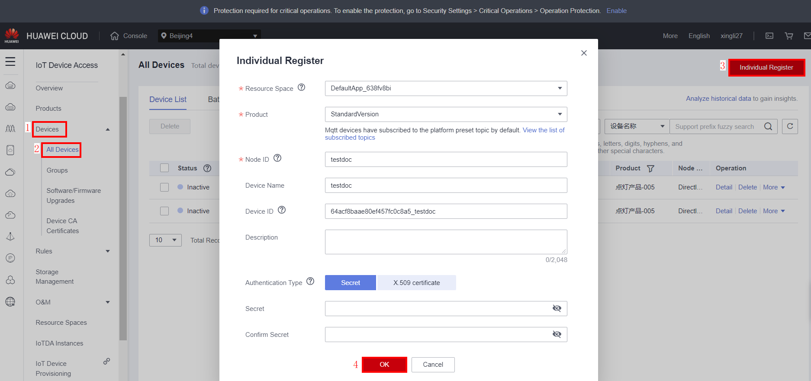
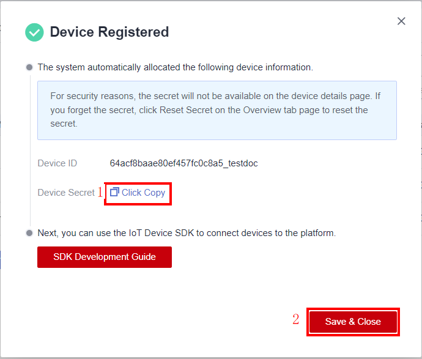
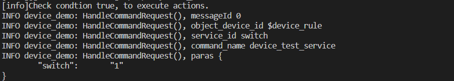
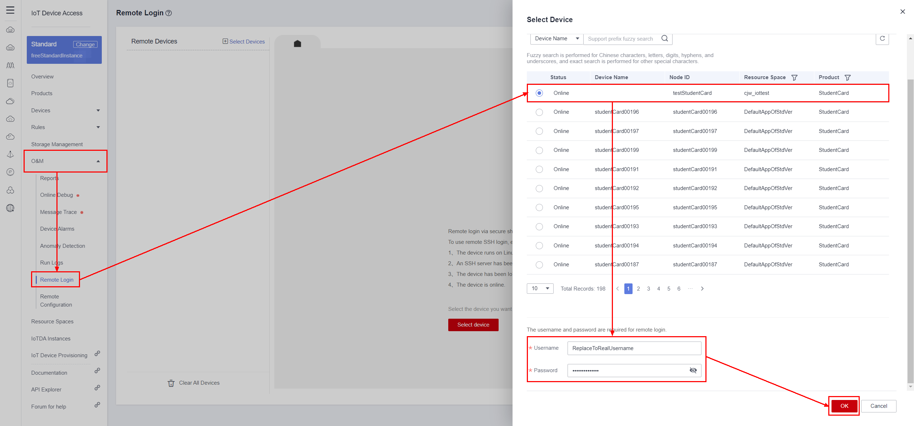
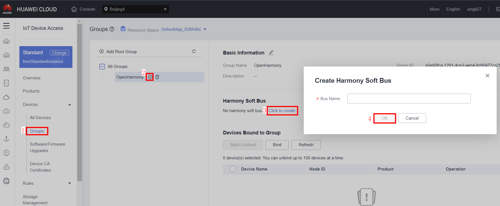
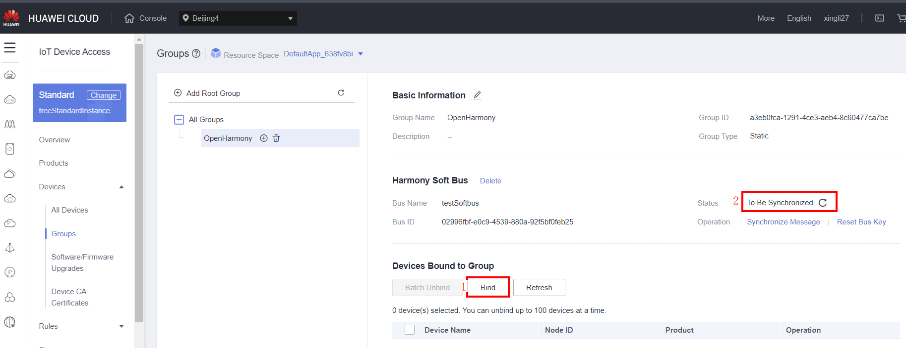

English | [Simplified Chinese](./README_CN.md)

#  huaweicloud-iot-device-sdk-c Development Guide

## Contents
<!-- TOC -->

- [0 Change History](#0)
- [1 About This Document](#1)
- [2 SDK Overview](#2)
- [3 Preparations](#3)
  -  [3.1 Environment Requirements](#3.1)
  -  [3.2 Compiling the OpenSSL Library](#3.2)
  -  [3.3 Compiling the paho Library](#3.3)
  -  [3.4 Compiling the zlib Library](#3.4)
  -  [3.5 Compiling the huawei_secure_c Library](#3.5)
  -  [3.6 Compiling the libssh Library](#3.6)
  -  [3.7 Compiling the libnopoll Library](#3.7)
  -  [3.8 Uploading a Product Model and Registering a Device](#3.8)
- [4 Quick Experience](#4)
- [5 Procedure](#5)
<!-- /TOC -->

<h1 id="0">0. Change History</h1>

| Version Number| Change Type| Description                                                |
| ------ | -------- | ------------------------------------------------------------ |
| 1.1.3  | Function enhancement | update conf\rootcert.pem          |
| 1.1.2  | New feature  | Device rules, M2M, GN compilation file, anomaly detection, timestamp printed in logs, MQTT_DEBUG, Chinese cryptographic algorithm, remote configuration, and device-cloud secure communication (soft bus) were added.|
| 1.1.1  | New feature  | SSH remote O&M function was added.                                         |
| 1.1.0  | New feature  | MQTT 5.0 was supported. The code was optimized to resolve the memory overflow issue.                 |
| 1.0.1  | Function enhancement| The application scenarios where MQTTS does not verify the platform public key, using TLS version is V1.2, and adding message storage examples were added.|
| 0.9.0  | New feature  | The API for the gateway to update the child device status was added.                                  |
| 0.8.0  | Function enhancement| The access domain name (iot-mqtts.cn-north-4.myhuaweicloud.com) and root certificate were added.<br>If the device uses the old domain name (iot-acc.cn-north-4.myhuaweicloud.com) for access, use the v0.5.0 SDK.|
| 0.5.0  | Function enhancement| The device access address and the CA certificate matching IoTDA were preset in the SDK.           |

1. Generic-protocol access was added.

2. Bootstrap scenario was added.

3. Encapsulation of SDK downstream payload structure was added.

4. Compressed message and property reporting were added.

5. Implicit subscription was added.

6. Context callback parameters were added.

7. English description was added.

8. The functions of adding and deleting a child device on a gateway were added.

9. Time synchronization function was added.

10. The API for reporting device logs was added.

11. The API for reporting device information was added.

12. The compatibility description of certificates of different versions was added.

13. Configurable timestamp verification was added.

14. The .so library file can be automatically generated.

15. The application scenario where MQTTS does not verify the platform public key was added.

16. The TLS version is V1.2.

17. Message storage examples were added.

18. File uploading/downloading were added.

19. MQTT5.0 was supported.

20. Device-side rules were supported.

21. SSH remote login function was added.

22. The M2M function was added.

23. The GN compilation file was added.

24. The device information abstraction layer was added.

25. Anomaly detection was added.

26. The function of printing timestamps in logs was added.

27. MQTT_DEBUG was added.

28. Remote configuration was added.

29. Device-cloud secure communication (soft bus) was added.

30. Update server ca conf/rootcert.pem 

31. Optimize the timeout period for SSH remote reporting packets.

Sept 5, 2023

<h1 id="1">1 About This Document</h1>
This document uses an example to describe how to use **huaweicloud-iot-device-sdk-c** (SDK for short) to quickly connect MQTT devices to the Huawei Cloud IoT platform.

<h1 id="2">2. SDK Overview</h1>
The SDK is designed for embedded devices with powerful computing and storage capabilities. You can call SDK APIs to implement communication between devices and the platform. The SDK currently supports: 

- Product model: reporting device messages/properties/events and receiving the platform's commands/messages/events/requests for setting properties

- Child device message forwarding and child device management

- Over-the-air (OTA) upgrades

- Secret authentication and certificate authentication for device access

- Topic customization

- Device shadow query

- Custom log collection

- Device-side rules

- SSH remote login

- Interconnection with edge M2M devices

**SDK Directory Structure**


<h1 id="3">3. Preparations</h1>
<h2 id="3.1">3.1 Environment Requirements</h2>
The SDK must run on the Linux OS, and GCC (version 4.8 or later is recommended) must be installed. The SDK depends on the OpenSSL and Paho libraries. If you have your own compilation chains, compile these library files. For details about the common GCC compilation procedure in Linux, see section 3.2 and 3.3.  

<h2 id="3.2">3.2 Compiling the OpenSSL Library</h2>

1. Visit the OpenSSL website (https://www.openssl.org/source/), download the latest OpenSSL version (for example, **openssl-1.1.1d.tar.gz**), upload it to the Linux compiler (for example, in the directory **/home/test**), and run the following command to decompress the package: 

   ```shell
   tar -zxvf openssl-1.1.1d.tar.gz 
   ```
   

2. Generate a **Makefile**.
   Run the following command to access the OpenSSL source code directory:

   ```shell
   cd openssl-1.1.1d
   ```

   Run the following configuration command: 

   ```shell
   ./config shared --prefix=/home/test/openssl --openssldir=/home/test/openssl/ssl 
   ```

   **prefix** is a custom installation directory, **openssldir** is a custom directory that stores configuration files, and **shared** is used to generate a dynamic link library (.so library).

   If an exception occurs during the compilation, add **no-asm** to the configuration command (indicating that the assembly code is not used).

   ```shell
   ./config  no-asm shared --prefix=/home/test/openssl --openssldir=/home/test/openssl/ssl
   ```

   

3. Generate library files.
   In the OpenSSL source code directory, run the following command to add dependencies:

   ```shell
   make depend
   ```

   Run the following command to start compilation:

   ```shell
   make
   ```

   Run the following command to install:

   ```shell
   make install
   ```

   In the OpenSSL installation directory **home/test/openssl**, find the **lib** folder.

   Find the library files (**libcrypto.so.1.1** and **libssl.so.1.1**) and soft links (**libcrypto.so** and **libssl.so**). Copy these files to the **lib** folder of the SDK and copy the **openssl** folder in the **home/test/openssl/include** directory to the **include** folder of the SDK.

   

4. To use the TLS for Chinese cryptographic algorithm, download [the corresponding version of OpenSSL](https://github.com/jntass/TASSL-1.1.1). The installation method is the same as that of native OpenSSL. Based on OpenSSL 1.1.1s, this version is compatible with various native OpenSSL APIs and supports international TLS.

<h2 id="3.3">3.3 Compiling the Paho Library</h2>

1. Visit https://github.com/eclipse/paho.mqtt.c to download the **paho.mqtt.c** source code. The files of version 1.3.9 or earlier in the release version are recommended. For the latest version, the number of lines in the file and the header files to be copied may be changed.

2. Decompress the package and upload it to the Linux compiler.

3. Edit the **Makefile**.
	- Run the following command to edit the **Makefile**:
	  
	  ```shell
	  vim Makefile
	  ```
	  
	- Run the following command to display the number of lines:
	  
	  ```shell
	  :set nu
	  ```
	  
	- Add the following two lines after **DOXYGEN_COMMAND** (locations of the OpenSSL header files and library files customized in [3.2](#3.2)):
	  
	  ```makefile
	  CFLAGS += -I/home/test/openssl/include  
	  LDFLAGS += -L/home/test/openssl/lib -lrt 
	  ```
	  
	  
	  
	- Add the header file reference of the OpenSSL to the **CCFLAGS_SO** and add library file references to **LDFLAGS_CS**, **LDFLAGS_AS**, and **FlagS_EXES**. (The reference is added by default in some updated versions of Paho libraries. In this case, you do not need to modify the reference.)
	  
	
4. Compile the code.
	- Run the following command:
	  
	  ```shell
	  make clean
	  ```
	  
	- Run the following command:
	  
	  ```shell
	  make
	  ```
	
5. After the compilation is complete, you can view the libraries that are compiled in the **build/output** directory.
	

6. Copy Paho library files.
	Currently, the SDK uses only **libpaho-mqtt3as**. Copy the **libpaho-mqtt3as.so**、**libpaho-mqtt3as.so.1** and **libpaho-mqtt3as.so.1.3** files to the **lib** folder of the SDK, and copy the header files (**MQTTAsync.h**, **MQTTClient.h**, **MQTTClientPersistence.h**, **MQTTProperties.h**, **MQTTReasonCodes.h**, and **MQTTSubscribeOpts.h**) in the **src** folder of the Paho source code directory to the **include/base** directory of the SDK. Alternatively, you can add all MQTT-related header files to the directory, as some versions of Paho libraries have the **MQTTExportDeclarations.h** header file. 


<h2 id="3.4">3.4 Compiling the zlib Library </h2>

1. Download the [zlib source code package](https://github.com/madler/zlib/archive/v1.2.11.zip).
	Run the following command to decompress the package:
   
   ```shell
   unzip zlib-1.2.11.zip
   ```
   
2. Run the following command to access the source code directory:

	```shell
	cd zlib-1.2.11
	```
	
3. Generate a **Makefile**.

   ```shell
   ./configure
   ```

4. Run the **Makefile**.

   ```shell
   make
   ```

5. Copy .so library files.
    Copy the **libz.so**, **libz.so.1**, and **libz.so.1.2.11** files generated in the source code directory to the **lib** folder of the SDK.

<h2 id="3.5">3.5 Compiling the huawei_secure_c Library </h2>

1. Download the [secure_c source code package](https://gitee.com/openeuler/libboundscheck/blob/master/README.en.md).

2. Access the source code directory and run the **Makefile** with the following command:

   ```shell
   make
   ```

3. Copy .so library files.
    Copy the **libboundscheck.so** files generated in the source code of **lib** directory to the **lib** folder of the SDK.

<h2 id="3.6">3.6 Compiling the libssh Library</h2>

1. Download the [libssh source code package](https://www.libssh.org/files/0.10/libssh-0.10.4.tar.xz).
	Run the following command to decompress the package:
   
   ```shell
   tar xvf libssh-0.10.4.tar.xz
   ```
   
2. Run the following command to access the source code directory:

	```shell
	cd libssh-0.10.4
	```
	
3. Run the following commands to compile the library files:

   ```shell
   mkdir build
   cd build
   cmake ..
   make
   ```

4. Run the following command to install the lib:

	```shell
	sudo make install  
	```
	
5. Copy .so library files and header files.
    Copy the **libssh.so**, **libssh.so.4**, and **libssh.so.4.9.4** files generated in the source code directory **build/lib** to the **lib** folder of the SDK.
   Copy the **libssh** folder in the **usr/local/include** directory to the **include** folder of the SDK.

<h2 id="3.7">3.7 Compiling the libnopoll Library</h2>

1. Download the [libnopoll source code package](http://www.aspl.es/nopoll/downloads/nopoll-0.4.8.b429.tar.gz).
	Run the following command to decompress the package:
   
   ```shell
   tar xzvf nopoll-0.4.8.b429.tar.gz
   ```
   
2. Run the following command to access the source code directory:

	```shell
	cd nopoll-0.4.8.b429
	```
	
3. Run the following commands to compile and install the library files:

   ```shell
   ./configure
    make
    sudo make install
    pkg-config nopoll --cflags
    pkg-config nopoll --libs  
   ```

4. Copy .so library files.
    Copy the **libnopoll.so**, **libnopoll.so.0**, and **libnopoll.so.0.0.0** files generated in the source code directory **src/.libs** to the **lib** folder of the SDK.
   Copy the **nopoll** folder in the **usr/local/include** directory to the **include** folder of the SDK.

<h2 id="3.8">3.8 Uploading a Product Model and Registering a Device</h2>

1. To import the developed profile (product model) to the console, choose **Products** in the navigation pane, click **Model Definition** on the displayed page, click **Import from Local**, select **Add File**, select a file, and click **OK**.
   
	

2. Choose **Device** > **All Devices** in the navigation pane, click **Individual Register** in the upper right corner, select the resource space where the product is located, select the product, enter the node ID (IMEI or MAC address), and customize the device name. If you do not customize the secret, the value is automatically generated by the platform. After all parameters are set, click **OK**.
	

3. You can copy the device secret and click **Save & Close**. The device ID and device secret are automatically downloaded to the local host in TXT format.

	

4. Choose **Devices** > **All Devices** in the navigation pane and you can see that the status of the newly created device is inactive.
	

<h1 id="4">4. Quick Experience</h1>

1. Copy the SDK package to the Linux environment and run the following command to decompress the package:
	
	**unzip  huaweicloud-iot-device-sdk-c-master.zip**
	
2. Run the following command to go to the decompressed folder:
	
	**cd huaweicloud-iot-device-sdk-c-master**

3. Modify configuration.
	You need to modify the following parameters in the **src/device_demo/device_demo.c** file: 
	**g_serverIp**: southbound IP address of IoTDA, which can be viewed on the overview page of the console.
    
	**g_username**: parameter required for using MQTT. The default value is device ID, which is returned during device registration.
	**g_password**: device secret, which is returned during device registration.
	

4. Run the **make** command to start compilation, It is recommended to use Makefile to compile.

	4.1 Run the following command to compile the file using **Makefile**:
   
        make (Delete -m64 from the Makefile in a 32-bit OS.)

   4.2 Run the following command to compile the file using GN, first install gn and ninja tools:

   
   
	```shell
	gn gen -C out
	ninja -C out
	cd out
	```
	
5. Run.

    5.1 Run the following command to load library files:

	  **export LD_LIBRARY_PATH=./lib/**

	  5.2 Run the following command:
	
	  **./MQTT_Demo**
	
	  You can view many printed logs on the console.
	  **login success** indicates that the device authentication is successful.  
	
	  **MqttBase_onSubscribeSuccess** indicates that the subscription is successful.  
	
	  **MqttBase_onPublishSuccess** indicates that the data has been published.  
	
	  

6. Check the running status of the device.
  - Gateway (online)
	  
	- Gateway (reporting data)
	  
	- Child device
	  - A gateway receives the notification of adding a child device from the platform.
	    
	  - A child device reports data.
	    
	  - Check the status of the child device.
	    - Child device (online)
	      
	    - Child device (reporting data)
	      
        
7. Device-side Rules
   
   7.1 Delivering Rules to a Device
   
   Log in to the IoTDA console, choose **Rules** > **Device Linkage**, and click `Create Rule`.
   
   
   
   Enter the rule name, select the **Device Side** mode, and select a device.
   
   
   
   Configure the rule.
   
   
   On the console, when the property is reported and the value of `PhV_phsA` is **9**, the rule on the device is triggered and the `HandleCommandRequest` is invoked.
   
   
   If a command is executed across devices, the callback function **IOTA_SetDeviceRuleSendMsgCallback** needs to be invoked. You need to implement the **HandleDeviceRuleSendMsg** function to parse and execute the command.
   
   
   7.2 Storing the Device-side Rules Locally
   
   After the device is restarted and no longer connected to the network, the configured device-side rules cannot be obtained from the cloud. Store the rules in a file so that they can still be read after the device restarts. To use this feature, the device must support the file system. You only need to provide a path for the **IOTA_EnableDeviceRuleStorage** API (invoked in **src/device_demo/device_demo.c**) to locally store rules on the device. Change the value **testdata.txt** of the macro definition **DEVICE_RULE_FILE_PATH** in **include/agentlite/iota_datatrans.h** to the target file storage path.

   

8. SSH Remote Login

  Before using the SSH remote login function, compile the libssh and libnopoll libraries by referring to [3.5 Compiling the libssh Library](#3.5) and [3.6 Compiling the libnopoll Library](#3.6). In addition, ensure that the device is online.

  Log in to the IoTDA console, choose **O&M** > **Remote Login** in the navigation pane, select an online device, enter the user name and password, and click **OK**.

   

   The ssh remote login can be realized after the operations. Now you can enter commands for interactive operation.

   

9. Connecting to the Edge M2M

   Currently, the SDK can be used to connect to the edge IoTEdge. The edge node forwards messages to the target device to implement the M2M function. Procedure:
  - 1. Set up an edge node, create a product, and add edge devices. For details, see Best Practices.
    https://support.huaweicloud.com/bestpractice-iotedge/iotedge_bestpractice_0050.html
  - 2. Use the required certificate. For details, see Best Practices.
    https://support.huaweicloud.com/bestpractice-iotedge/iotedge_bestpractice_0052.html

  Download the **plt-device-ca** certificate file, copy the certificate content, and use it to replace the content in the **conf/rootcert.perm** file in the sdk directory.

  This certificate is used by the device to verify the identity of the edge node.
  - 3. Replace port number.
        In the directory of **include/base/mqtt_base.h**, replace
    
      ```c
      #define MQTT_PORT         			    "1883"
      #define MQTTS_PORT         			    "8883"
      ```
    
      with
    
      ```C
      #define MQTT_PORT         				"7882"
      #define MQTTS_PORT         				"7883"
      ```

  - 4. Test the demo.
        Replace the following information in **src/device_demo/device_demo.c**.
    
      ```c
       char *g_serverIp = "xx.xx.xx.xx"; // IP address of the edge node.
      
       int g_port= 7883; // MQTTS port number. Currently, the IoT Edge uses this port number by default.
      
       char *g_username = "tunnelDeviceA"; // The value is set in step 1.
      
       char *g_password = "xxxx"; // The value is set in step 1.
      ```

  Assume that the IDs of source device A and target device B are **tunnelDeviceA** and **tunnelDeviceB** respectively. Device A sends a **hello world** message to device B.
  The following code is invoked on device A (the demo can be invoked in the **main** function):

   void Test_M2MSendMsg()
   {

     char *to = "deviceB";
     char *from = username;
     char *content = "hello deviceB";
     char *requestId = "demoIdToDeviceB";
     int messageId = IOTA_M2MSendMsg(to, from, content, requestId, NULL);
     ....
  At the receiving end (device B), the following received message is printed with the callback function **HandleM2mMessageDown**:

  void HandleM2mMessageDown(EN_IOTA_M2M_MESSAGE *rsp)
  {
   ...

    PrintfLog(EN_LOG_LEVEL_INFO, "device_demo: HandleM2mMessageDown(), requestId: %s\n", rsp->request_id);
    PrintfLog(EN_LOG_LEVEL_INFO, "device_demo: HandleM2mMessageDown(), to: %s\n", rsp->to);
    PrintfLog(EN_LOG_LEVEL_INFO, "device_demo: HandleM2mMessageDown(), from: %s\n", rsp->from);
    PrintfLog(EN_LOG_LEVEL_INFO, "device_demo: HandleM2mMessageDown(), content: %s\n", rsp->content);
  
    // You can add the service processing logic here, for example, the subsequent processing after the content is received.
    // do sth
  }

  The following information can be printed in terminal logs:
  Device A:

    DEBUG device_demo: this is m2m demo
    DEBUG iota_datatrans: IOTA_M2MSendMsg() with payload ==> {
          "request_id":   "demoIdToDeviceB",
          "to":   "deviceB",
          "from": "deviceA",
          "content":      "hello deviceB"
    }
    DEBUG device_demo: Test_M2MSendMsg() ok, messageId 0
  Device B:

    INFO device_demo: HandleM2mMessageDown(), requestId: demoIdToDeviceB
    INFO device_demo: HandleM2mMessageDown(), to:        deviceB
    INFO device_demo: HandleM2mMessageDown(), from:      deviceA
    INFO device_demo: HandleM2mMessageDown(), content:   hello deviceB


10. Device-cloud Secure Communication (with the OpenHarmony Soft Bus)


<h1 id="5">5. Procedure</h1> 

This section describes how to use some APIs. For more information about APIs, see **the API documentation**. 

- **Setting the log callback function**

The SDK provides log callback functions. You can call the **IOTA_SetPrintLogCallback** function as required. For details, see the API documentation. Refer to **IOTA_SetPrintLogCallback** called by the **main()** function in the **device_demo** (**device_demo.c** in the **src/device_demo** folder, hereinafter referred to as demo).

  `void IOTA_SetPrintLogCallback(PFN_LOG_CALLBACK_HANDLER pfnLogCallbackHandler)`

  - To print logs on the console, refer to **vprintf(format, args)** set in the **myPrintLog** function in the demo.
  - To print logs to the system log file, refer to the **vsyslog(level, format, args)** set in the **myPrintLog** function in the demo. In addition, **#include "syslog.h"** and **#define _SYS_LOG** should be contained.
  
- **Initializing resources**

Before initiating services, call the **IOTA_Init()** API to initialize AgentLite resources. For details, see the API documentation. Refer to **IOTA_Init()** called by the **main()** function in the demo.

`IOTA_Init(HW_CHAR *workPath)`

- **Configuring device binding**

Before connecting a device to the platform, set the IP address, port, device ID, and secret. Refer to **setAuthConfig()** called by the **main()** function in the demo.

```c

void setAuthConfig(){
  IOTA_ConfigSetStr(EN_IOTA_CFG_MQTT_ADDR, g_serverIp);
  IOTA_ConfigSetUint(EN_IOTA_CFG_MQTT_PORT, g_port);
  IOTA_ConfigSetStr(EN_IOTA_CFG_DEVICEID, g_username);
  IOTA_ConfigSetStr(EN_IOTA_CFG_DEVICESECRET, g_password);
  IOTA_ConfigSetUint(EN_IOTA_CFG_AUTH_MODE, EN_IOTA_CFG_AUTH_MODE_SECRET); // Secret mode
  IOTA_ConfigSetUint(EN_IOTA_CFG_CHECK_STAMP_METHOD, EN_IOTA_CFG_CHECK_STAMP_OFF);
/**
  * Configuration is required in certificate mode:
  *
  * IOTA_ConfigSetUint(EN_IOTA_CFG_AUTH_MODE, EN_IOTA_CFG_AUTH_MODE_CERT);
  * IOTA_ConfigSetStr(EN_MQTT_CFG_PRIVATE_KEY_PASSWORD, "yourPassword");
* */  

  #ifdef _SYS_LOG
//IOTA_ConfigSetUint(EN_IOTA_CFG_LOG_LOCAL_NUMBER, LOG_LOCAL7);
  IOTA_ConfigSetUint(EN_IOTA_CFG_LOG_LEVEL, LOG_INFO);
  #endif

}
```

The IP (**EN_IOTA_CFG_MQTT_ADDR**) and port (**EN_IOTA_CFG_MQTT_PORT**) of the platform can be obtained from the application interconnection information on the SP portal.  

The device ID (**EN_IOTA_CFG_DEVICEID**) and device secret (**EN_IOTA_CFG_DEVICESECRET**) are returned during device registration.  

The timestamp verification mode (**EN_IOTA_CFG_CHECK_STAMP_METHOD**) can be set to **EN_IOTA_CFG_CHECK_STAMP_OFF**. The sha256 (**EN_IOTA_CFG_CHECK_STAMP_SHA256**) or sm3 (**EN_IOTA_CFG_CHECK_STAMP_SM3**) can be used for hashing algorithm verification.

When **_SYS_LOG** is defined (printing a log in the system file), the facility type (**EN_IOTA_CFG_LOG_LOCAL_NUMBER**) and display level (**EN_IOTA_CFG_LOG_LEVEL**) of the log can be customized as required.

- **Configuring callback function**

You can set callback functions for actions such as device authentication success/failure, device disconnection success/failure, device message subscription success/failure, device message publishment success/failure, and device message/command receiving. Refer to **setMyCallbacks()** called by **main()** function in the demo.

```c
void setMyCallbacks(){	
  	IOTA_SetProtocolCallback(EN_IOTA_CALLBACK_CONNECT_SUCCESS, HandleConnectSuccess);
	IOTA_SetProtocolCallback(EN_IOTA_CALLBACK_CONNECT_FAILURE, HandleConnectFailure);

	IOTA_SetProtocolCallback(EN_IOTA_CALLBACK_DISCONNECT_SUCCESS, HandleDisConnectSuccess);
	IOTA_SetProtocolCallback(EN_IOTA_CALLBACK_DISCONNECT_FAILURE, HandleDisConnectFailure);
	IOTA_SetProtocolCallback(EN_IOTA_CALLBACK_CONNECTION_LOST, HandleConnectionLost);

	IOTA_SetProtocolCallback(EN_IOTA_CALLBACK_SUBSCRIBE_SUCCESS, HandleSubscribesuccess);
	IOTA_SetProtocolCallback(EN_IOTA_CALLBACK_SUBSCRIBE_FAILURE, HandleSubscribeFailure);

	IOTA_SetProtocolCallback(EN_IOTA_CALLBACK_PUBLISH_SUCCESS, HandlePublishSuccess);
	IOTA_SetProtocolCallback(EN_IOTA_CALLBACK_PUBLISH_FAILURE, HandlePublishFailure);

	IOTA_SetMessageCallback(HandleMessageDown);
	IOTA_SetUserTopicMsgCallback(HandleUserTopicMessageDown);
	IOTA_SetCmdCallback(HandleCommandRequest);
	IOTA_SetPropSetCallback(HandlePropertiesSet);
	IOTA_SetPropGetCallback(HandlePropertiesGet);
	IOTA_SetEventCallback(HandleEventsDown);
	IOTA_SetShadowGetCallback(HandleDeviceShadowRsp);
}
```

	- The **HandleConnectSuccess** function is called when a device is authenticated. 
	- The **HandleConnectFailure** function is called when a device fails to be authenticated. 
	- The **HandleDisConnectSuccess** function is called when a device proactively disconnects from the platform.
	- The **HandleDisConnectFailure** function is called when a device fails to proactively disconnect from the platform.
	- The **HandleConnectionLost** function is called when the connection between a device and the platform is lost.
	- The **HandleSubscribesuccess** function is called when a device subscribes to a message.
	- The **HandleSubscribeFailure** function is called when a device fails to subscribe to a message.
	- The **HandlePublishSuccess** function is called when device data is published.
	- The **HandlePublishFailure** function is called when device data fails to be published.
	- The **HandleMessageDown** function is called when a device receives the unparsed data message (default topic) from the platform.
	- The **HandleUserTopicMessageDown** function is called when a device receives the unparsed data message (custom topic) from the platform.
	- The **HandleCommandRequest** function is called when a device receives a command.
	- The **HandlePropertiesSet** function is called when a device receives the request for setting device properties.
	- The **HandlePropertiesGet** function is called when a device receives the request for querying device properties.
	- The **HandleEventsDown** function is called when a device receives the notification of an event (a child device addition or deletion event or an OTA event).
	- The **HandleDeviceShadowRsp** function is called when a device receives the device shadow data.

- **Device authentication**
  
  After callback functions are set, call the authentication function. For details, see the invoking of this API in the demo:
  
  **HW_INT IOTA_Connect()**
  
  After the API is called, the message **login success** is displayed. It is recommended that you report data several seconds after a device is authenticated, or process services via the invoked callback function.
  
  The gateway is online.
  
You can press **Ctrl+C** to stop the program. After that, the device is offline.
  
- **Reporting device messages/properties**
  
  After a device is authenticated, a gateway can call SDK APIs to report device messages and properties. In addition, the gateway can report the command execution result, property setting result, and property query result. It is recommended that the interval for reporting data is greater than or equal to hundreds of milliseconds.
  
  - API for reporting a device message:
    
    `HW_API_FUNC HW_INT IOTA_MessageReport(HW_CHAR *object_device_id, HW_CHAR *name, HW_CHAR *id, HW_CHAR *content, HW_CHAR *topicParas, HW_INT compressFlag, void *context);`
    The data reported via this API is not parsed by the platform. It can be forwarded to other services or pushed to the application server. **object_device_id** indicates the device to be reported. **name** indicates the message name. **id** indicates the message ID. **content** indicates the content to be reported. **topicParas** indicates the parameters of the custom topic. If this parameter is set to **NULL**, the default topic of the platform is used to report data. Refer to the **Test_MessageReport** function in the demo. For details about the parameters, see the API documentation.
    
```c
static void Test_MessageReport()
{
    // default topic
    int messageId = IOTA_MessageReport(NULL, "data123", "123", "hello123123123123", NULL, 0, NULL);

    // user topic
    // int messageId = IOTA_MessageReport(NULL, "data123", "123", "hello", "devMsg", 0, NULL);
    if (messageId != 0) {
        PrintfLog(EN_LOG_LEVEL_ERROR, "device_demo: Test_MessageReport() failed, messageId %d\n", messageId);
    }
}
```

  - API for reporting device properties:
    
    `HW_INT IOTA_PropertiesReport(ST_IOTA_SERVICE_DATA_INFO pServiceData[], HW_INT serviceNum)`
    
    The data reported via this API is parsed by the platform and the data in the structure must be the same as the properties defined in the product model. **ST_IOTA_SERVICE_DATA_INFO** indicates a structure array. A gateway can report multiple services at the same time. **serviceNum** indicates the number of services to be reported. Refer to the **Test_propertiesReport** function in the demo. For details about the parameters, see the API documentation.
    
```c
void Test_propertiesReport() {
  int serviceNum = 2; // Number of services to be reported by a gateway
  ST_IOTA_SERVICE_DATA_INFO services[serviceNum];

  //---------------the data of service1-------------------------------
  char *service1 = "{\"Load\":\"5\",\"ImbA_strVal\":\"6\"}";
  //   services[0].event_time = GetEventTimesStamp(); //you need to free the services[0].event_time
  services[0].event_time = NULL;
  services[0].service_id = "parameter";
  services[0].properties = service1;

  //---------------the data of service2-------------------------------
  char *service2 = "{\"PhV_phsA\":\"4\",\"PhV_phsB\":9}";
  //	services[1].event_time =  GetEventTimesStamp(); //you need to free the services[1].event_time
  services[0].event_time = NULL;
  services[1].service_id = "analog";
services[1].properties = service2;

  int messageId = IOTA_PropertiesReport(services, serviceNum);
  if(messageId != 0) {
  	PrintfLog(EN_LOG_LEVEL_ERROR, "device_demo: Test_batchPropertiesReport() failed, messageId %d\n", messageId);
  }
}
```

- **Receiving device messages/commands/properties**
  
  After a device is authenticated and the callback function is set, it can receive commands from the platform. (The SDK automatically subscribes to related topics.) The following commands are available: message delivery, command delivery, device property setting, device property query, child device addition, and child device deletion. (For details, see the API documentation.) Note: IoTDA uses implicit subscription. Devices do not need to subscribe to the downstream system topic. Devices subscribe to the system topic whose QoS is 0 by default. Call the API to subscribe to another topic whose QoS is 1.
  
  - A device receives a data message.
	  
	  After receiving a message, the device processes it via a callback function. For details, see the **HandleMessageDown** function in the demo. (Set the callback function in advance.)
  
  - A device receives the command as defined in the product model.

    `HW_API_FUNC HW_VOID IOTA_SetCmdCallback(PFN_CMD_CALLBACK_HANDLER callbackHandler)`
    This API is used to set the command callback function. When a command is delivered from the cloud or a device-side rule is triggered, `callbackHandler` is called.
    ```c
    void HandleCommandRequest(EN_IOTA_COMMAND *command)
    {
        if (command == NULL) {
            return;
        }

        PrintfLog(EN_LOG_LEVEL_INFO, "device_demo: HandleCommandRequest(), messageId %d\n",
            command->mqtt_msg_info->messageId);

        PrintfLog(EN_LOG_LEVEL_INFO, "device_demo: HandleCommandRequest(), object_device_id %s\n",
            command->object_device_id);
        PrintfLog(EN_LOG_LEVEL_INFO, "device_demo: HandleCommandRequest(), service_id %s\n", command->service_id);
        PrintfLog(EN_LOG_LEVEL_INFO, "device_demo: HandleCommandRequest(), command_name %s\n", command->command_name);
        PrintfLog(EN_LOG_LEVEL_INFO, "device_demo: HandleCommandRequest(), paras %s\n", command->paras);
        PrintfLog(EN_LOG_LEVEL_INFO, "device_demo: HandleCommandRequest(), request_id %s\n", command->request_id);
        // Specific command can be implemented here.
        Test_CommandResponse(command->request_id); // response command
    }
    ```
    Registers a callback.
    ```c
    IOTA_SetCmdCallback(HandleCommandRequest);
    ```

    
    
  - A device receives the request for setting device properties.
	
	You can use the callback function to process the command. After receiving the request for setting device properties, call the **IOTA_PropertiesSetResponse** API to report the response. For details, see the **HandlePropertiesSet** function in the demo. (Set the callback function in advance.)

  - A device receives the request for querying device properties.
	
	You can use the callback function to process the command. After receiving the request for querying device properties, call the **IOTA_PropertiesGetResponse** API to report the response. For details, see the **HandlePropertiesGet** function in the demo. (Set the callback function in advance.)
	
  - The platform notifies a gateway of child device addition.
	
	You can use the callback function to process the command. After receiving the notification, call the **IOTA_BatchPropertiesReport** API to report child device data (view the reported data on the console). For details, see the **HandleEventsDown** function in the demo. (Set the callback function in advance.)
	
  - The platform notifies a gateway of child device deletion.
  
  
- **Reporting device data (child device)**
  
  A child device can report data in batch via the following API:
  
  `HW_INT IOTA_BatchPropertiesReport(ST_IOTA_DEVICE_DATA_INFO pDeviceData[], HW_INT deviceNum, HW_INT serviceLenList[])`
  
  The data reported via this API is parsed by the platform. The data in the structure must be the same as that defined in the product model. **ST_IOTA_DEVICE_DATA_INFO** indicates a structure array. Multiple child devices can report data at the same time and each child device can report multiple services. **deviceNum** indicates the number of child devices to report data. **serviceLenList** indicates the number of services reported by a child device. Refer to the **Test_batchPropertiesReport** function in the demo. For details about parameters, see the API documentation.

```c
void Test_BatchPropertiesReport() {
  int deviceNum = 1;      // Number of child devices to report data.
  ST_IOTA_DEVICE_DATA_INFO devices[deviceNum]; // Array hosting the structure of data to be reported by child devices.
  int serviceList[deviceNum];  // Number of services to be reported by each child device.
  serviceList[0] = 2;       // **Device 1** needs to report two services.
  //	serviceList[1] = 1;		  // **Device 2** needs to report one service.
  char *device1_service1 = "{\"Load\":\"1\",\"ImbA_strVal\":\"3\"}";     // Properties to be reported by **service 1** (in JSON format).
  char *device1_service2 = "{\"PhV_phsA\":\"2\",\"PhV_phsB\":\"4\"}";// Properties to be reported by **service 2** (in JSON format).
  devices[0].device_id = g_subDeviceId;
  devices[0].services[0].event_time = "20191209T081212Z";
  devices[0].services[0].service_id = "parameter";
  devices[0].services[0].properties = device1_service1;
  devices[0].services[1].event_time = "20191209T081212Z";
  devices[0].services[1].service_id = "analog";
  devices[0].services[1].properties = device1_service2;
  //	char *device2_service1 = "{\"AA\":\"2\",\"BB\":\"4\"}";
  //	devices[1].device_id = "subDevices22222";
  //	devices[1].services[0].event_time = "d2s1";
  //	devices[1].services[0].service_id = "device2_service11111111";
  //	devices[1].services[0].properties = device2_service1;
  int messageId = IOTA_BatchPropertiesReport(devices, deviceNum, serviceList);
  if(messageId != 0) {
  	printfLog(EN_LOG_LEVEL_ERROR, "device_demo: Test_BatchPropertiesReport() failed, messageId %d\n", messageId);
  }
}
```
- **Accessing using a certificate**

  The platform supports device access authentication using X.509 certificates. The access procedures are as follows:
  
  1. For details about how to create and upload a certificate, visit https://support.huaweicloud.com/usermanual-iothub/iot_01_0055.html.
  2. Set the following parameters in the SDK:
	  - Change the certificate and secret file names to **deviceCert.pem** and **deviceCert.key** respectively, and place the two files in the **conf** directory of the SDK.
	  - Refer to the **SetAuthConfig** function in the demo to set the mode for the device to access using a certificate.
```c
void SetAuthConfig() {
	IOTA_ConfigSetStr(EN_IOTA_CFG_MQTT_ADDR, g_serverIp);
	IOTA_ConfigSetUint(EN_IOTA_CFG_MQTT_PORT, g_port);
	IOTA_ConfigSetStr(EN_IOTA_CFG_DEVICEID, g_username);
	//	IOTA_ConfigSetStr(EN_IOTA_CFG_DEVICESECRET, g_password);
	//	IOTA_ConfigSetUint(EN_IOTA_CFG_AUTH_MODE, 	EN_IOTA_CFG_AUTH_MODE_SECRET);
	
	 IOTA_ConfigSetUint(EN_IOTA_CFG_AUTH_MODE, EN_IOTA_CFG_AUTH_MODE_CERT);
	 IOTA_ConfigSetStr(EN_MQTT_CFG_PRIVATE_KEY_PASSWORD, "yourPassword");
}   
```
- **TLS accessing using Chinese cryptographic algorithm**
  
  Currently, the SDK supports TLS access and data transmission using Chinese cryptographic algorithm. To use the Chinese cryptographic algorithm for communication, you need to download the corresponding version of OpenSSL. For details, see [3.2 Compiling the OpenSSL Library](#3.2).
  
  To use TLS, you need to install a patch for the **paho.mqtt.c-1.3.9/src/SSLSocket.c** file in the **paho_mqtt** open-source library. The patch installation method is as follows:
    1. Run the following command to decompress .**/generatingLib/gmtls.patch.zip** and obtain the patch file **gmtls.patch**:

        **unzip ./generatingLib/gmtls.patch.zip**
    2. Run the following command to patch **paho.mqtt.c-1.3.9/src/SSLSocket.c**:

        **patch -b ./generatingLib/paho.mqtt.c-1.3.9/src/SSLSocket.c ./generatingLib/gmtls.patch**
  
  ```c
  // Use the absolute path to read the certificate.
  const char *signCert = "/volume/tassl/iot-device-sdk-c/conf/gmcert_s/CS.cert.pem";
  const char *signKey = "/volume/tassl/iot-device-sdk-c/conf/gmcert_s/CS.key.pem";
  const char *encCert = "/volume/tassl/iot-device-sdk-c/conf/gmcert_e/CE.cert.pem";
  const char *encKey = "/volume/tassl/iot-device-sdk-c/conf/gmcert_e/CE.key.pem";
  const char *caPath = "/volume/tassl/iot-device-sdk-c/conf/GMCert_GMCA01.cert.pem";
  const char *passWord = NULL;
  ```

  After the patch is installed, you can check whether the preceding certificate path fields exist in **paho.mqtt.c-1.3.9/src/SSLSocket.c**. With password login mode, you do not need to enter the signature certificate, private key, encryption certificate, and private key path. But with certificate login mode, you need to enter the absolute path to access the file. After the modification, recompile the Paho library.

- **Customizing topic**

  For details, see **the API documentation** in the home directory.

- **Conducting OTA upgrade**

  For details, see **the API documentation** in the home directory.

- **Querying device shadow**

  For details, see **the API documentation** in the home directory.
  
- **Accessing with generic protocol** 

	[Generic-Protocol Access Demo](./doc/doc_cn/generic_protocol.md)

- **Bootstrap accessing** 
	You can provision devices to different regions with IoTDA. For details, go to https://support.huaweicloud.com/qs-iotps/iot_03_0006.html for more access examples. For details, see the user guide.
	You need to enable **device_demo.o** and **bootstrap_demo.o** in OBJS in **Makefile** in the home directory of the SDK.   
	
	

Currently, IoTDA uses certificates issued by two authoritative CAs: [DigiCert Global Root CA.](https://cacerts.digicert.com/DigiCertGlobalRootCA.crt.pem) and [GlobalSign Root CA - R3](https://valid.r3.roots.globalsign.com/). By default, the certificate in the **conf** directory is bound to the domain name of IoTDA basic edition. For details about how to switch to another IoTDA version, see [Obtaining Resources](https://support.huaweicloud.com/devg-iothub/iot_02_1004.html).

- **Compile and run the program.**
1. Copy the **huaweicloud-iot-device-sdk-c-master.zip** package to the Linux environment and run the following command to decompress the package:
	
	**unzip  huaweicloud-iot-device-sdk-c-master.zip**
	
2. Go to the following folder:
	
	**cd huaweicloud-iot-device-sdk-c-master**
	
3. Run the following command to perform compilation:
	
	**make**
	
4. Run the following SDK demo:
	
	**./MQTT_Demo**
	
- **Generating SDK library files**
  
  To generate a .so file, modify the **Makefile**. You can open the file using Notepad or run the **vim Makefile** to modify the file in the Linux environment. Press **i** to edit the file, and then run **wq!** to save the modification.
  
  - Add **-shared -fPIC** to CFLAGS.
    
  - Delete **device_demo.o** from OBJS.
    
  - Change the compiled TARGET file from **MQTT_Demo.o** to **libHWMQTT.so** (the file name can be customized).
    
  - Run the **make** command to generate the **libHWMQTT.so** file. 
    
    
  
- **Storing data in abnormal scenarios**
  
  IoTDA provides code to store, report, and resend property messages in abnormal scenarios. You can use the **Test_PropertiesStoreData()** function. **STORE_DATA_SWITCH** specifies whether to enable this function. By default, it is disabled with the **#define** added. You can delete the **#define** to enable the function.
  The new code is sample code. You can use the default dynamic two-dimensional arrays or other data structures as needed. It is recommended that the device stores the collected data and resends the data when the device link is normal.
  The running logic of this API is as follows:
  
- Storing the sensor data before reporting data. (Array is used by default, but you can use other data structures.)

    
  
- If a publish success response is received, the message is deleted from the container. Or the message will be sent again later.
  
    
  
  - After the network is recovered, the remaining data in the container is reported.
  


- **Using MQTT5.0**

  If you want to use MQTT5.0 (not the default MQTT3.1.1), uncomment **#define MQTTV5** in the **./include/util/mqttv5_util.h** file.

- **Using MQTT_DEBUG**

  To use the MQTT_DEBUG function, change the value of **MQTT_TRACE_ON** to **1** in the **./include/util/mqtt_base.h** file.
  **MQTT_TRACE_LEVEL** indicates the log level. The default value is **MQTTASYNC_TRACE_MAXIMUM**, which is the highest level.

  Log levels are described as follows:

  |        Log levels        |                 significance                  |
  | :----------------------: | :-------------------------------------------: |
  | MQTTASYNC_TRACE_MAXIMUM  |      only print log contains fatal error      |
  |  MQTTASYNC_TRACE_MEDIUM  |        only print log has severe error        |
  | MQTTASYNC_TRACE_MINIMUM  |  lesser log, only print when error happened   |
  | MQTTASYNC_TRACE_PROTOCOL |      only print log about mqtt protocol       |
  |  MQTTASYNC_TRACE_ERROR   |                   print all                   |
  |  MQTTASYNC_TRACE_SEVERE  |                   print all                   |
  |  MQTTASYNC_TRACE_FATAL   | print all, include memory allocation and free |

  When **LOG_FILE_ENABLE** is set to **1**, logs are exported to the file path specified by **LOG_FILE_NAME**. When **LOG_FILE_ENABLE** is set to **0**, logs are directly output.

- **Performing remote configuration**

  Configuration parameters can be remotely delivered. The SDK receives related information through **event/down**. You can register a customized callback hook function through **IOTA_SetDeviceConfigCallback**. The function processes related data after receiving configuration information.

- **Using soft bus**

  You can group and connect devices with the soft bus function of IoTDA. IoTDA can manage security groups and deliver credit identifiers for communication between group members.

  Log in to the IoTDA console, choose **Devices** > **Groups** in the navigation pane, create a child group, create a Harmony soft bus, and customize its name.

  

  To bind a device, click **Bind**, select the device to be bound to the group, and synchronize the soft bus information.

  

  You can call **IOTA_GetLatestSoftBusInfo** to obtain the soft bus information of the device.
  You can obtain the version of the updated soft bus from the callback function **HandlePropertiesSet** delivered by the device shadow.

- **Automatic reconnection**

  `src/device_demo/device_demo.c` provides two reconnection modes that cannot be used at the same time. You can use the macro `CUSTOM_RECONNECT_SWITCH` to choose one mode.

    1. The `CUSTOM_RECONNECT_SWITCH` macro is not defined. In this case, reconnection is performed with the callback functions of `HandleConnectFailure` and `HandleConnectionLost`. The MQTT disconnection will be detected in a timely manner. This method is recommended.

    2. The macro `CUSTOM_RECONNECT_SWITCH` is defined. In this case, a thread is used to simulate a timer. The `IOTA_IsConnected()` API is invoked every 30 seconds to check the connection status. If a disconnection is detected, reconnection is performed.


  The system uses the first mode by default, where the macro `CUSTOM_RECONNECT_SWITCH` is not defined.
  ```C
  void HandleConnectFailure(EN_IOTA_MQTT_PROTOCOL_RSP *rsp)
  {
      PrintfLog(EN_LOG_LEVEL_ERROR, "device_demo: HandleConnectFailure() error, messageId %d, code %d, messsage %s\n",
          rsp->mqtt_msg_info->messageId, rsp->mqtt_msg_info->code, rsp->message);
      PrintfLog(EN_LOG_LEVEL_ERROR, "device_demo: HandleConnectFailure() login again\n");

  #ifndef CUSTOM_RECONNECT_SWITCH
      // Backoff reconnection
      connect_failed_times++;
      if (connect_failed_times < 10) {
          TimeSleep(50);
      } else if (connect_failed_times < 50) {
          TimeSleep(2500);
      }

      int ret = IOTA_Connect();
      if (ret != 0) {
          PrintfLog(EN_LOG_LEVEL_ERROR, "device_demo: HandleAuthFailure() error, login again failed, result %d\n", ret);
      }
  #endif
  }

  ```

  To use the second mode, find the following code and uncomment the macro `CUSTOM_RECONNECT_SWITCH`.
  ```C
  // #define CUSTOM_RECONNECT_SWITCH
  ```

  You can use the `IOTA_IsConnected()` API to read the connection status for reconnection.
  ```C
  static void ReconnectRoutine(void *args)
  {
      (void)args;
      while (1) {
          PrintfLog(EN_LOG_LEVEL_DEBUG, "device_demo: need to reconnect: %s \n", IOTA_IsConnected() ? "no" : "yes");
          if (!IOTA_IsConnected()) {// Check the connection status.
              int ret = IOTA_Connect();
              if (ret != 0) {
                  PrintfLog(EN_LOG_LEVEL_ERROR, "device_demo: IOTA_Connect() error, result %d\n", ret);
              }
          }
          TimeSleep(30 * 1000); // 30s
      }
  }

  static void ReconnectDemo()
  {
      if (pthread_create(&reconnectThread, NULL, ReconnectRoutine, NULL) != NULL) {
          PrintfLog(EN_LOG_LEVEL_ERROR, "device_demo: create ReconnectionThread failed! ===================>\n");
      }
  }
  ```

## License

* In compliance with the BSD-3 open source license agreement
