[English](./README.md) | 简体中文

#  huaweicloud-iot-device-sdk-c 开发指南

## 目 录
<!-- TOC -->

- [0 版本更新说明](#0)
- [1 前言](#1)
- [2 SDK简介](#2)
- [3 准备工作](#3)
  -  [3.1 环境信息](#3.1)
  -  [3.2 编译openssl库](#3.2)
  -  [3.3 编译paho库](#3.3)
  -  [3.4 编译zlib库](#3.4)
  -  [3.5 编译华为安全库](#3.5)
  -  [3.6 编译libssh库](#3.6)
  -  [3.7 编译libnopoll库](#3.7)
  -  [3.8 上传profile及注册设备](#3.8)
- [4 快速体验](#4)
- [5 使用步骤](#5)
<!-- /TOC -->

<h1 id="0">0.版本更新说明</h1>

| 版本号 | 变更类型 | 功能描述说明                                                 |
| ------ | -------- | ------------------------------------------------------------ |
| 1.1.2  | 新功能   | 增加规则引擎、M2M、gn编译文件、异常检测、日志打印时间戳、MQTT_DEBUG、国密算法、远程配置、端云安全通信（软总线）功能 |
| 1.1.1  | 新功能   | 新增SSH远程运维功能                                          |
| 1.1.0  | 新功能   | 增加MQTT5.0功能，优化代码，修复内存溢出问题                  |
| 1.0.1  | 功能增强 | 增加mqtts不校验平台公钥场景、TLS版本为V1.2、增加消息存储样例等场景 |
| 0.9.0  | 新功能   | 增加网关更新子设备状态接口                                   |
| 0.8.0  | 功能增强 | 更换新的接入域名（iot-mqtts.cn-north-4.myhuaweicloud.com）和根证书。<br/>如果设备使用老域名（iot-acc.cn-north-4.myhuaweicloud.com）接入，请使用 v0.5.0版本的SDK |
| 0.5.0  | 功能增强 | sdk预置了设备接入地址及华为物联网平台配套的CA证书，支持对接华为云物联网平台。 |

1、增加泛协议接入场景

2、增加bootstrap场景

3、SDK下行payload结构体封装

4、增加压缩消息、属性上报

5、隐式订阅

6、增加context回调参数

7、增加英文说明

8、网关新增/删除子设备

9、增加时间同步功能

10、增加设备日志上报接口

11、增加设备信息上报接口

12、增加各版本证书兼容说明

13、是否校验时间戳可以配置

14、自动生成so库文件

15、增加mqtts不校验平台公钥场景

16、TLS版本为V1.2

17、增加消息存储样例

18、增加文件上传/下载功能

19、增加MQTT5.0协议

20、增加端侧规则引擎

21、增加SSH远程登录功能

22、增加M2M功能

23、增加gn编译文件

24、增加设备信息抽象层

25、增加异常检测

26、增加日志打印时间戳功能

27、增加MQTT_DEBUG功能

28、增加远程配置功能

29、增加端云安全通信（软总线）功能

*2023/05/06*

<h1 id="1">1.前言</h1>
本文通过实例讲述huaweicloud-iot-device-sdk-c（以下简称SDK）帮助设备用MQTT协议快速连接到华为物联网平台。

<h1 id="2">2.SDK简介</h1>
SDK面向运算、存储能力较强的嵌入式终端设备，开发者通过调用SDK接口，便可实现设备与物联网平台的上下行通讯。SDK当前支持的功能有：  

- 支持物模型：设备消息/属性/事件上报，设备命令/消息/属性/事件接收

- 支持子设备消息转发、子设备管理

- 支持OTA升级

- 支持密码认证和证书认证两种设备接入方式

- 支持自定义topic

- 支持设备影子查询

- 支持自定义日志收集能力

- 支持端侧规则引擎

- 支持SSH远程登录

- 支持对接边缘M2M

**SDK目录结构**


<h1 id="3">3.准备工作</h1>
<h2 id="3.1">3.1 环境信息</h2>
SDK需运行在Linux操作系统上，并安装好gcc（建议4.8及以上版本）。SDK依赖openssl库和paho库，如果开发者有自己的编译链，需要自行编译openssl/paho库文件。Linux通用的gcc编译步骤请参考章节3.2/3.3。   

<h2 id="3.2">3.2 编译openssl库</h2>

1. 访问openssl官网https://www.openssl.org/source ，下载最新版本openssl（如openssl-1.1.1d.tar.gz），上传到linux编译机上（以上传到目录/home/test为例），并使用如下命令解压：  

   tar -zxvf openssl-1.1.1d.tar.gz  
   

2. 配置生成makefile文件
   执行以下命令进入openssl源码目录：

   cd openssl-1.1.1d        
   
   运行如下配置命令：  

   ./config shared --prefix=/home/test/openssl --openssldir=/home/test/openssl/ssl  
   
   其中“prefix”是自定义安装目录，“openssldir”是自定义配置文件目录，“shared”作用是生成动态链接库（即.so库）。

   - 如果编译有问题配置命令加上no-asm（表示不使用汇编代码）
     
     ./config  no-asm shared --prefix=/home/test/openssl --openssldir=/home/test/openssl/ssl
     

3. 编译出库。
   在openssl源码目录下，运行make depend命令添加依赖：

   make depend  

   运行make命令开始编译：

   make

   再运行如下命令进行安装：

   make install

   在配置的openssl安装目录下home/test/openssl找到lib目录，有生成的库文件：

   libcrypto.so.1.1、libssl.so.1.1和软链接libcrypto.so、libssl.so，请将这些文件拷贝到SDK的lib文件夹下（同时将home/test/openssl/include底下的openssl文件夹拷贝到SDK的include目录下）。

   

4. 若需要使用国密TLS，可访问[国密版本openssl](https://github.com/jntass/TASSL-1.1.1)，安装方法同原生openssl。该版本当前基于openssl1.1.1s，兼容openssl各类原生接口，仍支持国际TLS。

<h2 id="3.3">3.3 编译paho库</h2>  
1. 访问github下载地址https://github.com/eclipse/paho.mqtt.c, 下载paho.mqtt.c源码(建议下载release版本中1.3.9及之前的版本的Source code (tar.gz)文件，如果使用最新的版本，下方适配的文件中的行数可能会有所改变，以及需要拷贝的头文件按照最新版本增加)。

2. 解压后上传到linux编译机。

3. 修改makefile
	- 通过如下命令进行编辑Makefile
	  
	  vim Makefile
	  
	- 显示行数
	  
	  :set nu
	
	- 在"DOXYGEN_COMMAND"之后添加下面两行（[3.2](#3.2)中自定义的openssl的头文件和库文件位置）
	  
	  CFLAGS += -I/home/test/openssl/include  
	  
	  LDFLAGS += -L/home/test/openssl/lib -lrt  
	  
	  
	  
	- 在CCFLAGS_SO中添加openssl的头文件引用、LDFLAGS_CS、LDFLAGS_AS以及FLAGS_EXES中添加库文件引用（随着paho版本的更新，有的版本会默认添加该引用，此时可不需要再修改）
	  
	
4. 编译
	- 执行清空命令：
	  
	  make clean
	  
	- 执行编译命令：
	  
	  make
	
5. 编译完成后，可以在build/output目录下看到编译成功的库。
	

6. 拷贝paho库文件
	当前SDK仅用到了libpaho-mqtt3as，请将文件libpaho-mqtt3as.so和libpaho-mqtt3as.so.1拷贝到SDK的lib文件夹下（同时将paho源码目录下src文件夹里的头文件（MQTTAsync.h/MQTTClient.h/MQTTClientPersistence.h/MQTTProperties.h/MQTTReasonCodes.h/MQTTSubscribeOpts.h）拷贝到SDK的include/base目录下，注意：有的paho版本会有 MQTTExportDeclarations.h 头文件，建议可以将MQTT相关的头文件都添加进去)。


<h2 id="3.4">3.4 编译zlib库</h2>  
1. 下载zlib源码https://github.com/madler/zlib/archive/v1.2.11.zip 
	通过如下命令解压缩：
   
   	unzip zlib-1.2.11.zip
   
2. 进入源码目录下：

	cd  zlib-1.2.11
	
3. 配置生成makefile文件

	./configure
	
4. 执行makefile文件

	make
	
5. 拷贝so库文件
	将源码目录下生成的libz.so、libz.so.1、libz.so.1.2.11拷贝到sdk的lib文件夹下。

<h2 id="3.5">3.5 编译华为安全函数库</h2>

1. 下载安全函数库源码https://gitee.com/openeuler/libboundscheck.git

2. 进入源码makefile同级目录，执行makefile文件

   make

3. 拷贝so库文件
    将源码目录下生成的lib文件夹下的libboundscheck.so拷贝到sdk的lib文件夹下。

<h2 id="3.6">3.6 编译libssh库</h2>

1. 下载libssh源码https://www.libssh.org/files/0.10/libssh-0.10.4.tar.xz
	通过如下命令解压缩：
   
   	tar xvf libssh-0.10.4.tar.xz
   
2. 进入源码目录下：

	cd libssh-0.10.4
	
3. 编译库文件：

    mkdir build
    cd build
    cmake ..
    make
	
4. 安装库：

	sudo make install
	
5. 拷贝so库文件和头文件
	将源码目录下生成的libssh.so、libssh.so.4、libssh.so.4.9.4拷贝到sdk的lib文件夹下。
    将/usr/local/include下的libssh的整个头文件目录拷贝到sdk的include文件夹下。

<h2 id="3.7">3.7 编译libnopoll库</h2>
1. 下载nopoll源码http://www.aspl.es/nopoll/downloads/nopoll-0.4.8.b429.tar.gz
	通过如下命令解压缩：
   
   	tar xzvf nopoll-0.4.8.b429.tar.gz
   
2. 进入源码目录下：

	cd nopoll-0.4.8.b429
	
3. 编译与安装

	./configure
    make
    make install
    pkg-config nopoll --cflags
    pkg-config nopoll --libs
	
4. 拷贝so库文件
	通过上一步获取到的路径，将源码目录下生成的libnopoll.so libnopoll.so.0 libnopoll.so.0.0.0拷贝到sdk的lib文件夹下。
    将/usr/local/include下的libnopoll的整个头文件目录拷贝到sdk的include文件夹下。

<h2 id="3.8">3.8 上传profile及注册设备</h2>     
1. 将已开发完成的profile（产品模型）导入到控制台，点击左侧导航栏“产品”，点击“模型定义”，再点击下方的“上传模型文件”，选择”添加文件“，选择文件后点击”确定“，即可完成profile导入。
   

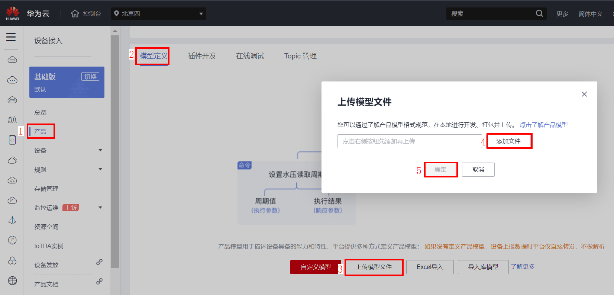

2. 点击“设备”->“所有设备”，点击右上角“注册设备”，选择产品所在的“资源空间”，选择上方创建的产品，填写设备标识码（一般是IMEI、MAC地址等），自定义“设备名称”，“密钥”如果不自定义，平台会自动生成。全部填写完毕后，点击“确定”。
	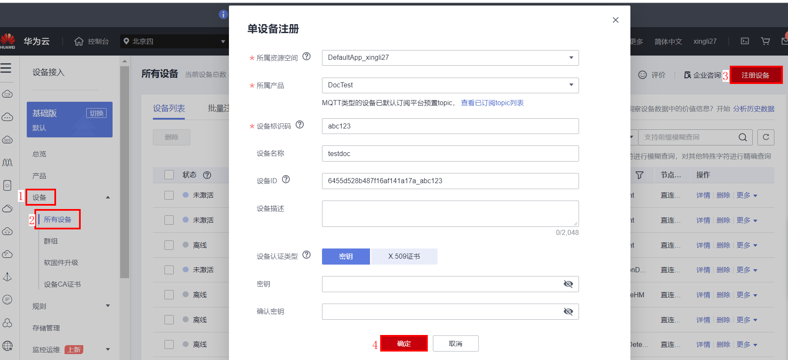

3. 可以直接复制设备秘钥，点击“保存并关闭”将自动将设备ID以及设备秘钥以txt文本形式下载到本地。

	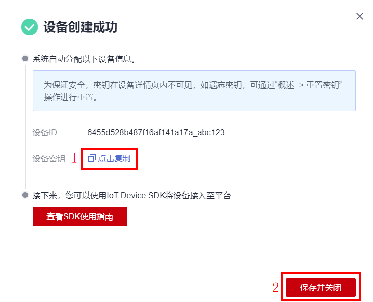

4. 点击”设备“->“所有设备”，在最上方可看到该设备的状态是未激活。
	

<h1 id="4">4.快速体验</h1>  
1. 将SDK压缩包拷贝到Linux环境中，通过如下命令解压：
	
	unzip  huaweicloud-iot-device-sdk-c-master.zip
	
2. 进入到解压的文件夹下：
	
	cd huaweicloud-iot-device-sdk-c-master

3. 修改配置信息：
	需要修改src/device_demo/device_demo.c文件中的如下参数：  
	g_serverIp：平台南向IP，可在控制台的应用管理中查看。
	g_username：MQTT协议需要填写username，iot平台默认设备ID为username，设备ID是设备注册时返回的值。
	g_password：设备密钥，设备注册时返回的值。
	

4. 执行命令进行编译：

	4.1 用Makefile进行编译：
   
        make（如果是32位的操作系统，请删除掉Makefile中的"-m64"）

   4.2 用gn进行编译：

        gn gen -C out
        ninja -C out
	
5. 运行：	
	- 加载库文件
	
	  export LD_LIBRARY_PATH=./lib/

	- 执行如下命令：
	
	  ./MQTT_Demo
	
	  在控制台上可以看到很多打印的日志：
	  “login success”表示设备鉴权成功   
	  
	  “MqttBase_onSubscribeSuccess”表示订阅成功   
	  
	  “MqttBase_onPublishSuccess”表示发布数据成功   
	  
	  

6. 查看设备运行情况：
  - 网关设备在线：
	  
	- 网关上报数据
	  
	- 子设备
	  - 接收平台下发的新增子设备通知
	    
	  - 子设备上报数据
	    
	  - 查看子设备状态
	    - 子设备在线
	      
	    - 子设备上报数据
	      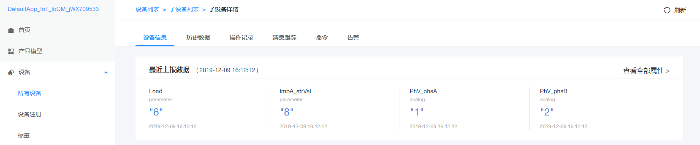
        
7. 端侧规则引擎
   
   7.1 下发端侧规则
   
   进入IoTDA控制台，在规则、设备联动页面上点击`创建规则`按钮,
   
   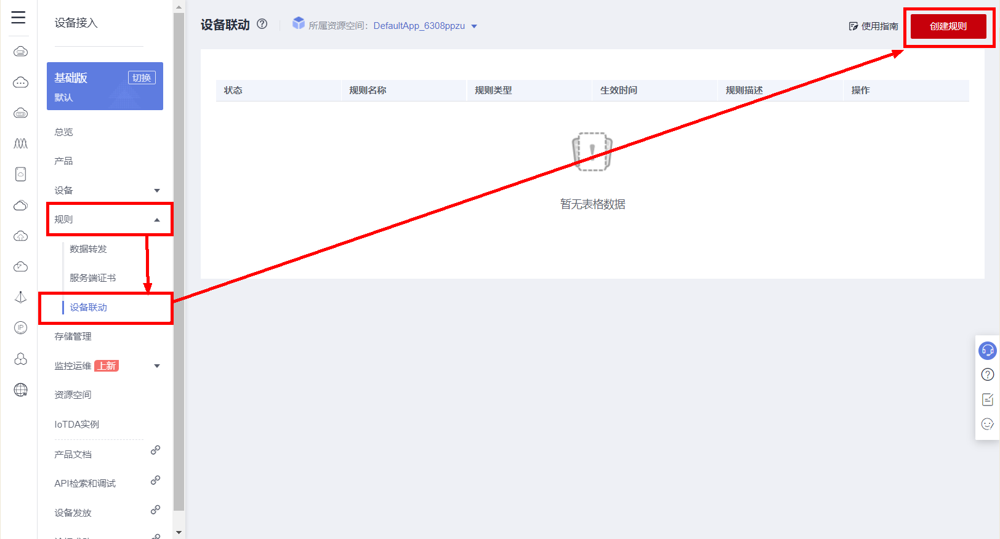
   
   填写规则名称，选中端侧执行然后选中设备：
   
   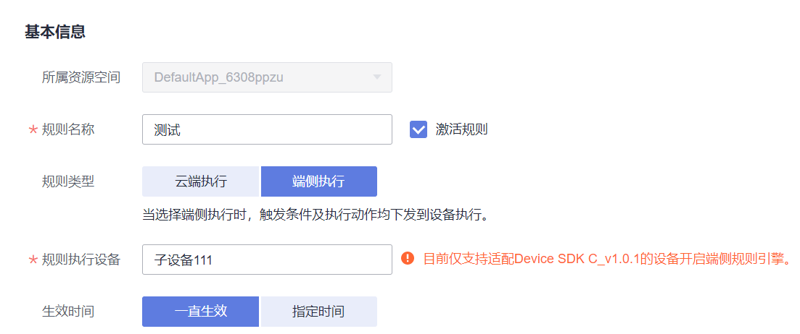
   
   配置端侧规则
   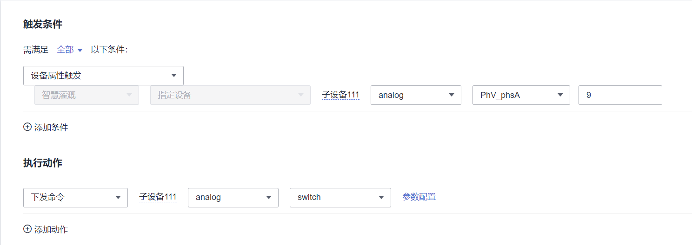
   
   在控制台中可以观察到当属性上报、`PhV_phsA`为"9"时，端侧规则触发执行, 从而调用`HandleCommandRequest`：
   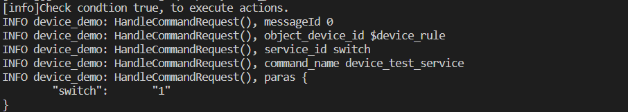
   
   如果是跨设备执行命令时，需要调用回调函数IOTA_SetDeviceRuleSendMsgCallback，用户需要自行实现以下功能：HandleDeviceRuleSendMsg，从中解析出命令并执行。
   
   
   7.2 端侧规则引擎支持本地存储
   
   当设备重启后若不再具备联网条件，将无法从云端拉取配置的端侧规则，进而导致设备端侧规则丢失。为满足该场景下不影响设备执行端侧规则，可以将云端配置的规则存储在文件中，设备重启后将从文件系统中读取规则。该特性要求设备支持文件系统。用户只需要提供一个路径给接口IOTA_EnableDeviceRuleStorage（该接口在src/device_demo/device_demo.c被调用），即可实现端侧规则本地存储。具体如下图，将include/agentlite/iota_datatrans.h中的宏定义DEVICE_RULE_FILE_PATH的值testdata.txt修改为自己的文件存储路径即可。

   

8.支持SSH远程登录

  使用SSH远程登录功能前，需参考[3.5 编译libssh库](#3.5)和[3.6 编译libnopoll库](#3.6)实现libssh和libnopoll库的编译，并且设备必须在线。

  如下图进入IoTDA控制台, 选择"监控运维——远程登录——{自己的在线设备}——输入用户名密码——确认"

   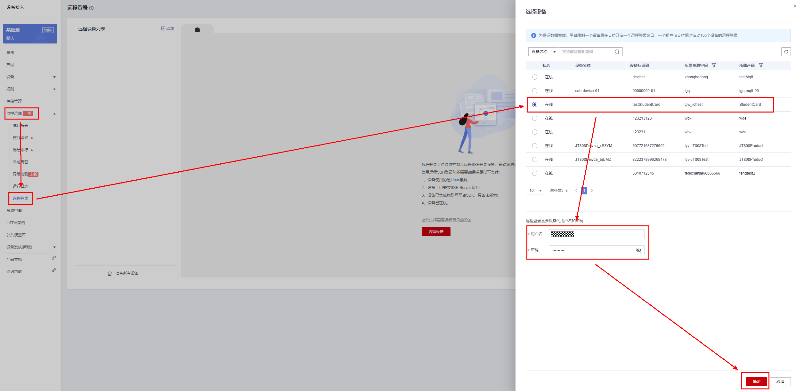

   如上图操作操作之后即可实现ssh远程登录。实现效果如下，可输入命令进行交互

   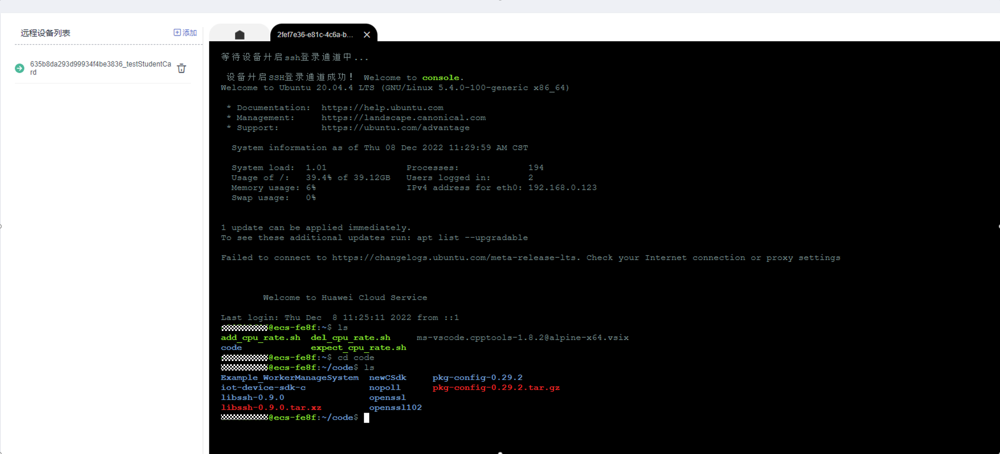

9.对接边缘M2M功能

   目前支持使用SDK对接边缘IoTEdge，边缘节点完成消息的中转到目标设备，从而实现M2M的功能。使用步骤如下：
  - 1.搭建边缘节点，创建产品，并添加边缘设备，参考如下最佳实践：
    https://support.huaweicloud.com/bestpractice-iotedge/iotedge_bestpractice_0050.html
  - 2.替换相应的证书：
    https://support.huaweicloud.com/bestpractice-iotedge/iotedge_bestpractice_0052.html

  下载其中的plt-device-ca证书文件，将证书内容拷贝并替换sdk目录当中conf/rootcert.perm文件中的内容。

  此证书用于设备校验边缘节点的身份。
  - 3.替换端口号：
    将include/base/mqtt_base.h中的：

  #define MQTT_PORT         				"1883"

  #define MQTTS_PORT         				"8883"

  替换为：

  #define MQTT_PORT         				"7882"

  #define MQTTS_PORT         				"7883"

  - 4.测试Demo：
    将src/device_demo/device_demo.c中边缘节点IP等信息进行替换：

  char *g_serverIp = "xx.xx.xx.xx"; // 边缘节点的IP

  int g_port = 7883; // MQTTS端口号, 目前IoTEdge默认使用此端口号

  char *g_username = "tunnelDeviceA"; // 上述步骤1当中设置

  char *g_password = "xxxx"; // 上述步骤1中设置

  假设源设备A和目标设备B的ID分别：tunnelDeviceA和tunnelDeviceB, 设备A向设备B发送"hello world"消息。
  在A设备当中调用如下代码（demo可在main函数中调用）:

   void Test_M2MSendMsg()
   {

     char *to = "deviceB";
     char *from = username;
     char *content = "hello deviceB";
     char *requestId = "demoIdToDeviceB";
     int messageId = IOTA_M2MSendMsg(to, from, content, requestId, NULL);
     ....
  在接收端(即B设备)，会在回调函数HandleM2mMessageDown中打印接收的消息：

  void HandleM2mMessageDown(EN_IOTA_M2M_MESSAGE *rsp)
  {
   ...

    PrintfLog(EN_LOG_LEVEL_INFO, "device_demo: HandleM2mMessageDown(), requestId: %s\n", rsp->request_id);
    PrintfLog(EN_LOG_LEVEL_INFO, "device_demo: HandleM2mMessageDown(), to: %s\n", rsp->to);
    PrintfLog(EN_LOG_LEVEL_INFO, "device_demo: HandleM2mMessageDown(), from: %s\n", rsp->from);
    PrintfLog(EN_LOG_LEVEL_INFO, "device_demo: HandleM2mMessageDown(), content: %s\n", rsp->content);
    
    // 用户可在此处加上业务处理逻辑，比如接收到content的后续处理
    // do sth
  }

  可以在终端日志中打印出如下信息：
  设备A:

    DEBUG device_demo: this is m2m demo
    DEBUG iota_datatrans: IOTA_M2MSendMsg() with payload ==> {
          "request_id":   "demoIdToDeviceB",
          "to":   "deviceB",
          "from": "deviceA",
          "content":      "hello deviceB"
    }
    DEBUG device_demo: Test_M2MSendMsg() ok, messageId 0
  设备B:

    INFO device_demo: HandleM2mMessageDown(), requestId: demoIdToDeviceB
    INFO device_demo: HandleM2mMessageDown(), to:        deviceB
    INFO device_demo: HandleM2mMessageDown(), from:      deviceA
    INFO device_demo: HandleM2mMessageDown(), content:   hello deviceB


10.端云安全通信（结合OpenHarmony软总线）


<h1 id="5">5.使用步骤</h1>  

以下是部分接口的使用指导，详细的功能请参考主目录下的**API文档**。  

- **设置日志回调函数**

SDK以日志回调函数的方式供开发者使用，开发者可以根据自己的需求调用IOTA_SetPrintLogCallback函数设置。具体API接口的参数使用请参考SDK API接口文档。可参考device_demo（在src/device_demo文件夹下的device_demo.c，以下简称为demo）中main()方法对IOTA_SetPrintLogCallback函数的调用。

  `void IOTA_SetPrintLogCallback(PFN_LOG_CALLBACK_HANDLER pfnLogCallbackHandler)`

  - 如果需要打印在控制台，可以参考demo中的myPrintLog函数中设置的vprintf(format, args);
  - 如果需要打印到系统日志文件中，可以参考demo中的myPrintLog函数中设置的vsyslog(level, format, args)函数。同时需要引入头文件#include "syslog.h"，并且定义宏#define _SYS_LOG。
  
- **初始化**

在发起业务前，需要先初始化Agent Lite相关资源，调用API接口IOTA_Init()，初始化Agent Lite资源。具体API接口的参数使用请参考Agent Lite API接口文档。可参考demo中main()方法对IOTA_Init()的调用。

`IOTA_Init(HW_CHAR *workPath)`

- **设备绑定配置**

设备连接到IoT平台之前，需配置平台的地址、端口、设备Id及设备密钥。可以参考demo中main()方法中调用的setAuthConfig()函数。

```c

void setAuthConfig(){
  IOTA_ConfigSetStr(EN_IOTA_CFG_MQTT_ADDR, g_serverIp);
  IOTA_ConfigSetUint(EN_IOTA_CFG_MQTT_PORT, g_port);
  IOTA_ConfigSetStr(EN_IOTA_CFG_DEVICEID, g_username);
  IOTA_ConfigSetStr(EN_IOTA_CFG_DEVICESECRET, g_password);
  IOTA_ConfigSetUint(EN_IOTA_CFG_AUTH_MODE, EN_IOTA_CFG_AUTH_MODE_SECRET); //密码模式
  IOTA_ConfigSetUint(EN_IOTA_CFG_CHECK_STAMP_METHOD, EN_IOTA_CFG_CHECK_STAMP_OFF);
/**
  * Configuration is required in certificate mode:
  *
  * IOTA_ConfigSetUint(EN_IOTA_CFG_AUTH_MODE, EN_IOTA_CFG_AUTH_MODE_CERT);
  * IOTA_ConfigSetStr(EN_MQTT_CFG_PRIVATE_KEY_PASSWORD, "yourPassword");
* */  

  #ifdef _SYS_LOG
//IOTA_ConfigSetUint(EN_IOTA_CFG_LOG_LOCAL_NUMBER, LOG_LOCAL7);
  IOTA_ConfigSetUint(EN_IOTA_CFG_LOG_LEVEL, LOG_INFO);
  #endif

}
```

平台的IP（EN_IOTA_CFG_MQTT_ADDR）、端口（EN_IOTA_CFG_MQTT_PORT）可以在SP portal的应用对接信息中获取；   

设备ID（EN_IOTA_CFG_DEVICEID）、设备密钥（EN_IOTA_CFG_DEVICESECRET）是注册设备的时候返回的。   

时间戳检验方式（EN_IOTA_CFG_CHECK_STAMP_METHOD）可设置不校验（EN_IOTA_CFG_CHECK_STAMP_OFF）、使用sha256（EN_IOTA_CFG_CHECK_STAMP_SHA256）或者国密sm3（EN_IOTA_CFG_CHECK_STAMP_SM3）做杂凑算法校验。

当定义了_SYS_LOG（日志打印在系统文件中）时，日志的facility类型（EN_IOTA_CFG_LOG_LOCAL_NUMBER）、日志的显示级别（EN_IOTA_CFG_LOG_LEVEL）可以按需自定义。

- **回调函数配置**

SDK针对设备鉴权成功/失败、设备断链成功/失败、设备订阅消息成功/失败、设备发布消息成功/失败、设备接收消息/命令等动作，以回调函数的方式供开发者调用，开发者可以针对不同的事件设置回调函数来实现业务处理逻辑。可以参考demo中main()方法中调用的setMyCallbacks()函数。

```c
void setMyCallbacks(){	
  	IOTA_SetProtocolCallback(EN_IOTA_CALLBACK_CONNECT_SUCCESS, HandleConnectSuccess);
	IOTA_SetProtocolCallback(EN_IOTA_CALLBACK_CONNECT_FAILURE, HandleConnectFailure);

	IOTA_SetProtocolCallback(EN_IOTA_CALLBACK_DISCONNECT_SUCCESS, HandleDisConnectSuccess);
	IOTA_SetProtocolCallback(EN_IOTA_CALLBACK_DISCONNECT_FAILURE, HandleDisConnectFailure);
	IOTA_SetProtocolCallback(EN_IOTA_CALLBACK_CONNECTION_LOST, HandleConnectionLost);

	IOTA_SetProtocolCallback(EN_IOTA_CALLBACK_SUBSCRIBE_SUCCESS, HandleSubscribesuccess);
	IOTA_SetProtocolCallback(EN_IOTA_CALLBACK_SUBSCRIBE_FAILURE, HandleSubscribeFailure);

	IOTA_SetProtocolCallback(EN_IOTA_CALLBACK_PUBLISH_SUCCESS, HandlePublishSuccess);
	IOTA_SetProtocolCallback(EN_IOTA_CALLBACK_PUBLISH_FAILURE, HandlePublishFailure);

	IOTA_SetMessageCallback(HandleMessageDown);
  // 推荐使用此API，可以处理自定格式的消息
	IOTA_SetRawMessageCallback(HandleRawMessageDown);
	IOTA_SetUserTopicMsgCallback(HandleUserTopicMessageDown);
  // 推荐使用此API，可以处理自定格式的消息
	IOTA_SetUserTopicRawMsgCallback(HandleUserTopicRawMessageDown);
	IOTA_SetCmdCallback(HandleCommandRequest);
	IOTA_SetPropSetCallback(HandlePropertiesSet);
	IOTA_SetPropGetCallback(HandlePropertiesGet);
	IOTA_SetEventCallback(HandleEventsDown);
	IOTA_SetShadowGetCallback(HandleDeviceShadowRsp);
}
```

	- 鉴权成功后，将调用HandleConnectSuccess函数；  
	- 鉴权失败后，将调用HandleConnectFailure函数；  
	- 设备主动断链成功后，将调用HandleDisConnectSuccess函数；
	- 设备主动断链失败后，将调用HandleDisConnectFailure函数；
	- 链接断开后，将调用HandleConnectionLost函数；
	- 订阅成功后，将调用HandleSubscribesuccess函数；
	- 订阅失败后，将调用HandleSubscribeFailure函数；
	- 发布数据成功后，将调用HandlePublishSuccess函数；
	- 发布数据失败后，将调用HandlePublishFailure函数；
	- 设备接收到平台不解析的透传消息（默认topic）后，将调用HandleRawMessageDown函数；如果消息符合系统格式将同时调用HandleMessageDown；
	- 设备接收到平台不解析的透传消息（自定义topic）后，将调用HandleUserTopicMessageDown函数；如果消息符合系统格式将同时调用HandleUserTopicMessageDown；
	- 设备接收到命令后，将调用HandleCommandRequest函数；
	- 设备接收到属性设置命令后，将调用HandlePropertiesSet函数；
	- 设备接收到属性查询命令后，将调用HandlePropertiesGet函数；
	- 设备接收到事件（子设备、OTA）相关命令后，将调用HandleEventsDown函数；
	- 设备接收到设备影子数据后，将调用HandleDeviceShadowRsp函数；

- **设备鉴权**
  
  回调函数设置完毕后，可以调用鉴权函数。可以参考demo中对该接口的调用：
  
  HW_INT IOTA_Connect()
  
  鉴权接口调用成功后，会打印“login success”的字样（建议鉴权成功后再进行数据上报，可以鉴权后sleep几秒钟，或者在鉴权成功的回调函数里进行业务处理）：
  
  同时，在控制台界面上可以看到网关设备已经在线：
  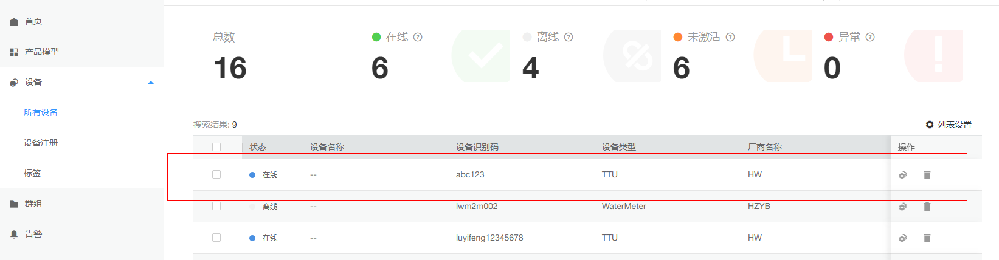
可以通过ctrl + c停止程序运行，程序停止后，可以在控制台界面上查看设备已离线。
  
- **设备消息/属性上报**
  
  设备鉴权通过后, 网关设备可以调用SDK的“设备消息上报”和“设备属性上报”接口上报数据，同时网关可以上报命令响应结果，建议上报数据的间隔不要小于几百毫秒，主要包括“平台命令下发响应”、“平台设置设备属性响应”、“平台查询设备属性响应”。
  
  - 设备消息上报接口：
    
    `HW_API_FUNC HW_INT IOTA_MessageReport(HW_CHAR *object_device_id, HW_CHAR *name, HW_CHAR *id, HW_CHAR *content, HW_CHAR *topicParas, HW_INT compressFlag, void *context);`
    
    通过该接口上报的数据平台不解析，数据可以转发到其他服务或者推送到应用服务器。object_device_id为需要上报的设备，name为消息名称，id为消息ID，content为上报的内容，topicParas是自定义topic的参数，NULL是用平台默认的topic上报数据。具体参数说明请查看API文档，可以参考demo中Test_MessageReport函数对该接口的调用。
    
```c
static void Test_MessageReport()
{
    // default topic
    int messageId = IOTA_MessageReport(NULL, "data123", "123", "hello123123123123", NULL, 0, NULL);

    // user topic
    // int messageId = IOTA_MessageReport(NULL, "data123", "123", "hello", "devMsg", 0, NULL);
    if (messageId != 0) {
        PrintfLog(EN_LOG_LEVEL_ERROR, "device_demo: Test_MessageReport() failed, messageId %d\n", messageId);
    }
}
```

  - 设备属性上报接口：
    
    `HW_INT IOTA_PropertiesReport(ST_IOTA_SERVICE_DATA_INFO pServiceData[], HW_INT serviceNum)`
    
    通过该接口上报的数据平台会解析，并且结构体中的数据需跟profile中定义的属性保持一致，ST_IOTA_SERVICE_DATA_INFO为结构体数组，可以同时上报多个服务，serviceNum为上报的服务个数。入参具体说明请参考API文档，demo中的Test_propertiesReport函数演示了对该接口的调用方法。
    
```c
void Test_propertiesReport() {
  int serviceNum = 2;//网关要上报的service个数
  ST_IOTA_SERVICE_DATA_INFO services[serviceNum];

  //---------------the data of service1-------------------------------
  char *service1 = "{\"Load\":\"5\",\"ImbA_strVal\":\"6\"}";
  //   services[0].event_time = GetEventTimesStamp(); //you need to free the services[0].event_time
  services[0].event_time = NULL;
  services[0].service_id = "parameter";
  services[0].properties = service1;

  //---------------the data of service2-------------------------------
  char *service2 = "{\"PhV_phsA\":\"4\",\"PhV_phsB\":9}";
  //	services[1].event_time =  GetEventTimesStamp(); //you need to free the services[1].event_time
  services[0].event_time = NULL;
  services[1].service_id = "analog";
services[1].properties = service2;

  int messageId = IOTA_PropertiesReport(services, serviceNum);
  if(messageId != 0) {
  	PrintfLog(EN_LOG_LEVEL_ERROR, "device_demo: Test_batchPropertiesReport() failed, messageId %d\n", messageId);
  }
}
```

- **设备接收消息/命令/属性**
  
  设备鉴权通过并且配置了相关回调函数后，可以接受平台命令（SDK已自动实现相关TOPIC的订阅）。主要有如下命令：设备消息下发、平台命令下发、平台设置设备属性、平台查询设备属性、平台通知网关新增子设备、平台通知网关删除子设备（参数具体说明请参考API文档）。注意：平台采用了隐式订阅的功能，对于下行的系统topic，设备无需订阅，平台默认该设备订阅了qos为0的系统topic。如果需要qos为1的下行系统topic，需要设备自行调用订阅接口来订阅。
  
  - 设备接收消息下发（透传的消息）
	  
	  设备收到消息后可以通过回调函数进行命令处理，可以参考demo中HandleMessageDown函数（需在回调函数配置中提前设置，下行消息的处理均需要提前设置回调函数）。
  
  - 设备接收命令下发（profile中定义的命令）：

    `HW_API_FUNC HW_VOID IOTA_SetCmdCallback(PFN_CMD_CALLBACK_HANDLER callbackHandler)`
    通过该接口设置命令回调函数，当云端下发命令或端侧规则触发执行命令时，`callbackHandler`会被调用。
    ```c
    void HandleCommandRequest(EN_IOTA_COMMAND *command)
    {
        if (command == NULL) {
            return;
        }

        PrintfLog(EN_LOG_LEVEL_INFO, "device_demo: HandleCommandRequest(), messageId %d\n",
            command->mqtt_msg_info->messageId);

        PrintfLog(EN_LOG_LEVEL_INFO, "device_demo: HandleCommandRequest(), object_device_id %s\n",
            command->object_device_id);
        PrintfLog(EN_LOG_LEVEL_INFO, "device_demo: HandleCommandRequest(), service_id %s\n", command->service_id);
        PrintfLog(EN_LOG_LEVEL_INFO, "device_demo: HandleCommandRequest(), command_name %s\n", command->command_name);
        PrintfLog(EN_LOG_LEVEL_INFO, "device_demo: HandleCommandRequest(), paras %s\n", command->paras);
        PrintfLog(EN_LOG_LEVEL_INFO, "device_demo: HandleCommandRequest(), request_id %s\n", command->request_id);
        // 可以在此处实现具体命令处理
        Test_CommandResponse(command->request_id); // response command
    }
    ```
    注册回调函数:
    ```c
    IOTA_SetCmdCallback(HandleCommandRequest);
    ```

    
    
  - 设备接收平台属性设置
	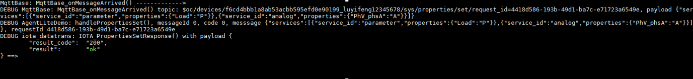
	收到命令后可以通过回调函数进行命令处理。当收到平台下发的设置设备属性命令时，可以调用IOTA_PropertiesSetResponse接口主动上报结果，请参考demo中HandlePropertiesSet函数（需在回调函数配置中提前设置）。

  - 设备接收平台属性查询
	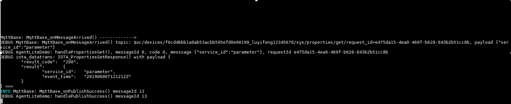
	收到命令后可以通过回调函数进行命令处理。当收到平台下发的查询设备属性命令时，可以调用IOTA_PropertiesGetResponse接口主动上报结果，请参考demo中HandlePropertiesGet函数（需在回调函数配置中提前设置）。
	
  - 平台通知网关新增子设备
	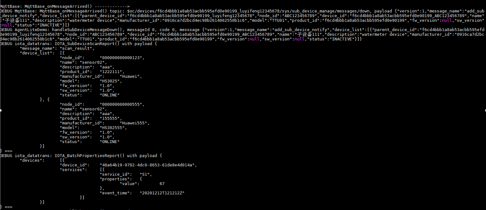
	收到命令后可以通过回调函数进行命令处理。当收到平台下发的新增子设备通知时，可以调用IOTA_BatchPropertiesReport接口给子设备上报数据（请查看子设备数据上报），请参考demo中HandleEventsDown函数（需在回调函数配置中提前设置）。
	
  - 平台通知网关删除子设备
  
  
- **子设备数据上报**
  
  子设备可以通过网关批量设备属性上报接口进行数据上报，接口如下：
  
  `HW_INT IOTA_BatchPropertiesReport(ST_IOTA_DEVICE_DATA_INFO pDeviceData[], HW_INT deviceNum, HW_INT serviceLenList[])`
  
  通过该接口上报的数据平台会解析，并且结构体中的数据需跟profile中定义的属性保持一致，ST_IOTA_DEVICE_DATA_INFO为结构体数组，可以同时上报多个子设备数据，每个子设备可以上报多个服务，deviceNum为上报的子设备个数，serviceLenList为每个子设备上报的服务个数。入参具体说明请参考API文档，demo中的Test_batchPropertiesReport函数演示了对该接口的调用方法。

```c
void Test_BatchPropertiesReport() {
  int deviceNum = 1;      //要上报的子设备的个数
  ST_IOTA_DEVICE_DATA_INFO devices[deviceNum]; //子设备要上报的结构体数组
  int serviceList[deviceNum];  //对应存储每个子设备要上报的服务个数
  serviceList[0] = 2;       //子设备一要上报两个服务
  //	serviceList[1] = 1;		  //子设备二要上报一个服务
  char *device1_service1 = "{\"Load\":\"1\",\"ImbA_strVal\":\"3\"}";     //    service1要上报的属性数据，必须是json格式
  char *device1_service2 = "{\"PhV_phsA\":\"2\",\"PhV_phsB\":\"4\"}";//service2要上报的属性数据，必须是json格式
  devices[0].device_id = g_subDeviceId;
  devices[0].services[0].event_time = "20191209T081212Z";
  devices[0].services[0].service_id = "parameter";
  devices[0].services[0].properties = device1_service1;
  devices[0].services[1].event_time = "20191209T081212Z";
  devices[0].services[1].service_id = "analog";
  devices[0].services[1].properties = device1_service2;
  //	char *device2_service1 = "{\"AA\":\"2\",\"BB\":\"4\"}";
  //	devices[1].device_id = "subDevices22222";
  //	devices[1].services[0].event_time = "d2s1";
  //	devices[1].services[0].service_id = "device2_service11111111";
  //	devices[1].services[0].properties = device2_service1;
  int messageId = IOTA_BatchPropertiesReport(devices, deviceNum, serviceList);
  if(messageId != 0) {
  	printfLog(EN_LOG_LEVEL_ERROR, "device_demo: Test_BatchPropertiesReport() failed, messageId %d\n", messageId);
  }
}
```
- **证书模式接入**

  华为物联网平台支持设备使用自己的X.509证书进行设备接入认证。接入步骤请参考：
  
  1. 证书制作上传请参考：<https://support.huaweicloud.com/usermanual-iothub/iot_01_0055.html>。
  2. SDK需设置：
	  - 将证书/密钥名称修改为deviceCert.pem/deviceCert.key ，并将其放在SDK的conf目录下。
	  - 设置设备为证书接入模式，请参考demo中的SetAuthConfig函数：
```c
void SetAuthConfig() {
	IOTA_ConfigSetStr(EN_IOTA_CFG_MQTT_ADDR, g_serverIp);
	IOTA_ConfigSetUint(EN_IOTA_CFG_MQTT_PORT, g_port);
	IOTA_ConfigSetStr(EN_IOTA_CFG_DEVICEID, g_username);
	//	IOTA_ConfigSetStr(EN_IOTA_CFG_DEVICESECRET, g_password);
	//	IOTA_ConfigSetUint(EN_IOTA_CFG_AUTH_MODE, 	EN_IOTA_CFG_AUTH_MODE_SECRET);
	
	 IOTA_ConfigSetUint(EN_IOTA_CFG_AUTH_MODE, EN_IOTA_CFG_AUTH_MODE_CERT);
	 IOTA_ConfigSetStr(EN_MQTT_CFG_PRIVATE_KEY_PASSWORD, "yourPassword");
}   
```
- **国密TLS接入**
  
  当前SDK已支持国密TLS方式接入并进行数据传输。若需要采用国密通信，需要下载国密版本的openssl，具体可参考[3.2 编译openssl库](#3.2)第4点。
  
  使用国密TLS需要对paho_mqtt开源库中paho.mqtt.c-1.3.9/src/SSLSocket.c文件打补丁，补丁方法如下：
    1. 解压./generatingLib/gmtls.patch.zip得到补丁文件gmtls.patch

        unzip ./generatingLib/gmtls.patch.zip
    2. 对paho.mqtt.c-1.3.9/src/SSLSocket.c文件进行打补丁

        patch -b ./generatingLib/paho.mqtt.c-1.3.9/src/SSLSocket.c ./generatingLib/gmtls.patch
  
  ```c
  // 使用绝对路径来读取证书
  const char *signCert = "/volume/tassl/iot-device-sdk-c/conf/gmcert_s/CS.cert.pem";
  const char *signKey = "/volume/tassl/iot-device-sdk-c/conf/gmcert_s/CS.key.pem";
  const char *encCert = "/volume/tassl/iot-device-sdk-c/conf/gmcert_e/CE.cert.pem";
  const char *encKey = "/volume/tassl/iot-device-sdk-c/conf/gmcert_e/CE.key.pem";
  const char *caPath = "/volume/tassl/iot-device-sdk-c/conf/GMCert_GMCA01.cert.pem";
  const char *passWord = NULL;
  ```

  打完补丁后，可以查看paho.mqtt.c-1.3.9/src/SSLSocket.c中是否存在上述证书路径字段。若使用口令登录的方式则不需要填写对应的签名证书、私钥和加密证书、私钥路径，若使用证书登录的方式则需要填写对应文件的路径，并使用绝对路径来进行访问。修改完成后重新编译paho库即可。

- **自定义tpoic**

  请参考主目录下的**API文档**。

- **ota升级**

  请参考主目录下的**API文档**。

- **设备影子查询**

  请参考主目录下的**API文档**。
  
- **泛协议接入场景**  

	[泛协议接入demo](./doc/doc_cn/generic_protocol.md)

- **bootstrap接入场景**  
	通过设备发放功能，可以将设备发放到不同的region，参考文档：https://support.huaweicloud.com/qs-iotps/iot_03_0006.html  注意：流程可参考“快速入门”中的各种接入示例，SDK已自动实现示例中的“引导设备”。详细的步骤可参考链接中的“用户指南”。
	SDK中需要将主目录下的Makefile里的OBJS中的device_demo.o，同时将bootstrap_demo.o放开。    
	
	
  当前，平台使用了 [DigiCert Global Root CA.](https://cacerts.digicert.com/DigiCertGlobalRootCA.crt.pem) 和 [GlobalSign Root CA - R3](https://valid.r3.roots.globalsign.com/) 两个权威CA签发的证书。conf目录下的证书默认是跟IoTDA的基础版域名绑定的。如果需要切换到其他IoTDA版本，请参考官方文档的 [证书资源](https://support.huaweicloud.com/devg-iothub/iot_02_1004.html#section3) 章节。

- **编译并运行程序**
1. 将huaweicloud-iot-device-sdk-c-master.zip压缩包拷贝到Linux环境中，通过如下命令解压：
	
	unzip  huaweicloud-iot-device-sdk-c-master.zip
	
2. 进入到文件夹下：
	
	cd huaweicloud-iot-device-sdk-c-master
	
3. 执行make命令进行编译：
	
	make
	
4. 运行SDK Demo
	
	./MQTT_Demo
	
- **生成SDK库文件**
  
  如果想生成so文件，可以修改Makefile的内容（可以本地用记事本打开后上传到Linux环境，也可以在Linux环境上直接通过"vim Makefile"修改，按"i"键编辑，编辑完毕后用"wq!”保存）:
  
  - 在CFLAGS中添加-shared -fPIC
    
  - 把OBJS中的device_demo.o删除掉
    
  - 把编译后的TARGET文件由MQTT_Demo修改为libHWMQTT.so（名称可以自定义）
    
  - 修改完毕后执行make即可生成libHWMQTT.so文件  
    
    
  
- **异常存储**
  
  新增代码实现了异常场景下的属性消息存储，并进行上报、重发的样例。 Test_PropertiesStoreData( )函数是具体实现入口。通过STORE_DATA_SWITCH来标识是否打开该功能，不注释#define STORE_DATA_SWITCH 是打开 ，注释时关闭，默认是关闭的。
  该新增代码为样例代码，存储的容器采用的是动态二维数组，用户可以根据自己的业务逻辑来进行选择。建议设备采集到数据后就进行存储，设备链路正常的时候再进行重发。
  基本逻辑如下：
- 上报数据前 存储传感器的数据（当前使用的是数组 用户可以自己选择）

    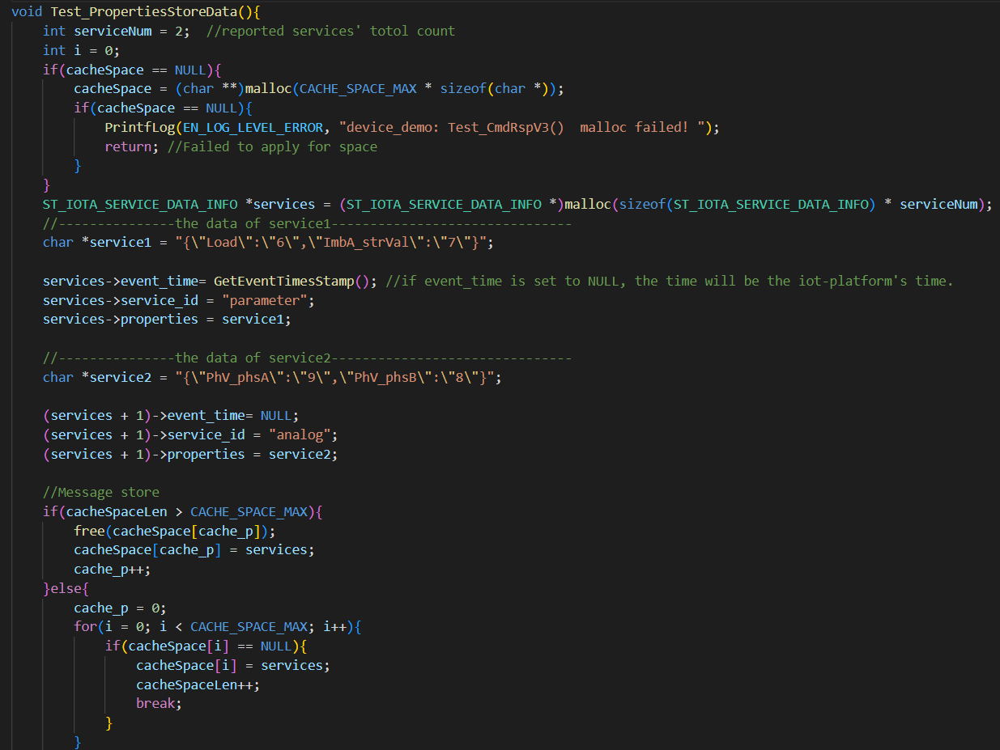
  
- 如果收到了publish成功的响应 再从容器中删除该条消息，如果存储中有未发送的数据，再次发送。
    
    
  - 等网络恢复后，再上报容器中遗留的数据。
  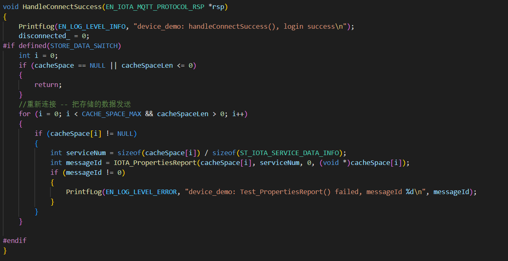


- **MQTT5.0协议使用**

  如果想使用MQTT5.0协议（默认为MQTT3.1.1），需要在文件./include/util/mqttv5_util.h 中取消 #define MQTTV5的备注。

- **MQTT_DEBUG功能使用**

  如果想使用 MQTT_DEBUG 功能，需要在文件./include/util/mqtt_base.h 中把 MQTT_TRACE_ON 的值改为1。 
  其中，MQTT_TRACE_LEVEL 是 MQTT_DEBUG 日志打印级别，默认为最高等级 MQTTASYNC_TRACE_MAXIMUM。

  日志打印级别说明：
    

  LOG_FILE_ENABLE 为 1 时，的log就会输出到 LOG_FILE_NAME 设置的文件路径中。当 LOG_FILE_ENABLE 为 0 时，log会直接输出。

- **远程配置功能**

  支持配置参数通过远程下发，SDK通过event/down接收相关信息，用户可通过IOTA_SetDeviceConfigCallback注册自定义的回调钩子函数，该回调函数会在接收到配置信息后进行处理相关数据。

- **异常检测功能**
  当用户使用异常检测功能时，若开启如下功能：内存泄漏检测、异常端口检测、CPU使用率检测、磁盘空间检测、电池电量检测，需要在文件src\service\sys_hal\sys_hal_imp.c中进行适配，获取所使用的检测项数据。检测数据上报周期可以在include\agentlite\iota_datatrans.h中对宏DETECT_REPORT_FREQUENCY进行调整，单位为秒。[云平台配置使用说明参考](https://support.huaweicloud.com/usermanual-iothub/iot_01_0030_5.html)。

- **软总线功能**

  通过平台下发设备组，设备可通过软总线实现物物互联。IoTDA可以进行安全群组管理以及下发群成员之间通信的授信标识。

  进入IoTDA平台，点击左侧“设备”->"群组"，新建子群组，“点击创建”进行创建鸿蒙软总线，自定义鸿蒙软总线名称。

  

  绑定设备，点击图中“绑定”，选择要绑定到该群组的设备，之后点击右侧进行同步软总线信息。

  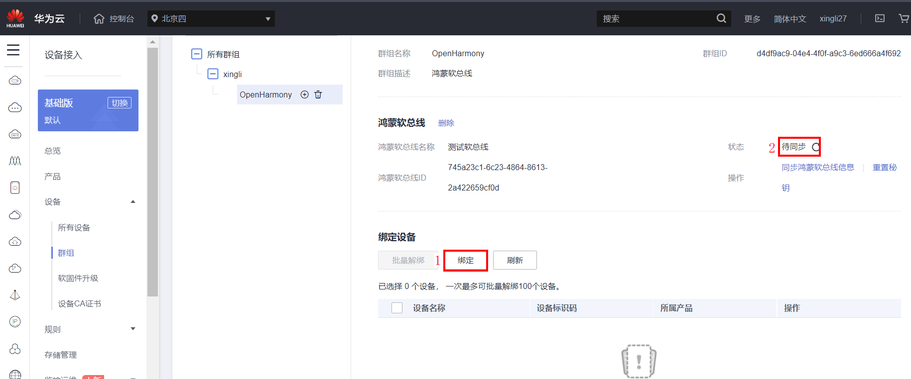

  用户可通过 IOTA_GetLatestSoftBusInfo主动获取设备软总线信息。
  当软总线更新时，会在影子下发的回调函数HandlePropertiesSet中获取版本。

- **自动重连**

  `src/device_demo/device_demo.c`中提供两种重连示例，两种示例对应的重连方法不能同时使用，用户可使用宏`CUSTOM_RECONNECT_SWITCH`进行选择:

    1. 不定义宏`CUSTOM_RECONNECT_SWITCH`，此时在`HandleConnectFailure`, `HandleConnectionLost`回调函数内进行重连，可以第一时间感知到MQTT的断连，为推荐重连做法。

    2. 定义宏`CUSTOM_RECONNECT_SWITCH`，此时使用线程模拟定时器，每隔30秒调用`IOTA_IsConnected()`接口检查连接状态，如果发现断开则进行重连。


  默认情况下宏`CUSTOM_RECONNECT_SWITCH`未定义，此时使用示例1：
  ```C
  void HandleConnectFailure(EN_IOTA_MQTT_PROTOCOL_RSP *rsp)
  {
      PrintfLog(EN_LOG_LEVEL_ERROR, "device_demo: HandleConnectFailure() error, messageId %d, code %d, messsage %s\n",
          rsp->mqtt_msg_info->messageId, rsp->mqtt_msg_info->code, rsp->message);
      PrintfLog(EN_LOG_LEVEL_ERROR, "device_demo: HandleConnectFailure() login again\n");

  #ifndef CUSTOM_RECONNECT_SWITCH
      //退避重连
      connect_failed_times++;
      if (connect_failed_times < 10) {
          TimeSleep(50);
      } else if (connect_failed_times < 50) {
          TimeSleep(2500);
      }

      int ret = IOTA_Connect();
      if (ret != 0) {
          PrintfLog(EN_LOG_LEVEL_ERROR, "device_demo: HandleAuthFailure() error, login again failed, result %d\n", ret);
      }
  #endif
  }

  ```

  要开启示例2，找到以下代码并取消最前面的注释, 此时定义宏 `CUSTOM_RECONNECT_SWITCH`：
  ```C
  // #define CUSTOM_RECONNECT_SWITCH
  ```

  用户可以参考以下`IOTA_IsConnected()`接口用法，使用该接口读取连接状态进行重连。
  ```C
  static void ReconnectRoutine(void *args)
  {
      (void)args;
      while (1) {
          PrintfLog(EN_LOG_LEVEL_DEBUG, "device_demo: need to reconnect: %s \n", IOTA_IsConnected() ? "no" : "yes");
          if (!IOTA_IsConnected()) { //检查连接状态
              int ret = IOTA_Connect();
              if (ret != 0) {
                  PrintfLog(EN_LOG_LEVEL_ERROR, "device_demo: IOTA_Connect() error, result %d\n", ret);
              }
          }
          TimeSleep(30 * 1000); // 30s
      }
  }

  static void ReconnectDemo()
  {
      if (pthread_create(&reconnectThread, NULL, ReconnectRoutine, NULL) != NULL) {
          PrintfLog(EN_LOG_LEVEL_ERROR, "device_demo: create ReconnectionThread failed! ===================>\n");
      }
  }
  ```

## 开源协议

* 遵循BSD-3开源许可协议


