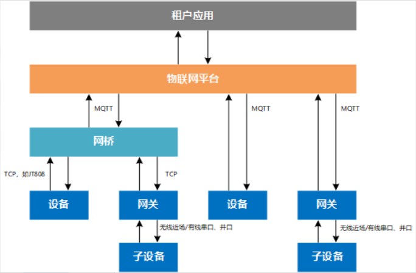

[English](./README.md) | [简体中文](./README_CN.md)

#  huaweicloud-iot-device-sdk-c 开发指南

- [0.版本更新说明](#0)
- [1.前言](#1)
- [2.SDK简介](#2)
  -  [2.1 功能支持](#2.1)
  -  [2.2 SDK目录结构](#2.2)
- [3.准备工作](#3.)
  -  [3.1 环境信息](#3.1)
  -  [3.2编译openssl库](#3.2)
  -  [3.3 编译paho库](#3.3)
  -  [3.4 编译zlib库](#3.4)
  -  [3.5 编译华为安全函数库](#3.5)
  -  [3.6 编译libssh库](#3.6)
  -  [3.7 编译libnopoll库](#3.7)
  -  [3.8 编译curl库](#3.8)
  -  [3.9 上传profile及注册设备](#3.9)
- [4.快速体验](#4)
- [5.设备初始化](#5)
  -  [5.1 底层数据初始化](#5.1)
  -  [5.2 设置日志打印函数](#5.2)
  -  [5.3 初始化连接参数](#5.3)
  -  [5.4 回调函数配置](#5.4)
  -  [5.5 设备鉴权](#5.5)
  -  [5.6 订阅Topic](#5.6)
  -  [5.7 编译并运行程序](#5.7)
- [6.SDK功能](#6)
  -  [6.1 生成SDK库文件](#6.1)
  -  [6.2 设备接入](#6.2)
  -  [6.3 设备消息上报、下发](#6.3)
  -  [6.4 属性上报下发](#6.4)
  -  [6.5 命令下发](#6.5)
  -  [6.6 断线重连](#6.6)
  -  [6.7 设备影子](#6.7)
  -  [6.8 时间同步](#6.8)
  -  [6.9 软固件升级（OTA）](#6.9)
  -  [6.10 文件上传\下载](#6.10)
  -  [6.11 泛协议&网桥](#6.11)
  -  [6.12 国密TLS接入](#6.12)
  -  [6.13 异常存储](#6.13)
  -  [6.14 MQTT5.0](#6.14)
  -  [6.15 MQTT_DEBUG功能](#6.15)
  -  [6.16 网关与子设备](#6.16)
  -  [6.17 远程配置](#6.17)
  -  [6.18 异常检测](#6.18)
  -  [6.19 软总线功能](#6.19)
  -  [6.20 日志上传](#6.20)
  -  [6.21 端侧规则引擎](#6.21)
  -  [6.22 远程登录](#6.22)
  -  [6.23 边缘M2M功能](#6.23)
  -  [6.24 gn编译](#6.24)
  -  [6.25 使用全局变量配置连接参数](#6.25)
  -  [6.26 设备发放](#6.26)
- [7.开源协议](#7)

<h1 id = "0">0.版本更新说明</h1>

| 版本号 | 变更类型 | 功能描述说明                                                 |
| ------ | -------- | ------------------------------------------------------------ |
| 1.2.0  | 功能增强 | 新增SDK测试代码及Demo，优化代码使用。                        |
| 1.1.5  | 功能增强 | 新增使用示例                                                 |
| 1.1.4  | 功能增强 | 更新OTA升级传输格式                                          |
| 1.1.3  | 功能增强 | 更新conf\rootcert.pem证书，增加日志上传                      |
| 1.1.2  | 新功能   | 增加规则引擎、M2M、gn编译文件、异常检测、日志打印时间戳、MQTT_DEBUG、国密算法、远程配置、端云安全通信（软总线）功能 |
| 1.1.1  | 新功能   | 新增SSH远程运维功能                                          |
| 1.1.0  | 新功能   | 增加MQTT5.0功能，优化代码，修复内存溢出问题                  |
| 1.0.1  | 功能增强 | 增加mqtts不校验平台公钥场景、TLS版本为V1.2、增加消息存储样例等场景 |
| 0.9.0  | 新功能   | 增加网关更新子设备状态接口                                   |
| 0.8.0  | 功能增强 | 更换新的接入域名（iot-mqtts.cn-north-4.myhuaweicloud.com）和根证书。<br/>如果设备使用老域名（iot-acc.cn-north-4.myhuaweicloud.com）接入，请使用 v0.5.0版本的SDK |
| 0.5.0  | 功能增强 | sdk预置了设备接入地址及华为物联网平台配套的CA证书，支持对接华为云物联网平台。 |

*2024/07/22*

<h1 id="1"> 1.前言</h1>

本文通过实例讲述huaweicloud-iot-device-sdk-c（以下简称SDK）帮助设备用MQTT协议快速连接到华为物联网平台。

<h1 id="2">2.SDK简介</h1>

<h2 id="2.1">2.1 功能支持</h2>

SDK面向运算、存储能力较强的嵌入式终端设备，开发者通过调用SDK接口，便可实现设备与物联网平台的上下行通讯。SDK当前支持的功能有：  

| 功能                                        | 描述说明                                                     |
| ------------------------------------------- | ------------------------------------------------------------ |
| [设备接入](#6.2)                   | 作为客户端使用MQTT协议接入到华为云平台。分为证书认证与密钥认证两种认证方式。 |
| [断线重连](#6.6)                   | 当设备由于网络不稳定或其他原因，导致链接断开，设备将每隔一段时间进行重新连接，直到连接成功。 |
| [消息上报](#6.3)         | 用于设备将自定义数据上报给平台，平台将设备上报的消息转发给应用服务器或华为云其他云服务上进行存储和处理。 |
| [属性上报](#6.4)               | 用于设备按产品模型中定义的格式将属性数据上报给平台。         |
| [命令下发](#6.5)                   | 用于平台向设备下发设备控制命令。平台下发命令后，需要设备及时将命令的执行结果返回给平台。 |
| [设备影子](#6.6)                   | 用于存储设备的在线状态、设备最近一次上报的设备属性值、应用服务器期望下发的配置。 |
| [软固件（OTA）升级](#6.9) | 用于与平台配合下载OTA升级包。                                |
| [时间同步](#6.8)                   | 设备向平台发起时间同步请求。                                 |
| [网关与子设备](#6.16)          | 网关设备：通过平台支持的协议，直接连接到平台的设备。子设备：针对未实现TCP/IP协议栈的设备，由于无法直接同物联网平台通信，它需要通过网关进行数据转发。当前仅支持通过mqtt协议直连到平台的设备作为网关设备。 |
| [文件上传/下载](#6.10)        | 支持设备将运行日志，配置信息等文件上传至平台，便于用户进行日志分析、故障定位、设备数据备份等。 |
| [异常检测](#6.18)                  | 提供安全检测能力，可持续检测设备的安全威胁。包括：1、内存泄漏检测 2、异常端口检测3、CPU使用率检测 4、磁盘空间检测 5、电池电量检测 |
| [规则引擎](#6.21)              | 通过条件触发，基于预设的规则，引发多设备的协同反应，实现设备联动、智能控制。目前物联网平台支持两种联动规则：云端规则和端侧规则。 |
| [MQTT5.0](#6.14)                    | MQTT5.0版本协议，新增了MQTT5.0新特性：对比数据、Clean Start 与 Session Expiry Interval、有效载荷标识与内容类型、主题别名、用户属性。 |
| [国密算法](#6.12)               | 一种TLS加密算法。                                            |
| [远程配置](#6.17)                  | 提供远程配置功能，用户可用于在不中断设备运行的情况下，远程更新设备的系统参数、运行参数等配置信息。 |
| [远程登录](#6.22)                  | 支持通过控制台远程SSH登录设备，可在控制台输入设备支持的命令，进行功能调试及问题定位，从而方便地实现设备管理及远程运维 |
| [泛协议接入](#6.11)             | 当非HTTP、MQTT、LWM2M等第三方协议接入时，需要在平台外部完成协议转换。推荐使用网关来完成协议转换，将第三方协议转成MQTT协议。 |
| [软总线](#6.19)                  | 当使用鸿蒙系统时。通过平台下发设备组，设备可通过软总线实现物物互联。IoTDA可以进行安全群组管理以及下发群成员之间通信的授信标识。 |
| [设备发放](#6.26)                  | 分为证书认证、密钥认证。主要用于分发到不同局点、实例，动态完成不同批次设备初始化配置。发放完成的数据可以通过设备接入进行数据传输。 |

<h2 id="2.2">2.2 SDK目录结构</h2>


<h1 id = "3">3.准备工作</h1>

<h2 id = "3.1">3.1 环境信息</h2>

SDK需运行在Linux操作系统上，并安装好gcc（建议4.8及以上版本）。SDK依赖openssl库和paho库，如果开发者有自己的编译链，需要自行编译openssl/paho库文件。Linux通用的gcc编译步骤请参考章节3.2/3.3。   

<h2 id = "3.2">3.2编译openssl库</h2>

1. 访问[openssl官网](https://www.openssl.org/source) ，下载openssl（推荐使用openssl-1.1.1h.tar.gz，在./generatingLib目录下有openssl安装包），上传到linux编译机上（以上传到目录/home/test为例），并使用如下命令解压：  

   ```shell
   tar -zxvf openssl-1.1.1d.tar.gz 
   ```
   
   

2. 配置生成makefile文件
   执行以下命令进入openssl源码目录：

   ```shell
   cd openssl-1.1.1d
   ```

   运行如下配置命令：

   ```shell
   ./config shared --prefix=/home/test/openssl --openssldir=/home/test/openssl/ssl 
   ```

   其中“prefix”是自定义安装目录，“openssldir”是自定义配置文件目录，“shared”作用是生成动态链接库（即.so库）。

   如果编译有问题配置命令加上no-asm（表示不使用汇编代码）

   ```shell
   ./config  no-asm shared --prefix=/home/test/openssl --openssldir=/home/test/openssl/ssl
   ```
   
   


3. 编译出库。
   在openssl源码目录下，运行make depend命令添加依赖：

   ```shell
   make depend
   ```

   运行make命令开始编译：

   ```sh
   make
   ```

   再运行如下命令进行安装：

   ```shell
   make install
   ```

   在配置的openssl安装目录下home/test/openssl找到lib目录，有生成的库文件：

   libcrypto.so.1.1、libssl.so.1.1和软链接libcrypto.so、libssl.so，请将这些文件拷贝到SDK的lib文件夹下（同时将home/test/openssl/include底下的openssl文件夹拷贝到SDK的include目录下）。
   
   
   
4. 若需要使用国密TLS，可访问[国密版本openssl](https://github.com/jntass/TASSL-1.1.1)，安装方法同原生openssl。该版本当前基于openssl1.1.1s，兼容openssl各类原生接口，仍支持国际TLS。

<h2 id = "3.3">3.3 编译paho库</h2>

1. 访问github下载地址https://github.com/eclipse/paho.mqtt.c, 下载paho.mqtt.c源码(建议下载release版本中1.3.9及之前的版本的Source code (tar.gz)文件，如果使用最新的版本，下方适配的文件中的行数可能会有所改变，以及需要拷贝的头文件按照最新版本增加)。

2. 解压后上传到linux编译机。

3. 修改makefile
	- 通过如下命令进行编辑Makefile
	  
	  ```sh
	  vim Makefile
	  ```
	  
	- 显示行数
	  
	  ```shell
	  :set nu
	  ```
	  
	- 在"DOXYGEN_COMMAND"之后添加下面两行（[3.2](#3.2)中自定义的openssl的头文件和库文件位置）
	  
	  ```makefile
	  CFLAGS += -I/home/test/openssl/include  
	  LDFLAGS += -L/home/test/openssl/lib -lrt 
	  ```
	  
	  
	  
	- 在CCFLAGS_SO中添加openssl的头文件引用、LDFLAGS_CS、LDFLAGS_AS以及FLAGS_EXES中添加库文件引用（随着paho版本的更新，有的版本会默认添加该引用，此时可不需要再修改）
	  
	
4. 编译
	- 执行清空命令：
	  
	  ```shell
	  make clean
	  ```
	  
	- 执行编译命令：
	  
	  ```shell
	  make
	  ```
	
5. 编译完成后，可以在build/output目录下看到编译成功的库。
	

6. 拷贝paho库文件
	当前SDK仅用到了libpaho-mqtt3as，请将文件libpaho-mqtt3as.so、libpaho-mqtt3as.so.1和libpaho-mqtt3as.so.1.3拷贝到SDK的lib文件夹下（同时将paho源码目录下src文件夹里的头文件（MQTTAsync.h/MQTTClient.h/MQTTClientPersistence.h/MQTTProperties.h/MQTTReasonCodes.h/MQTTSubscribeOpts.h）拷贝到SDK的include/base目录下，注意：有的paho版本会有 MQTTExportDeclarations.h 头文件，建议可以将MQTT相关的头文件都添加进去)。

<h2 id = "3.4">3.4 编译zlib库</h2>

1. 下载zlib源码https://github.com/madler/zlib/archive/v1.2.11.zip 
	通过如下命令解压缩：
   
   ```shell
   unzip zlib-1.2.11.zip
   ```
   
2. 进入源码目录下：

	```shell
	cd  zlib-1.2.11
	```
	
3. 配置生成makefile文件

   ```shell
   ./configure
   ```

4. 执行makefile文件

   ```shell
   make
   ```

5. 拷贝so库文件
    将源码目录下生成的libz.so、libz.so.1、libz.so.1.2.11拷贝到sdk的lib文件夹下。	
    				

<h2 id = "3.5">3.5 编译华为安全函数库</h2>

1. 下载安全函数库源码https://gitee.com/openeuler/libboundscheck.git

2. 进入源码makefile同级目录，执行makefile文件

   ```shell
   make
   ```

3. 拷贝so库文件
    将源码目录下生成的lib文件夹下的libboundscheck.so拷贝到sdk的lib文件夹下。

<h2 id = "3.6">3.6 编译libssh库</h2>

1. 下载libssh源码https://www.libssh.org/files/0.10/libssh-0.10.4.tar.xz
	通过如下命令解压缩：
   
   ```shell
   tar xvf libssh-0.10.4.tar.xz
   ```
   
2. 进入源码目录下：

	```shell
	cd libssh-0.10.4
	```
	
3. 编译库文件：

    ```shell
    mkdir build
    cd build
    cmake ..
    make
    ```

4. 安装库：

    ```shell
    sudo make install  
    ```

5. 拷贝so库文件和头文件
    将源码目录下build/lib文件夹中生成的libssh.so、libssh.so.4、libssh.so.4.9.4拷贝到sdk的lib文件夹下。
   将/usr/local/include下的libssh的整个头文件目录拷贝到sdk的include文件夹下。

<h2 id = "3.7">3.7 编译libnopoll库</h2>

1. 下载nopoll源码http://www.aspl.es/nopoll/downloads/nopoll-0.4.8.b429.tar.gz
	通过如下命令解压缩：
   
   	tar xzvf nopoll-0.4.8.b429.tar.gz
   
2. 进入源码目录下：

	```shell
	cd nopoll-0.4.8.b429
	```
	
3. 编译与安装

   ```shell
   ./configure
   make
   sudo make install
   pkg-config nopoll --cflags
   pkg-config nopoll --libs  
   ```

4. 拷贝so库文件
    通过上一步获取到的路径，将源码目录src/.libs下生成的libnopoll.so libnopoll.so.0 libnopoll.so.0.0.0拷贝到sdk的lib文件夹下。
   将/usr/local/include下的nopoll的整个头文件目录拷贝到sdk的include文件夹下。

<h2 id = "3.8">3.8 编译curl库</h2>
在generatingLib目录下执行以下命令， 注意--with-openssl后面换成自己的openssl安装路径：

```shell 
    curl https://github.com/curl/curl/releases/download/curl-8_4_0/curl-8.4.0.tar.gz | tar -xzvf - &&
    cd curl-8.4.0 &&
    ./configure --with-openssl=/home/test/openssl &&
    make &&
    make install &&
    cp -r /usr/local/include/curl ../../include
    cp /usr/local/lib/libcurl.so* ../../lib
    cp /usr/local/lib64/libcurl.so* ../../lib
```

<h2 id = "3.9">3.9 上传profile及注册设备</h2>

1. profile（产品模型）定义，具体详情可见：[物模型相关问题](https://support.huaweicloud.com/iothub_faq/iot_faq_01000.html)。

2. 注册设备详情可见：[注册设备](https://support.huaweicloud.com/usermanual-iothub/iot_01_0031.html)。
	

点击“设备”->“所有设备”，点击右上角“注册设备”，选择产品所在的“资源空间”，选择上方创建的产品，填写设备标识码（一般是IMEI、MAC地址等），自定义“设备名称”，“密钥”如果不自定义，平台会自动生成。全部填写完毕后，点击“确定”。
	
3. 可以直接复制设备秘钥，点击“保存并关闭”将自动将设备ID以及设备秘钥以txt文本形式下载到本地。

4. 在IoTDA控制台界面。点击”设备“->“所有设备”，在最上方可看到该设备的状态是未激活。当设备上线一次后，退出未激活状态。

<h1 id = "4">4.快速体验</h1>

1. 将SDK压缩包拷贝到Linux环境中，通过如下命令解压：
	
	```shell
	unzip  huaweicloud-iot-device-sdk-c-master.zip
	```
	
2. 进入到解压的文件夹下：

   ```shell
    cd huaweicloud-iot-device-sdk-c-master
   ```

3. 修改配置信息：
    需要修改src/device_demo/device_demo.c文件中的如下参数：  
    g_serverIp：平台MQTT南向IP，可在IoTDA控制台的“总览”->“接入信息”中查看。
   g_username：MQTT协议需要填写username，iot平台默认设备ID为username，设备ID是设备注册时返回的值。
    g_password：设备密钥，设备注册时返回的值。
    
   
4. 执行命令进行编译，推荐使用Makefile进行编译：

   4.1 用Makefile进行编译：

   ```shell
   make（如果是32位的操作系统，请删除掉Makefile中的"-m64"）
   ```

   4.2 用gn进行编译，先安装gn以及ninja工具，再进行编译：

   ```shell
   gn gen -C out
   ninja -C out
   cd out
   ```

5. 运行：

    5.1 加载库文件

    ```shell
     export LD_LIBRARY_PATH=./lib/
    ```

    5.2 执行如下命令：

    ```shell
    ./MQTT_Demo
    ```

      在控制台上可以看到很多打印的日志：
      “login success”表示设备鉴权成功   

      “MqttBase_onSubscribeSuccess”表示订阅成功   

      “MqttBase_onPublishSuccess”表示发布数据成功   

      

6. 查看设备运行情况：
  - 直连设备在线：可在平台控制台界面中的设备 -> 所有设备。中看到设备状态，当为在线时，设备上线成功。


<h1 id = "5">5.设备初始化</h1>

直连设备连接demo可见代码：./demos/device_demo/basic_test.c。证书获取： [证书资源](https://support.huaweicloud.com/devg-iothub/iot_02_1004.html#section3) 。

<h2 id = "5.1">5.1 底层数据初始化</h2>

在发起业务前，需要先初始化Agent Lite相关资源，调用API接口  IOTA_Init(HW_CHAR *workPath)，初始化Agent Lite资源，其中CA证书存放路径为：${workPath}/rootcert.pem。具体API接口的参数使用请参考Agent Lite API接口文档。可参考demo中main()方法对IOTA_Init()的调用。

```c
/* 
 * CA证书地址设置为：./conf/rootcert.pem 
 * 设备公钥路径：./conf/deviceCert.pem 
 * 设备私钥路径：./conf/deviceCert.key
 */
 IOTA_Init("."); 
```

在./include/base/mqtt_base.h文件中，有MQTT连接相关参数：

```c
#define DEFAULT_QOS                     1    // 默认通信质量（Qos）
#define DEFAULT_KEEP_ALIVE_INTERVAL     120  // 连接心跳时长 单位s
#define DEFAULT_CONNECT_TIME_OUT        30   // 最大连接请求时长 单位s
#define DEFAULT_RETRYINTERVAL           10   // 默认重试间隔 单位s
#define MQTT_PORT                       "1883" // 默认MQTT端口
#define MQTTS_PORT                      "8883" // 默认MQTTS端口

#define MQTT_TRACE_ON                   0  // Open or not MQTT_DEBUG
#define MQTT_TRACE_LEVEL                MQTTASYNC_TRACE_MINIMUM  // Please select according to your needs TraceLevel
#define MAX_BUFFERED_MESSAGES           3 // Maximum number of broken chain storage entries
```

<h2 id = "5.2">5.2 设置日志打印函数</h2>

SDK以日志回调函数的方式供开发者使用，开发者可以根据自己的需求调用IOTA_SetPrintLogCallback函数设置。具体API接口的参数使用请参考SDK API接口文档。

```c
void IOTA_SetPrintLogCallback(PFN_LOG_CALLBACK_HANDLER pfnLogCallbackHandler)
```

- 如果需要打印在控制台，可以参考demo中的myPrintLog函数中设置的vprintf(format, args);
- 如果需要打印到系统日志文件中，可以参考demo中的myPrintLog函数中设置的vsyslog(level, format, args)函数。同时需要引入头文件#include "syslog.h"，并且定义宏#define _SYS_LOG。

```c
static void MyPrintLog(int level, char *format, va_list args)
{
    vprintf(format, args);
    /*
     * if you want to printf log in system log files,you can do this:
     * vsyslog(level, format, args);
     */
}

void main() {
	IOTA_SetPrintLogCallback(MyPrintLog); // 设置日志打印
}
```


<h2 id = "5.3">5.3 初始化连接参数</h2>

设备连接到IoT平台之前，需配置平台的地址、端口、设备Id及设备密钥。可以参考demo中main()方法中调用的setAuthConfig()函数。

```c
  void setAuthConfig(){
      
    IOTA_ConnectConfigSet(${接入域名\ip}, ${端口}, ${设备id}, ${密码});
    IOTA_ConfigSetUint(EN_IOTA_CFG_AUTH_MODE, EN_IOTA_CFG_AUTH_MODE_SECRET); //密钥模式
    // 不校验时间戳
    IOTA_ConfigSetUint(EN_IOTA_CFG_CHECK_STAMP_METHOD, EN_IOTA_CFG_CHECK_STAMP_OFF); 
   /**
    * Configuration is required in certificate mode:
    *
    * IOTA_ConfigSetUint(EN_IOTA_CFG_AUTH_MODE, EN_IOTA_CFG_AUTH_MODE_CERT);
    * IOTA_ConfigSetStr(EN_MQTT_CFG_PRIVATE_KEY_PASSWORD, "yourPassword");
    */  
  
  }
```

- IOTA_ConnectConfigSet(${接入域名\ip}, ${端口}, ${设备id}, ${原始未加密密码}) 连接参数可以在SP portal的应用对接信息中获取；
- 鉴权方式（EN_IOTA_CFG_AUTH_MODE）可设置为： 
  1. 密钥认证（EN_IOTA_CFG_AUTH_MODE_SECRET）。
  2. 证书认证（EN_IOTA_CFG_AUTH_MODE_CERT）。
- 时间戳检验方式（EN_IOTA_CFG_CHECK_STAMP_METHOD）可设置为：
  1. 不校验时间戳（EN_IOTA_CFG_CHECK_STAMP_OFF）。
  2. 使用sha256（EN_IOTA_CFG_CHECK_STAMP_SHA256）。
  3. 国密sm3（EN_IOTA_CFG_CHECK_STAMP_SM3）校验。
- 当定义了_SYS_LOG（日志打印在系统文件中）时，日志的facility类型（EN_IOTA_CFG_LOG_LOCAL_NUMBER）、日志的显示级别（EN_IOTA_CFG_LOG_LEVEL）可以按需自定义。


<h2 id = "5.4">5.4 回调函数配置</h2>

SDK针对设备鉴权成功/失败、设备断链成功/失败、设备订阅消息成功/失败、设备发布消息成功/失败、设备接收消息/命令等动作，以回调函数的方式供开发者调用，开发者可以针对不同的事件设置回调函数来实现业务处理逻辑。

```c
void setMyCallbacks(){	
	IOTA_SetProtocolCallback(EN_IOTA_CALLBACK_CONNECT_SUCCESS, HandleConnectSuccess);
	IOTA_SetProtocolCallback(EN_IOTA_CALLBACK_CONNECT_FAILURE, HandleConnectFailure);
  
	IOTA_SetProtocolCallback(EN_IOTA_CALLBACK_DISCONNECT_SUCCESS, HandleDisConnectSuccess);
	IOTA_SetProtocolCallback(EN_IOTA_CALLBACK_DISCONNECT_FAILURE, HandleDisConnectFailure);
	IOTA_SetProtocolCallback(EN_IOTA_CALLBACK_CONNECTION_LOST, HandleConnectionLost);
  
	IOTA_SetProtocolCallback(EN_IOTA_CALLBACK_SUBSCRIBE_SUCCESS, HandleSubscribesuccess);
	IOTA_SetProtocolCallback(EN_IOTA_CALLBACK_SUBSCRIBE_FAILURE, HandleSubscribeFailure);
  
	IOTA_SetProtocolCallback(EN_IOTA_CALLBACK_PUBLISH_SUCCESS, HandlePublishSuccess);
	IOTA_SetProtocolCallback(EN_IOTA_CALLBACK_PUBLISH_FAILURE, HandlePublishFailure);
  
	IOTA_SetMessageCallback(HandleMessageDown);
	// 推荐使用此API，可以处理自定格式的消息
	IOTA_SetRawMessageCallback(HandleRawMessageDown);
	IOTA_SetUserTopicMsgCallback(HandleUserTopicMessageDown);
	// 推荐使用此API，可以处理自定格式的消息
	IOTA_SetUserTopicRawMsgCallback(HandleUserTopicRawMessageDown);
	IOTA_SetUndefinedMessageCallback(HandletUndefinedMessageDown);
  
	IOTA_SetCmdCallback(HandleCommandRequest);
	IOTA_SetPropSetCallback(HandlePropertiesSet);
	IOTA_SetPropGetCallback(HandlePropertiesGet);
	IOTA_SetEventCallback(HandleEventsDown);
	IOTA_SetShadowGetCallback(HandleDeviceShadowRsp);
}
```

```C
  // Connect相关
  - 鉴权成功后，将调用HandleConnectSuccess函数；  
  - 鉴权失败后，将调用HandleConnectFailure函数；  
  - 设备主动断链成功后，将调用HandleDisConnectSuccess函数；
  - 设备主动断链失败后，将调用HandleDisConnectFailure函数；
  - 链接断开后，将调用HandleConnectionLost函数；
  // Subscribe相关
  - 订阅成功后，将调用HandleSubscribesuccess函数；
  - 订阅失败后，将调用HandleSubscribeFailure函数；
  // Publish相关
  - 发布数据成功后，将调用HandlePublishSuccess函数；
  - 发布数据失败后，将调用HandlePublishFailure函数；
  // 消息相关
  - 设备接收到平台不解析的透传消息（默认topic）后，将调用HandleRawMessageDown函数；如果消息符合系统格式将同时调用HandleMessageDown；
  - 设备接收到平台不解析的透传消息（包含/user/自定义topic）后，将调用HandleUserTopicMessageDown函数；如果消息符合系统格式将同时调用HandleUserTopicMessageDown；
  - 设备接收到平台不解析的透传消息（非oc开头自定义topic）后， 将调用HandletUndefinedMessageDown函数。
  // 属性、命令相关
  - 设备接收到命令后，将调用HandleCommandRequest函数；
  - 设备接收到属性设置命令后，将调用HandlePropertiesSet函数；
  - 设备接收到属性查询命令后，将调用HandlePropertiesGet函数；
  // 事件相关
  - 设备接收到事件（子设备、OTA）相关命令后，将调用HandleEventsDown函数；
  - 设备接收到设备影子数据后，将调用HandleDeviceShadowRsp函数；
```

<h2 id = "5.5">5.5 设备鉴权</h2>

回调函数设置完毕后，可以调用鉴权函数。可以参考./demos/device_demo/basic_test.c中对该接口的调用：

```c
int ret = IOTA_Connect();
     if (ret != 0) {
        PrintfLog(EN_LOG_LEVEL_ERROR, "basic_test: IOTA_Connect() error, Auth failed, result %d\n", ret);
    }
```

鉴权接口调用成功后，会打印“login success”的字样（建议鉴权成功后再进行数据上报，可以鉴权后sleep几秒钟，或者在鉴权成功的回调函数里进行业务处理）：

可以通过ctrl + c停止程序运行，程序停止后最长等待1.5个心跳时间，可以在控制台界面上查看设备已离线。

<h2 id = "5.6">5.6 订阅Topic</h2>

当连接成功时，华为云平台会自动订阅qos（通信质量）为0的系统Topic。若要使用自定义Topic，需要调用订阅自函数进行Topic订阅。

- 订阅所有[系统Topic](https://support.huaweicloud.com/api-iothub/iot_06_v5_3004.html):

  ```c
  void SubscribeAllQos(int qos);
  ```

- 订阅[自定义的topic](https://support.huaweicloud.com/usermanual-iothub/iot_02_9999.html):

  ```c
  int IOTA_SubscribeTopic(char *topic, int qos);
  ```

  若订阅一个主题为“test/sdk/c”，通信质量为1的topic：

  ```c
  IOTA_SubscribeTopic("test/sdk/c", 1);
  ```

值得注意的是，当设备断链后重新连接，需要客户再次订阅自定义topic。可以在连接成功后的回调函数中编写代码，再次订阅。以下为示例：

```c
static void HandleConnectSuccess(EN_IOTA_MQTT_PROTOCOL_RSP *rsp)
{
    PrintfLog(EN_LOG_LEVEL_INFO, "device_demo: handleConnectSuccess(), login success\n");
    // You can subscribe to the required topics here
}

void main(int argc, char **argv)
{
    // connect success callback
    IOTA_SetProtocolCallback(EN_IOTA_CALLBACK_CONNECT_SUCCESS, HandleConnectSuccess);
    // 建链
    int ret = IOTA_Connect();
    if (ret != 0) {
        PrintfLog(EN_LOG_LEVEL_ERROR, "error, Auth failed, result %d\n", ret);
        return -1;
    }
    while(1);
}
```

<h2 id = "5.7">5.7 编译并运行程序</h2>

1. 将huaweicloud-iot-device-sdk-c-master.zip压缩包拷贝到Linux环境中，通过如下命令解压：

   unzip  huaweicloud-iot-device-sdk-c-master.zip

2. 进入到文件夹下：

   cd huaweicloud-iot-device-sdk-c-master

3. 执行make命令进行编译：

   make

   > ps：如果编译./denos/文件中的demo，可以运行 make ${demo名}，如make device_demo。
   >
   > 若是需要编译所有demo，请使用命令 make all 进行编译。

4. 运行SDK Demo

   ./MQTT_Demo
   
   ps：如果运行./demos/文件中的demo，在SDK根目录输入 ./{文件名}。

<h1 id = "6">6.SDK功能</h1>

以下是部分接口的使用指导，详细的功能请参考主目录下的**API文档**。  

<h2 id = "6.1">6.1 生成SDK库文件</h2>

如果想生成so文件，可以修改Makefile的内容（可以本地用记事本打开后上传到Linux环境，也可以在Linux环境上直接通过"vim Makefile"修改，按"i"键编辑，编辑完毕后用"wq!”保存）:

- 在CFLAGS中添加-shared -fPIC。同时，把CFLAGS中的-pie -fPIE 删除。
  

- 把编译后的TARGET文件由MQTT_Demo修改为libHWMQTT.so（名称可以自定义）
  

- 修改完毕后执行make即可生成libHWMQTT.so文件  

  


<h2 id = "6.2">6.2 设备接入</h2>

设备连接到IoT平台，分为设备密钥认证与证书认证。需配置平台的地址（${address}）、端口（${port}）、设备Id（${deviceId}）及设备密钥\证书私钥（${password}、${deviceKyePassword}）。Demo使用示例: [./demos/device_demo/basic_test.c](./demos/device_demo/basic_test.c)。

参考文档：[密钥认证](https://support.huaweicloud.com/usermanual-iothub/iot_01_0210.html)、[证书认证](https://support.huaweicloud.com/usermanual-iothub/iot_01_0211.html)。

Demo编译及运行：

```c
在basic_test.c中修改连接参数：
// You can get the access address from IoT Console "Overview" -> "Access Information"
char *g_address = "域名"; 
char *g_port = "8883";
char *g_deviceId = "设备id"; 
char *g_password = "设备密钥";
    
在根目录运行： 
    make device_demo
    ./basic_test
```

- 设备密钥认证：

  ```c
  // ---------------------------- 密钥认证 --------------------------------------
  void mqttDeviceSecretInit(char *address, char *port, char *deviceId, char *password) {
  
      IOTA_Init("."); // 证书地址设置为：./conf/rootcert.pem
      IOTA_SetPrintLogCallback(MyPrintLog); // 设置日志打印方式
   
      // 加载连接参数 为1883时为MQTT协议、 8883时为MQTTS协议
      IOTA_ConnectConfigSet(address, port, deviceId, password);
      // 设置鉴权方式为密钥认证
      IOTA_ConfigSetUint(EN_IOTA_CFG_AUTH_MODE, EN_IOTA_CFG_AUTH_MODE_SECRET);
  
      // 设置连接回调函数
      IOTA_SetProtocolCallback(EN_IOTA_CALLBACK_CONNECT_FAILURE, HandleConnectFailure);
      IOTA_SetProtocolCallback(EN_IOTA_CALLBACK_CONNECTION_LOST, HandleConnectFailure);
  }
  
  void main(int argc, char **argv) {
      // 密钥认证初始化
      mqttDeviceSecretInit(g_address, g_port, g_deviceId, g_password); 
  }
  ```
  
- 设备证书认证：

  华为物联网平台支持设备使用自己的X.509证书进行设备接入认证。接入步骤请参考：

  1. 证书制作上传请参考：[X.509证书认证](https://support.huaweicloud.com/usermanual-iothub/iot_01_0055.html)。
  2. SDK需设置：

    - 将证书/密钥名称修改为deviceCert.pem/deviceCert.key ，并将其放在SDK的conf目录下。
    - 设置设备为证书接入模式，请参考demo中的mqttDeviceCertInit函数：

  ```c
  // ---------------------------- 证书认证 --------------------------------------
  void mqttDeviceCertInit(char *address, char *port, char *deviceId, char *deviceKyePassword) {
  
      // 设备证书/密钥名称修改为：deviceCert.pem/deviceCert.key ，并将其放在SDK的conf目录下。
      IOTA_Init("."); 
      // 设置日志打印方式
      IOTA_SetPrintLogCallback(MyPrintLog); 
   
      // 加载连接参数 MQTTS协议
      IOTA_ConnectConfigSet(address, port, deviceId, NULL);
      // 设置鉴权方式为证书认证
      IOTA_ConfigSetUint(EN_IOTA_CFG_AUTH_MODE, EN_IOTA_CFG_AUTH_MODE_CERT);
      IOTA_ConfigSetUint(EN_IOTA_CFG_PRIVATE_KEY_PASSWORD, deviceKyePassword);
  
      // 设置连接回调函数
      IOTA_SetProtocolCallback(EN_IOTA_CALLBACK_CONNECT_FAILURE, HandleConnectFailure);
      IOTA_SetProtocolCallback(EN_IOTA_CALLBACK_CONNECTION_LOST, HandleConnectFailure);
  }
  
  void main(int argc, char **argv) {
      //证书认证初始化
      char *deviceKyePassword = ""; // 请输入设备私钥密码
      mqttDeviceCertInit(g_address, g_port, g_deviceId, g_deviceKyePassword); 
  }
  ```
  
- 连接回调函数：

    - 鉴权成功后，将调用HandleConnectSuccess函数；  
    - 鉴权失败后，将调用HandleConnectFailure函数；  
    - 设备主动断链成功后，将调用HandleDisConnectSuccess函数；
    - 设备主动断链失败后，将调用HandleDisConnectFailure函数；
    - 链接断开后，将调用HandleConnectionLost函数；
    
    ```c
    // 设置设备建链成功回调函数
     IOTA_SetProtocolCallback(EN_IOTA_CALLBACK_CONNECT_SUCCESS, HandleConnectSuccess);
    // 设置设备鉴权失败回调函数
      IOTA_SetProtocolCallback(EN_IOTA_CALLBACK_CONNECT_FAILURE, HandleConnectFailure);
      // 设置设备断链成功回调函数
      IOTA_SetProtocolCallback(EN_IOTA_CALLBACK_DISCONNECT_SUCCESS, HandleDisConnectSuccess);
      // 设置设备断链失败回调函数
      IOTA_SetProtocolCallback(EN_IOTA_CALLBACK_DISCONNECT_FAILURE, HandleDisConnectFailure);
      // 设置连接成功后非主动断链后的回调函数
      IOTA_SetProtocolCallback(EN_IOTA_CALLBACK_CONNECTION_LOST, HandleConnectionLost);
    ```

- Topic订阅：

    设备建链成功或设备重新建链（断线重连），都需要进行Topic订阅。推荐在建链成功后的回调函数中进行。

  ```c
  static void SubscribeDeviceTpoic(void)
  {
      SubscribeAllQos(1);
  }
  
  static void HandleConnectSuccess(EN_IOTA_MQTT_PROTOCOL_RSP *rsp)
  {
      (void)rsp;
      PrintfLog(EN_LOG_LEVEL_INFO, "HandleConnectSuccess(), login success\n");
      /* Connection successful, subscribe */
      SubscribeDeviceTpoic();
  }
  
  void main(int argc, char **argv) {
      ...
      // 设置连接成功回调函数
      IOTA_SetProtocolCallback(EN_IOTA_CALLBACK_CONNECT_SUCCESS, HandleConnectSuccess);
      ...
  }
  ```

- 设备断链：

  ```c
  void main(int argc, char **argv) {
      ...
      // 断链
      IOTA_Destroy();
  }
  ```

<h2 id = "6.3">6.3 设备消息上报、下发</h2>

设备鉴权通过后, 可以调用SDK的“设备消息上报”接口上报数据。

参考文档：[消息上报](https://support.huaweicloud.com/usermanual-iothub/iot_01_0322.html)、[消息下发](https://support.huaweicloud.com/usermanual-iothub/iot_01_0331.html)。

Demo示例：[./demos/device_demo/message_test.c](./demos/device_demo/message_test.c)。Demo使用方式如下：

```c
在message_test.c中修改连接参数：
// You can get the access address from IoT Console "Overview" -> "Access Information"
char *g_address = "域名"; 
char *g_port = "8883";
char *g_deviceId = "设备id"; // 请输入设备id
char *g_password = "设备密钥"; // 密钥认证时请输入设备密码
    
在根目录运行： 
    make device_demo
    ./message_test
```

- 自定义Topic消息上报、下发：

  可以通过该接口上报自定义格式的Topic及消息。平台收到的数据可以转发到其他服务或者推送到应用服务器。

  - 自定义Topic消息上报：

    `HW_API_FUNC HW_INT IOTA_RawTopicMessageReport(HW_CHAR *topic, HW_CHAR *payload, int qos, void *context);`

    其中topic是客户自定义的Topic；payload为要上报的内容；qos为通信质量，平台支持为0或1。可以参考demo中对该函数对该接口的调用。

    ```c
    // ----------------- 自定义topic消息上报 ------------------------
      void allCustomMessage() 
      {
          // 订阅topic为 massge/test， Qos通信质量为1
          IOTA_SubscribeTopic("massge/test", 1);
          //向连接设备上报一个topic为"message/test"，qos为1，消息内容为"hello!"的消息
          int messageId = IOTA_RawTopicMessageReport("message/test", "hello!", 1 NULL);
          if (messageId != 0) {
              PrintfLog(EN_LOG_LEVEL_ERROR, "allCustomMassage() failed, messageId %d\n", messageId);
          }
          TimeSleep(3000);
    }
    ```

  - 平台下发自定义消息：

    `HW_API_FUNC HW_VOID IOTA_SetUndefinedMessageCallback(PFN_MESSAGE_CALLBACK_HANDLER callbackHandler);`

    当已经订阅但并非平台设置的Topic会触发该回调函数。若是平台设置的以$oc/devices/{device_id}/user/开头的自定义消息，将不会触发该函数，转而触发IOTA_SetUserTopicMsgCallback(）中设置的函数指针。具体使用可以参考demo中对该函数对该接口的调用。

    ```c
    static void HandletUndefinedMessageDown(EN_IOTA_UNDEFINED_MESSAGE *rsp)
    {
       if (rsp == NULL) {
            return;
        }
        PrintfLog(EN_LOG_LEVEL_INFO, "%s(), content: %s\n", __FUNCTION__,  rsp->payload);
    }
    
    int main(int argc, char **argv)
    {
        ...
        // 消息下发回调函数注册
        IOTA_SetUndefinedMessageCallback(HandletUndefinedMessageDown);
        ...
    }
    ```

- 系统Topic消息上报、下发：

  可以通过该接口上报系统格式的Topic及消息。平台收到的数据可以转发到其他服务或者推送到应用服务器。

  - 系统消息上报：

    `HW_API_FUNC HW_INT IOTA_MessageDataReport(ST_IOTA_MESS_REP_INFO mass, void *context);`
  
    通过该接口上报的数据平台不解析，数据可以转发到其他服务或者推送到应用服务器。mass是消息结构体，包括：需要上报的设备id（object_device_id），消息名称（name），消息ID（id），上报内容（content）；topicParas是自定义topic的参数，当为NULL时用平台默认topic上报数据。具体参数说明请查看[API文档](https://support.huaweicloud.com/api-iothub/iot_06_v5_3016.html)，可以参考demo中对该函数对该接口的调用。
  
    ```c
    void basicMassage() 
    {
        // 订阅系统topic
        SubscribeAll(); 
        // 向连接设备上报一个id为123的消息，消息内容为"hello!"
        ST_IOTA_MESS_REP_INFO mass = {NULL, "name", "id", "hello!", "test"};
        int messageId = IOTA_MessageDataReport(mass, NULL);
        if (messageId != 0) {
            PrintfLog(EN_LOG_LEVEL_ERROR, "basicMassage() failed, messageId %d\n", messageId);
        }
        TimeSleep(3000);
    }
    ```
  
  - 平台下发系统消息：
  
    `HW_API_FUNC HW_VOID IOTA_SetMessageCallback(PFN_MESSAGE_CALLBACK_HANDLER callbackHandler);`
  
    其中callbackHandler为函数指针，当系统下发topic为： $oc/devices/{device_id}/sys/messages/down 的消息时会运行该函数。具体参数说明请查看[API文档](https://support.huaweicloud.com/api-iothub/iot_06_v5_3017.html)，可以参考demo中对该函数对该接口的调用。
  
    ```C
    static void HandleMessageDown(EN_IOTA_MESSAGE *rsp, void *mqttv5)
    {
        if (rsp == NULL) {
            return;
        }
        PrintfLog(EN_LOG_LEVEL_INFO, "%s(), content: %s\n", __FUNCTION__,  rsp->content);
        PrintfLog(EN_LOG_LEVEL_INFO, "%s(), id: %s\n", __FUNCTION__, rsp->id);
        PrintfLog(EN_LOG_LEVEL_INFO, "%s(), name: %s\n", __FUNCTION__,  rsp->name);
        PrintfLog(EN_LOG_LEVEL_INFO, "%s(), objectDeviceId: %s\n", __FUNCTION__, rsp->object_device_id);
    }
    
    int main(int argc, char **argv)
    {
          ...
            // 消息下发回调函数注册
          IOTA_SetMessageCallback(HandleMessageDown);
            ...
    }
    ```
  
    
  
  

<h2 id = "6.4">6.4 属性上报下发</h2>

设备鉴权通过后, 可以调用SDK的“设备属性上报”接口上报数据。

参考文档：[设备属性上报](https://support.huaweicloud.com/usermanual-iothub/iot_01_0326.html)、[平台属性下发](https://support.huaweicloud.com/usermanual-iothub/iot_01_0335.html)。

Demo示例：[./demos/device_demo/properties_test.c](./demos/device_demo/properties_test.c)。Demo使用方式如下：

  ```c
properties_test.c中修改连接参数：
// You can get the access address from IoT Console "Overview" -> "Access Information"
char *g_address = "域名"; 
char *g_port = "8883";
char *g_deviceId = "设备id"; // 请输入设备id
char *g_password = "设备密钥"; // 密钥认证时请输入设备密码
    
在根目录运行： 
    make device_demo
    ./properties_test
  ```

在示例中，使用的物模型为最佳实践中[智慧烟感物模型](https://support.huaweicloud.com/bestpractice-iothub/iot_bp_0024.html#section9)，可根据文档进行物模型配置：

该物模型定义了一个服务，服务ID为 Smoke。

在该服务ID中定义了一个可读可写的整型（int）属性 Smoke_Value。

- 设备属性上报接口：

  `HW_INT IOTA_PropertiesReport(ST_IOTA_SERVICE_DATA_INFO pServiceData[], HW_INT serviceNum, HW_INT compressFlag, void *context)`

  通过该接口上报的数据平台会解析，并且结构体中的数据需跟profile中定义的属性保持一致，ST_IOTA_SERVICE_DATA_INFO为结构体数组，可以同时上报多个服务，serviceNum为上报的服务个数。入参具体说明请参考API文档，demo中的Test_propertiesReport函数演示了对该接口的调用方法。

  ```c
  void Test_propertiesReport() {
    int serviceNum = 1;//上报的service个数
    ST_IOTA_SERVICE_DATA_INFO services[serviceNum];
  
    //---------------the data of service-------------------------------
    char *service = "{\"Smoke_value\": 5}";
    services[0].event_time = NULL;
    services[0].service_id = "Smoke";
    services[0].properties = service;
  
    int messageId = IOTA_PropertiesReport(services, serviceNum, 0, NULL);
    if(messageId != 0) {
    	PrintfLog(EN_LOG_LEVEL_ERROR, "device_demo: Test_batchPropertiesReport() failed, messageId %d\n", messageId);
    }
  }
  ```
  
  上报成功后可在平台设备详情界面查看最新一次上报的物模型值。
  
- 属性下发回调函数接口：

  ```C
  // 平台设置属性回调接口
  HW_API_FUNC HW_VOID IOTA_SetPropSetCallback(PFN_PROP_SET_CALLBACK_HANDLER callbackHandler);
  // 平台主动获取属性回调接口
  HW_API_FUNC HW_VOID IOTA_SetPropGetCallback(PFN_PROP_GET_CALLBACK_HANDLER callbackHandler);
  ```

  其中callbackHandler为函数指针，当属性下发时会运行该函数。具体参数说明请查看[API文档](https://support.huaweicloud.com/api-iothub/iot_06_v5_3016.html)，可以参考demo中对该函数对该接口的调用。

  ```c
  void HandlePropertiesGet(EN_IOTA_PROPERTY_GET *rsp) {
  	if (rsp == NULL) {
  		return;
  	}
      /* 开发者在此实现平台设置设备属性 */
  	IOTA_PropertiesSetResponse(requestId, 0, "success", NULL); //response
  }
  
  static void Test_PropGetResponse(char *requestId)
  {
      
      /* 开发者在此实现查询设备属性的数据处理，以下为示例 */
      const int serviceNum = 1;
      ST_IOTA_SERVICE_DATA_INFO serviceProp[serviceNum];
      int messageId = IOTA_PropertiesGetResponse(requestId, serviceProp, serviceNum, NULL);
      if (messageId != 0) {
          PrintfLog(EN_LOG_LEVEL_ERROR, "Test_PropGetResponse() failed, messageId %d\n", messageId);
      }
  }
  
  void HandlePropertiesGet(EN_IOTA_PROPERTY_GET *rsp) {
  	if (rsp == NULL) {
  		return;
  	}
  
  	Test_PropGetResponse(rsp->request_id); //response
  }
  
  int main(int argc, char **argv)
  {
      ...
      // 设置平台属性设置 回调函数注册
      IOTA_SetPropSetCallback(HandlePropertiesSet);
      IOTA_SetPropGetCallback(HandlePropertiesGet);
      ...
  }
  ```

<h2 id = "6.5">6.5 命令下发</h2>

设备鉴权通过并且配置了相关回调函数后，可以接受平台命令（SDK已自动实现相关TOPIC的订阅）。注意：平台采用了隐式订阅的功能，对于下行的系统topic，设备无需订阅，平台默认该设备订阅了qos为0的系统topic。如果需要qos为1的下行系统topic，需要设备自行调用订阅接口来订阅。

参考文档：[命令下发](https://support.huaweicloud.com/usermanual-iothub/iot_01_0339.html)。

Demo示例：[./demos/device_demo/command_test.c](./demos/device_demo/command_test.c)。Demo使用方式如下：

```c
在message_test.c中修改连接参数：
// You can get the access address from IoT Console "Overview" -> "Access Information"
char *g_address = "域名"; 
char *g_port = "8883";
char *g_deviceId = "设备id"; // 请输入设备id
char *g_password = "设备密钥"; // 密钥认证时请输入设备密码
    
在根目录运行： 
    make device_demo
    ./command_test
```

在示例中，使用的物模型为最佳实践中[智慧烟感物模型](https://support.huaweicloud.com/bestpractice-iothub/iot_bp_0024.html#section9)，可根据文档进行物模型配置：

在物模型中创建一个命令名称为 Smoke_Control_Beep ；下发命令参数为string类型的枚举数据，名为Beep； 新增命令响应参数为int型，名为  Beep_State 的物模型。

- 设备接收命令下发（profile中定义的命令）：`HW_API_FUNC HW_VOID IOTA_SetCmdCallback(PFN_CMD_CALLBACK_HANDLER callbackHandler)`
    通过该接口设置命令回调函数，当云端下发命令或端侧规则触发执行命令时，定义的函数会被调用。以上述物模型为例：

    ```c
    
  int beepState = 0; // 物模型，蜂鸣器状态
  // 响应命令下发
  static void Test_CommandResponse(char *requestId)
  {
      /* 请客户自行实现命令下发响应参数，以下为示例 */
      char pcCommandRespense[100] = {0}; // in service accumulator
      (void)sprintf_s(pcCommandRespense, sizeof(pcCommandRespense), "{\"Beep_State\": %d}", beepState); 
  
      int result_code = 0;
      char *response_name = "Smoke_Control_Beep";
  
      int messageId = IOTA_CommandResponse(requestId, result_code, response_name, pcCommandRespense, NULL);
      if (messageId != 0) {
          PrintfLog(EN_LOG_LEVEL_ERROR, "Test_CommandResponse() failed, messageId %d\n", messageId);
      }
  } 
  
  void HandleCommandRequest(EN_IOTA_COMMAND *command)
    {
        if (command == NULL) {
            return;
        }
        /* 请客户自行实现命令下发，以下为示例 */
        if (strncmp(command->command_name, "Smoke_Control_Beep", strlen(command->service_id)) == 0) {
              cJSON *properties = cJSON_Parse(command->paras);
              cJSON *beepCjosn = cJSON_GetObjectItem(properties, "Beep");
              
              if (cJSON_IsString(beepCjosn)) {
                  char *beepV = cJSON_GetStringValue(beepCjosn);
                  beepState = strncmp(beepV, "ON", strlen(beepV)) == 0 ? 1 : 0;
                  printf("Set Command success! beepState = %d\n", beepState);
              }
              cJSON_Delete(properties);
      }
   
     Test_CommandResponse(command->request_id); //response command
    }
  ```
  
    注册回调函数:
  
  ```c
      IOTA_SetCmdCallback(HandleCommandRequest);
  ```

<h2 id = "6.6">6.6 断线重连</h2>

在调用IOTA_DefaultCallbackInit()函数时，SDK会自动装载一个断线重连代码。可在文件[./src/agentlite/iota_defaultCallback.c](./src/agentlite/iota_defaultCallback.c)中查看。

```c
#define IOTA_DEFAULE_BACKOFF 1000 // 退避系数
#define IOTA_MIN_BACKOFF 1000  // 最小重连时间，单位为s
#define IOTA_MAX_BACKOFF (30 * 1000) // 最大重连时间，单位为s
```

默认断线重连初始化：

```c
int main(int argc, char **argv) {
    // ...
	IOTA_CallbackExampleInit();
	// ...
}
```

如若客户需要自行实现，可参考：[./demos/device_demo/reconnection_test.c](./demos/device_demo/reconnection_test.c)中的重连示例。

demo配置&运行：

```c
在reconnection_test.c中修改连接参数：
// You can get the access address from IoT Console "Overview" -> "Access Information"
char *g_address = "域名"; 
char *g_port = "8883";
char *g_deviceId = "设备id"; // 请输入设备id
char *g_password = "设备密钥"; // 密钥认证时请输入设备密码
    
若要运行相关demo，在根目录运行： 
    make device_demo
    ./reconnection_test
```

IOTA_SetProtocolCallback() 可以设置建链失败、非主动断链后的回调函数。当设备断链后会到该回调函数内进行重连。可以第一时间感知到MQTT的断连，客户可自行编写重连机制，以下为示例。

```c
void HandleConnectFailure(EN_IOTA_MQTT_PROTOCOL_RSP *rsp)
  {
      static int g_connectFailedTimes = 0;
      PrintfLog(EN_LOG_LEVEL_ERROR, "HandleConnectFailure() error, messageId %d, code %d, messsage %s\n",
          rsp->mqtt_msg_info->messageId, rsp->mqtt_msg_info->code, rsp->message);
      PrintfLog(EN_LOG_LEVEL_ERROR, "HandleConnectFailure() login again\n");

      // 退避重连示例
      connect_failed_times++;
      if (connect_failed_times < 10) {
          TimeSleep(5000);
      } else {
          TimeSleep(25000);
      }

      int ret = IOTA_Connect();
      if (ret != 0) {
          PrintfLog(EN_LOG_LEVEL_ERROR, "HandleAuthFailure() error, login again failed, result %d\n", ret);
      }
  }

void main(int argc, char **argv) {
    ...
    // 设置连接回调函数 
    IOTA_SetProtocolCallback(EN_IOTA_CALLBACK_CONNECT_FAILURE, HandleConnectFailure);
    IOTA_SetProtocolCallback(EN_IOTA_CALLBACK_CONNECTION_LOST, HandleConnectFailure); 
    ...
}

```


<h2 id = "6.7">6.7 设备影子</h2>

 设备影子是一个JSON格式的数据，用于存储设备的在线状态、设备最近一次上报的设备属性值，设备可以获取上报的设备属性值。设备影子示例代码：[./demos/device_demo/shadow_test.c](./demos/device_demo/shadow_test.c)。

```c
在 shadow_test.c中修改连接参数：
// You can get the access address from IoT Console "Overview" -> "Access Information"
char *g_address = "域名"; 
char *g_port = "8883";
char *g_deviceId = "设备id"; // 请输入设备id
char *g_password = "设备密钥"; // 密钥认证时请输入设备密码
    
若要运行相关demo，在根目录运行： 
    make device_demo
    ./shadow_test
```

- 设备获取设备影子：

  `HW_INT IOTA_GetDeviceShadow(HW_CHAR *requestId, HW_CHAR *object_device_id, HW_CHAR *service_id, void *context)`

  通过该接口获取设备影子，平台接收到后会下发最近一次上报的属性值。requestId为请求的唯一标识，用于区分上报；object_device_id为目标设备id；service_id为物模型服务id，如果为NULL，则获取所有。入参具体说明请参考API文档，demo中演示了对该接口的调用方法。

  ```c
  void main(int argc, char **argv) {
      ...
      // 获取平台存储的设备影子 标识码为"1232" 获取所有服务ID的影子数据
      IOTA_GetDeviceShadow("requestId", NULL, NULL, NULL);
      ...
  }
  ```

  影子设备下发回调函数：

  ```c
  // ---------------- 影子设备下发回调函数 -----------------
  void HandleDeviceShadowRsp(EN_IOTA_DEVICE_SHADOW *rsp) {
  	if (rsp == NULL) {
  		return;
  	}
  	/* 用户可在此处获得平台下发的数据 */
  }
  
  void main(int argc, char **argv) {
      ...
       // 设备获取平台设备影子 回调函数配置
      IOTA_SetShadowGetCallback(HandleDeviceShadowRsp);
      ...
  }
  ```

- 平台设置、获取设备影子：

  可见[属性上报下发]( https://support.huaweicloud.com/api-iothub/iot_06_v5_3010.html)中的：平台获取查询设备属性、平台设置设备属性实现。

<h2 id = "6.8">6.8 时间同步</h2>

设备侧可通过时间同步功能获取平台的时间，从而同步平台与设备的时间。时间同步代码示例：[./demos/device_demo/time_sync_test.c](./demos/device_demo/time_sync_test.c)。

```c
在 time_sync_test.c中修改连接参数：
// You can get the access address from IoT Console "Overview" -> "Access Information"
char *g_address = "域名"; 
char *g_port = "8883";
char *g_deviceId = "设备id"; // 请输入设备id
char *g_password = "设备密钥"; // 密钥认证时请输入设备密码
    
若要运行相关demo，在根目录运行： 
    make device_demo
    ./time_sync_test
```

- 发起时间同步请求：

  `HW_API_FUNC HW_INT IOTA_GetNTPTime(void *context);`

  可通过该接口获取平台时间。context为上下文传递指针，一般设置为NULL。下面为对接口的使用示例。

  ```c
  void main(int argc, char **argv) {
      ...
      // 发起时间同步请求
      IOTA_GetNTPTime(NULL);
      ...
  }
  ```

- 平台下发时间同步回调：

  `HW_API_FUNC HW_VOID IOTA_SetNtpCallback(PFN_CMD_CALLBACK_HANDLER callbackHandler)`
   通过该接口设置时间同步回调函数，当云端下发时间同步值是触发设定的函数指针，定义的函数会被调用。下面为对该接口的使用示例。

  ```c
  char *time_sync = NULL;
  // 事件回调函数
  static void HandleEventNtp(char *objectDeviceId, EN_IOTA_MQTT_MSG_INFO *mqtt_msg_info, EN_IOTA_SERVICE_EVENT *message)
  {
      if (message == NULL) {
          return;
      }
  
      PrintfLog(EN_LOG_LEVEL_INFO, "HandleEventNtp(), messageId %d\n", mqtt_msg_info->messageId);
      PrintfLog(EN_LOG_LEVEL_INFO, "HandleEventNtp(), objectDeviceId %s\n", objectDeviceId);
    
      if (message->event_type == EN_IOTA_EVENT_GET_TIME_SYNC_RESPONSE) {
  
          /* 用户可在该处编写代码 */
  		time_sync = message->ntp_paras->device_real_time;
          PrintfLog(EN_LOG_LEVEL_INFO, "HandleEventNtp(), device_real_time: %lld \n",
              message->ntp_paras->device_real_time);
      }
  }
  
  void main(int argc, char **argv) {
      ...
      // 设置事件回调
      IOTA_SetEventCallback(HandleEventsDown);
      ...
  }
  ```

<h2 id = "6.9">6.9 软固件升级（OTA）</h2>

用于与平台配合下载OTA升级包。实现了软固件下载，平台使用文档可见：[使用文档](https://support.huaweicloud.com/bestpractice-iothub/iot_bp_0039.html)。相关API接口上传参数可见：[API文档](https://support.huaweicloud.com/api-iothub/iot_06_v5_3028.html)。

在SDK中，可以一键加载OTA功能，该功能可以把平台下发的软固包下载到SDK根目录下，从而实现安装包的下载。一键加载OTA的接口为：

```c
int main(int argc, char **argv) {
    // ...
	IOTA_CallbackExampleInit();
	// ...
}
```

若是需要自定义OTA升级代码，可见OTA代码示例：[./demos/device_demo/ota_test.c](./demos/device_demo/ota_test.c)。

Demo使用&编译：

```c
在 ota_test.c中修改连接参数：
// You can get the access address from IoT Console "Overview" -> "Access Information"
char *g_address = "域名"; 
char *g_port = "8883";
char *g_deviceId = "设备id"; // 请输入设备id
char *g_password = "设备密钥"; // 密钥认证时请输入设备密码
    
若要运行相关demo，在根目录运行： 
    make device_demo
    ./ota_test
```

- 平台下发获取版本信息通知 ：

  `HW_API_FUNC HW_VOID IOTA_SetEvenOtaVersionUpCallback(PFN_OTAVERSION_CALLBACK_HANDLER_SPECIFY callbackHandler)`

  该接口用于配置平台软固件下载的回调函数，当平台下发获取版本信息通知时，会运行设置的函数指针。具体实现方式可见：./demos/device_demo/ota_test.c。

  ```c
  static void HandleEvenOtaVersion(char *objectDeviceId)
  {
       if (message->event_type == EN_IOTA_EVENT_VERSION_QUERY) {
           /* 平台下发获取版本信息通知，在此处实现上报OTA版本信息 */
          // report OTA version
          Test_ReportOTAVersion(objectDeviceId);
      }
  }
  void main(int argc, char **argv) {
      ...
      // 软固件升级回调
      IOTA_SetEvenOtaVersionUpCallback(HandleEvenOtaVersion);
      ...
  }
  ```
  
- 设备上报软固件版本信息 ：

  `HW_API_FUNC HW_INT IOTA_OTAVersionReport(ST_IOTA_OTA_VERSION_INFO otaVersionInfo, void *context)`

  该函数用于上报软固件版本信息。otaVersionInfo为结构体，包括软件版本、固件版本等参数。具体使用方式可见：./demos/device_demo/ota_test.c。

  ```c
  static void Test_ReportOTAVersion(char *object_device_id)
  {
      // 上报参数为：软件版本为"v1.0", 固件版本为"v2.0", 本设备上报
      ST_IOTA_OTA_VERSION_INFO otaVersion = {NULL, "v1.0", "v2.0", NULL};
      int messageId = IOTA_OTAVersionReport(otaVersion, NULL);
      if (messageId != 0) {
          PrintfLog(EN_LOG_LEVEL_ERROR, "Test_ReportOTAVersion() failed, messageId %d\n", messageId);
      }
  }
  ```

- 物联网平台向设备侧下发升级通知：

  `HW_API_FUNC HW_VOID IOTA_SetEvenOtaUrlResponseCallback(PFN_OTAURL_CALLBACK_HANDLER_SPECIFY callbackHandler)`

  该接口用于配置平台软固件下载的回调函数，当物联网平台向设备侧下发升级通知时，会运行设置的函数指针。具体实现方式可见：[./demos/device_demo/ota_test.c](./demos/device_demo/ota_test.c)。

  ```c
  static void HandleEvenOtaUrlResponse(char *objectDeviceId, int event_type, EN_IOTA_OTA_PARAS *ota_paras)
  {
      // 文件会下载到 ./${filename}中
      char filename[PKGNAME_MAX + 1];
      if (IOTA_GetOTAPackages_Ext(ota_paras->url, ota_paras->access_token,
              1000, ".", filename) == 0) {
          usleep(3000 * 1000);
          PrintfLog(EN_LOG_LEVEL_DEBUG, "the filename is %s\n", filename);
  
          /*  event_type = 3 firmware upgrade
           *  event_type = 4 software upgrade
           *  event_type = 13 firmware upgrade v2
           *  event_type = 14 software upgrade v2
           */
          PrintfLog(EN_LOG_LEVEL_INFO, "event_type is %d\n", event_type);
  
          // 校验文件
          if (IOTA_OTAVerifySign(ota_paras->sign, ".", filename) == 0) {
              Test_ReportUpgradeStatus(0, ota_paras->version, objectDeviceId);
              return;
          }
          PrintfLog(EN_LOG_LEVEL_ERROR, "File verification failed, file may be incomplete. the filename is %s", filename);
          Test_ReportUpgradeStatus(-1, ota_paras->version, objectDeviceId);
          return;
      }
      // 返回校验失败
      Test_ReportUpgradeStatus(-1, ota_paras->version, objectDeviceId);
  }
  void main(int argc, char **argv) {
      ...
      // 软固件升级回调
      IOTA_SetEvenOtaUrlResponseCallback(HandleEvenOtaUrlResponse);
      ...
  }
  ```

-  设备上报升级状态：

  `HW_API_FUNC HW_INT IOTA_OTAStatusReport(ST_IOTA_UPGRADE_STATUS_INFO otaStatusInfo, void *context)`

  该函数用于上报设备升级是否成功。otaStatusInfo为结构体，包括结果描述、结果返回值、升级版本等参数。具体API参数说明请见：[API文档](https://support.huaweicloud.com/api-iothub/iot_06_v5_3031.html)。

  ```c
  // 入参： success - 是否成功，成功0，失败其他；version - 软固件版本；object_device_id为设备id,为NULL时默认为本连接。
  static void Test_ReportUpgradeStatus(int i, char *version, char *object_device_id)
  {
      ST_IOTA_UPGRADE_STATUS_INFO statusInfo;
      if (i == 0) {
          statusInfo.description = "success";
          statusInfo.progress = 100;
          statusInfo.result_code = 0;
          statusInfo.version = version;
      } else {
          statusInfo.description = "failed";
          statusInfo.result_code = 1;
          statusInfo.progress = 0;
          statusInfo.version = version;
      }
  
      statusInfo.event_time = NULL;
      statusInfo.object_device_id = object_device_id;
  
      int messageId = IOTA_OTAStatusReport(statusInfo, NULL);
      if (messageId != 0) {
          PrintfLog(EN_LOG_LEVEL_ERROR, "Test_ReportUpgradeStatus() failed, messageId %d\n", messageId);
      }
  }
  ```

<h2 id = "6.10">6.10 文件上传\下载</h2>

支持设备将运行日志，配置信息等文件上传至平台，便于用户进行日志分析、故障定位、设备数据备份等。平台文件上传下载配置可见：[文件上传](https://support.huaweicloud.com/usermanual-iothub/iot_01_0033.html)。设备侧API可见：[文件上传\下载API](https://support.huaweicloud.com/api-iothub/iot_06_v5_3033.html)。

需要注意的是，该demo实现的是非自定义域名OBS存储配置。

使用该功能前，需要在IoTDA控制台中添加文件上传OBS桶， 可在设备 -> 所有设备 -> 文件上传中配置。

Demo路径：[./demos/device_demo/file_up_down_test.c](./demos/device_demo/file_up_down_test.c)。使用&编译如下：

```c
在 file_up_down_test.c中修改连接参数：
// You can get the access address from IoT Console "Overview" -> "Access Information"
char *g_address = "域名"; 
char *g_port = "8883";
char *g_deviceId = "设备id"; // 请输入设备id
char *g_password = "设备密钥"; // 密钥认证时请输入设备密码

char *uploadFilePath = "uploadFilePath.txt"; // directory of files to be uploaded
char *downloadFilePath = "downloadFilePath.txt"; // The file directory downloaded by OBS

若要运行相关demo，在根目录运行： 
    make device_demo
    ./file_up_down_test
```

- 获取文件上传URL：

  `HW_API_FUNC HW_INT IOTA_GetUploadFileUrl(const ST_IOTA_UPLOAD_FILE *upload, void *context)`

  该函数用于获取文件上传URL。upload为结构体，包括上传到OBS中的文件名称、文件hash值、文件大小(如果为0则默认为)等参数。具体API参数说明请见：[API文档](https://support.huaweicloud.com/api-iothub/iot_06_v5_3033.html)。

  ```c
  	ST_IOTA_UPLOAD_FILE uploadFile = {NULL , NULL, 0};
    uploadFile.file_name = "hello.txt";
  	uploadFile.hash_code = NULL;
  	uploadFile.size = 0;
    IOTA_GetUploadFileUrl(&uploadFile, NULL);
  ```

- 获取文件下载URL：

  `HW_API_FUNC HW_INT IOTA_GetDownloadFileUrl(const ST_IOTA_UPLOAD_FILE *upload, void *context)`

  该函数用于获取文件下载URL。upload为结构体，包括上传到OBS中的文件名称、文件hash值、文件大小(如果为0则默认为)等参数。具体API参数说明请见：[API文档](https://support.huaweicloud.com/api-iothub/iot_06_v5_3036.html)。

  ```c
    ST_IOTA_UPLOAD_FILE downloadFlie = {NULL , NULL, 0};
    downloadFlie.file_name = "hello.txt";
  	downloadFlie.hash_code = NULL;
  	downloadFlie.size = 0;
    IOTA_GetDownloadFileUrl(&downloadFlie, NULL);
  ```

- 文件上传下载回调函数：

  `HW_API_FUNC HW_INT IOTA_SetEvenFileManagerCallback(ST_IOTA_UPGRADE_STATUS_INFO otaStatusInfo, void *context)`

  该接口用于配置平台软固件下载的回调函数，当平台下发文件上传下载的URL时，会运行该函数。

  ```c
  // 事件回调函数
  static void HandleEventFile(char *objectDeviceId, EN_IOTA_MQTT_MSG_INFO *mqtt_msg_info, EN_IOTA_SERVICE_EVENT *message)
  {
      if (message == NULL) {
          return;
      }
  
      PrintfLog(EN_LOG_LEVEL_INFO, "HandleEventFile(), messageId %d\n", mqtt_msg_info->messageId);
      PrintfLog(EN_LOG_LEVEL_INFO, "HandleEventFile(), object_device_id %s\n", objectDeviceId);
     
      // 如果是文件上传事件
      if (message->event_type == EN_IOTA_EVENT_GET_UPLOAD_URL_RESPONSE) {
          // 通过平台下发的URL上传到OBS，客户也可以自行实现
          IOTA_UploadFile(uploadFilePath, message->file_mgr_paras->url, NULL);
      } else {
          // 通过平台下发的URL 下载文件到本地，客户也可以自行实现
          IOTA_DownloadFile(downloadFilePath, message->file_mgr_paras->url, NULL);
          // 上报文件下载结果
          // IOTA_DownloadFileResultReport();
      }
  }
  
      // 设置文件上传、下载回调函数
      IOTA_SetEvenFileManagerCallback(HandleEventFile);
  ```

- 上报文件上传结果：

  `HW_API_FUNC HW_INT IOTA_DownloadFileResultReport(char *object_device_id, char *object_name, int result_code, int status_code, char *status_description)`

  该接口用于上报文件上传结果。其中object_device_id为设备id，为空时默认为连接的设备；object_name为OBS中存储的文件名；result_code为上传结果，为0成功，1失败；status_code为OBS返回的状态码；status_description为OBS返回的描述。具体使用请见demo。

  上报文件成功后可以在OBS中查看到上传的文件。

- 上报文件下载结果：

  `HW_API_FUNC HW_INT IOTA_UploadFileResultReport(char *object_device_id, char *object_name, int result_code, int status_code, char *status_description)`

  该接口用于上报文件下载结果。其中object_device_id为设备id，为空时默认为连接的设备；object_name为OBS中存储的文件名；result_code为下载结果，为0成功，1失败；status_code为OBS返回的状态码；status_description为OBS返回的描述。
  
  demo运行成功后：
  
  


<h2 id = "6.11">6.11 泛协议&网桥</h2>

泛协议demo可见./demos/bridge_demo/目录下的文件，其中[bridge_server_test.c](./demos/bridge_demo/bridge_server_test.c)为网桥设备相关demo，如若使用泛协议，可以在ProcessMessageFromClient（）接口处理传入的数据，把传入的数据转换成MQTT协议，再与平台通信。bidge_client_test.c文件中为TCP客户端示例，当输入对应的数据时，会传输到网关，网关解析后再上报到平台。



配置&编译demo：

```c
在 bidge_server_test.c中修改连接参数：
// You can get the access address from IoT Console "Overview" -> "Access Information"
char *g_address = "域名"; 
char *g_port = "8883";
char *g_deviceId = "设备id"; // 请输入设备id
char *g_password = "设备密钥"; // 密钥认证时请输入设备密码

若要运行相关demo，在根目录运行： 
    make bridge_demo
打开2个线程窗户，分别运行：
    ./bidge_server_test
    ./bidge_client_test
```

网关常用接口如下：

```c
// 网桥设备登录
HW_API_FUNC HW_INT IOTA_BridgeDeviceLogin(HW_CHAR *deviceId, HW_CHAR *password, HW_CHAR *requestId, void *context);

// 网桥设备登出
HW_API_FUNC HW_INT IOTA_BridgeDeviceLogout(HW_CHAR *deviceId, HW_CHAR *requestId, void *context);

// 更换网桥设备密钥
HW_API_FUNC HW_INT IOTA_BridgeDeviceResetSecret(HW_CHAR *deviceId, HW_CHAR *oldSecret, HW_CHAR *newSecret, HW_CHAR *requestId, void *context);

// 网桥设备属性上报
HW_API_FUNC HW_INT IOTA_BridgeDevicePropertiesSetResponse(HW_CHAR *deviceId, HW_CHAR *requestId, HW_INT result_code, HW_CHAR *result_desc, void *context);
```

网桥相关API接口可见[./include/agentlite/iota_bridge.h](./include/agentlite/iota_bridge.h)，具体使用方式请看demo。

<h2 id = "6.12">6.12 国密TLS接入</h2>

当前SDK已支持国密TLS方式接入并进行数据传输。若需要采用国密通信，需要下载国密版本的openssl，具体可参考[3.2 编译openssl库](#3.2编译openssl库)第4点。

使用国密TLS需要对paho_mqtt开源库中paho.mqtt.c-1.3.9/src/SSLSocket.c文件打补丁，补丁方法如下：

1. 解压./generatingLib/gmtls.patch.zip得到补丁文件gmtls.patch

     unzip ./generatingLib/gmtls.patch.zip

2. 对paho.mqtt.c-1.3.9/src/SSLSocket.c文件进行打补丁

     patch -b ./generatingLib/paho.mqtt.c-1.3.9/src/SSLSocket.c ./generatingLib/gmtls.patch

```c
// 使用绝对路径来读取证书
const char *signCert = "/volume/tassl/iot-device-sdk-c/conf/gmcert_s/CS.cert.pem";
const char *signKey = "/volume/tassl/iot-device-sdk-c/conf/gmcert_s/CS.key.pem";
const char *encCert = "/volume/tassl/iot-device-sdk-c/conf/gmcert_e/CE.cert.pem";
const char *encKey = "/volume/tassl/iot-device-sdk-c/conf/gmcert_e/CE.key.pem";
const char *caPath = "/volume/tassl/iot-device-sdk-c/conf/GMCert_GMCA01.cert.pem";
const char *passWord = NULL;
```

打完补丁后，可以查看paho.mqtt.c-1.3.9/src/SSLSocket.c中是否存在上述证书路径字段。若使用口令登录的方式则不需要填写对应的签名证书、私钥和加密证书、私钥路径，若使用证书登录的方式则需要填写对应文件的路径，并使用绝对路径来进行访问。修改完成后重新编译paho库即可。

<h2 id = "6.13">6.13 异常存储</h2>

SDK提供断线后消息发送存储功能，对于上报失败的数据存储到内存中，当连接成功后再发送。存储条数可在：[./include/base/mqtt_base.h](./include/base/mqtt_base.h)中可以通过设置 MAX_BUFFERED_MESSAGES 来修改存储最大条数，默认为3。当不使用该功能时，可以设置为负数。


<h2 id = "6.14">6.14 MQTT5.0</h2>

如果想使用MQTT5.0协议（默认为MQTT3.1.1），需要在文件MakeFile 中取消对 MQTTV5 := 1 的注释。可以在.[/demos/device_demo/mqttV5_test.c](./demos/device_demo/mqttV5_test.c)中查看使用示例。

运行及编译demo：

```c
在 mqttV5_test.c中修改连接参数：
// You can get the access address from IoT Console "Overview" -> "Access Information"
char *g_address = "域名"; 
char *g_port = "8883";
char *g_deviceId = "设备id"; // 请输入设备id
char *g_password = "设备密钥"; // 密钥认证时请输入设备密码

若要运行相关demo，在根目录运行： 
    make device_demo
    ./mqttV5_test
```

MQTT5.0主要是在消息头部新增 Payload。支持在头部添加用户属性、 对比数据 、 主题别名、全新开始标识与会话过期间隔功能。

- 用户属性 （User Properties） 

  用户属性（User Properties）其实是一种自定义属性，允许用户向 MQTT 消息添加自己的元数据，传输额外的自定义信息以扩充更多应用场景。 

  使用示例：

  ```c
  // v5 User Property && maessage up
  static void Test_UserProperty()
  {
      MQTTV5_DATA massv5 = mqttv5_initializer;
      ST_IOTA_MESS_REP_INFO mass = {NULL, "name", "id", "content", NULL};
  
      MQTTV5_USER_PRO userProperty0;
      MQTTV5_USER_PRO userProperty1;
  
      userProperty0.key = "region";
      userProperty0.Value = "A";
      userProperty0.nex = &userProperty1;
  
      userProperty1.key = "type";
      userProperty1.Value = "JSON";
      userProperty1.nex = NULL;
  
      massv5.properties = &userProperty0;
      int messageId = IOTA_MessageReportV5(mass, 0, NULL, &massv5);
      if (messageId != 0) {
          PrintfLog(EN_LOG_LEVEL_ERROR, "Test_UserProperty() failed, messageId %d\n", messageId);
      }
  }
  ```

- 对比数据 （Correlation Data）

  在消息上报时携带，可用于标识异步数据请求与响应匹配。 请求消息中携带一个特征字段，响应方在响应时将收到的字段原封不动地返回，请求方在收到响应消息时可以根据其中的特征字段来匹配相应的请求。 

  使用示例：

  ```c
  // 上报消息
  static void Test_MessageReportV5()
  {
      MQTTV5_DATA massv5 = mqttv5_initializer;
      ST_IOTA_MESS_REP_INFO mass = {NULL, "name", "id", "content", NULL};
  
      // MQTTV5 publish
      massv5.properties = NULL;
      massv5.response_topic = NULL;
      massv5.correlation_data = "4321"; // 设置对比数据
      massv5.contnt_type = NULL;
  
      // default topic
      int messageId = IOTA_MessageReportV5(mass, 0, NULL, &massv5);
      if (messageId != 0) {
          PrintfLog(EN_LOG_LEVEL_ERROR, "Test_MessageReportV5() failed, messageId %d\n", messageId);
      }
  }
  ```

- 主题别名 （Topic Alias） 

   MQTT v5.0 中新加入的与主题名（topic）相关的特性。它允许用户将主题长度较长且常用的主题名缩减为一个双字节整数来降低发布消息时的带宽消耗。  它是一个双字节整数，并将作为属性字段，编码在PUBLISH报文中可变报头部分。并且在实际应用中，将受到CONNECT报文和CONNACK报文中“主题别名最大长度”属性的限制 。

   ```c
   // 主题别名
   static void Test_TopicAlias()
   {
       MQTTV5_DATA massv5 = mqttv5_initializer;
       massv5.topic_alias = 1;
       
       // 把主题"$oc/devices/{deviceId}/sys/messages/up" 映射为 1
       ST_IOTA_MESS_REP_INFO mass = {NULL, "name", "id", "content", NULL};
       int messageId = IOTA_MessageReportV5(mass, 0, NULL, &massv5);
       if (messageId != 0) {
           PrintfLog(EN_LOG_LEVEL_ERROR, "PUBLISH failed, messageId %d\n", messageId);
       }
       TimeSleep(1500);
       
       // 使用主题映射进行数据上报，平台会自动转换成"$oc/devices/{deviceId}/sys/messages/up"
       messageId = IOTA_CustomTopicMessageReportV5("", "hello!", 1, NULL, &massv5);
       if (messageId != 0) {
           PrintfLog(EN_LOG_LEVEL_ERROR, "PUBLISH failed, messageId %d\n", messageId);
       }
   }
   ```

- 内容类型（Content Type）

  在 MQTT 5.0 的所有报文类型中，该属性同样只存在于 PUBLISH 报文和 CONNECT 报文的遗嘱属性中。该属性存放的是 UTF-8 编码的字符串，用于描述遗嘱消息或 PUBLISH 消息的内容。  内容类型的一个比较典型的应用就是存放 MIME 类型，比如 text/plain 表示文本文件，audio/aac 表示音频文件。 

  ```c
  // 上报消息
  static void Test_ContentType()
  {
      MQTTV5_DATA massv5 = mqttv5_initializer;
      ST_IOTA_MESS_REP_INFO mass = {NULL, "name", "id", "content", NULL};
  
      massv5.contnt_type = "application/json";
      int messageId = IOTA_MessageReportV5(mass, 0, NULL, &massv5);
      if (messageId != 0) {
          PrintfLog(EN_LOG_LEVEL_ERROR, "Test_ContentType() failed, messageId %d\n", messageId);
      }
  }
  ```


<h2 id = "6.15">6.15 MQTT_DEBUG功能</h2>

MQTT_DEBUG是用于打印底层MQTT连接参数LOG，若无出现底层连接问题，不建议打开。如果想使用 MQTT_DEBUG 功能，需要在文件./include/util/mqtt_base.h 中把 MQTT_TRACE_ON 的值改为1。 
其中，MQTT_TRACE_LEVEL 是 MQTT_DEBUG 日志打印级别，默认为最高等级 MQTTASYNC_TRACE_MAXIMUM。

日志打印级别说明：


LOG_FILE_ENABLE 为 1 时，的log就会输出到 LOG_FILE_NAME 设置的文件路径中。当 LOG_FILE_ENABLE 为 0 时，log会直接输出。

<h2 id = "6.16">6.16 网关与子设备</h2>

网关设备：通过平台支持的协议，直接连接到平台的设备。子设备：针对未实现TCP/IP协议栈的设备，由于无法直接同物联网平台通信，它需要通过网关进行数据转发。当前仅支持通过mqtt协议直连到平台的设备作为网关设备。平台网关文档可见：[网关与子设备](https://support.huaweicloud.com/usermanual-iothub/iot_01_0052.html)；demo可见SKD：./demos/gateway_demo/ 文件夹中的网关（[gateway_server_test.c](./demos/gateway_demo/gateway_server_test.c)）与子设备（[gateway_client_test.c](./demos/gateway_demo/gateway_client_test.c)）示例。 

编译及运行demo指导：

```c
在 gateway_server_test.c中修改连接参数：
char *gIoTPlatformIp = "XXXX"; // replace with the real access address
char *gIoTPlatformPort = "8883";
char *gUserName = "XXXXX";  // 请输入网桥id
char *gPassWord = "XXXX"; // 密钥认证时请输入设备密码
char *gSubProductId = "XXXX"; // 注册子设备的产品id

若要运行相关demo，在根目录运行： 
    make gateway_demo
打开2个线程窗户，分别先后运行：
    ./gateway_server_test
    ./gateway_client_test
```

1. **子设备上报属性**

   子设备可以通过网关批量设备属性上报接口进行数据上报，接口如下：

   `HW_INT IOTA_BatchPropertiesReport(ST_IOTA_DEVICE_DATA_INFO pDeviceData[], HW_INT deviceNum, HW_INT serviceLenList[])`

   通过该接口上报的数据平台会解析，并且结构体中的数据需跟profile中定义的属性保持一致，ST_IOTA_DEVICE_DATA_INFO为结构体数组，可以同时上报多个子设备数据，每个子设备可以上报多个服务，deviceNum为上报的子设备个数，serviceLenList为每个子设备上报的服务个数。入参具体说明请参考API文档，demo中的Test_batchPropertiesReport函数演示了对该接口的调用方法。

   ```c
   void Test_BatchPropertiesReport() {
      int deviceNum = 1;      //要上报的子设备的个数
       ST_IOTA_DEVICE_DATA_INFO devices[deviceNum]; //子设备要上报的结构体数组
       int serviceList[deviceNum]; // 设置子设备上报服务个数
       serviceList[0] = 1;
   
       devices[0].device_id = subDeviceId;
       devices[0].services[0].event_time = GetEventTimesStamp();
       devices[0].services[0].service_id = "Smoke";
       devices[0].services[0].properties =  "{\"Smoke_value\": 12}");
   
       int messageId = IOTA_BatchPropertiesReport(devices, deviceNum, serviceList, 0, NULL);
       if (messageId != 0) {
           PrintfLog(EN_LOG_LEVEL_ERROR,"geteway_demo: SendReportToIoTPlatform(), report properties failed, messageId %d\n", messageId);
       }
   }
   ```

   上报数据：

   

   平台可查看数据：

   

2. **平台通知网关新增子设备**

   在平台处创建的子设备，通过事件接口下发数据。具体可见API：[平台通知网关新增子设备](https://support.huaweicloud.com/api-iothub/iot_06_v5_3019.html)。 设备收到平台下发数据后可以通过回调函数进行命令处理。请参考demo中IOTA_SetEvenSubDeviceCallback函数设置网关回调函数。配置接口如下：

   `HW_API_FUNC HW_VOID IOTA_SetEvenSubDeviceCallback(EVENT_CALLBACK_HANDLER_SPECIFY callbackHandler)`

   当与网关相关的平台下发数据时，都会运行到接口所配置的函数中。比如说：平台通知网关子设备新增、平台通知网关子设备删除、网关更新子设备状态响应、关新增子设备请求响应、网关删除子设备请求响应。callbackHandler为函数指针。使用示例请见：[./demos/gateway_demo/gateway_server_test.c](./demos/gateway_demo/gateway_server_test.c)。

   ```c
   void HandleSubDeviceManagerEvents(char *objectDeviceId, EN_IOTA_MQTT_MSG_INFO *mqtt_msg_info, EN_IOTA_SERVICE_EVENT *subDeviceServices)
   {
       PrintfLog(EN_LOG_LEVEL_INFO, HandleSubDeviceManagerEvents() start\n");
       switch(subDeviceServices->event_type) {
           // add a sub device
           case EN_IOTA_EVENT_ADD_SUB_DEVICE_NOTIFY :
               AddSubDevice(subDeviceServices->paras);
               break;
   
           case EN_IOTA_EVENT_DELETE_SUB_DEVICE_NOTIFY :
               DeleteSubDevice(subDeviceServices->paras);
               break;
   
           case EN_IOTA_EVENT_UPDATE_SUB_DEVICE_RESPONSE: 
               UpdateSubDeviceResponse(subDeviceServices->gtw_update_status_paras);
               break;
   
           case EN_IOTA_EVENT_ADD_SUB_DEVICE_RESPONSE :
               AddSubDeviceResponse(subDeviceServices->gtw_add_device_paras);
               break;
   
           case EN_IOTA_EVENT_DEL_SUB_DEVICE_RESPONSE :
               DelSubDeviceResponse(subDeviceServices->gtw_del_device_paras);
               break;
       }
       PrintfLog(EN_LOG_LEVEL_INFO, "HandleSubDeviceManagerEvents() end\n");
   }
   
   void mqttDeviceSecretInit(void) {
       IOTA_SetEvenSubDeviceCallback(HandleSubDeviceManagerEvents);
   }
   ```

3. **平台通知网关删除子设备**

   在平台处删除的子设备，通过事件接口下发数据。可见API：[平台通知网关删除子设备](https://support.huaweicloud.com/api-iothub/iot_06_v5_3020.html)。 设备收到平台下发数据后可以通过回调函数进行命令处理。请参考demo中IOTA_SetEvenSubDeviceCallback函数设置网关回调函数。配置接口与平台通知网关新增子设备一致。使用示例请见：[./demos/gateway_demo/gateway_server_test.c](./demos/gateway_demo/gateway_server_test.c)。

   ```c
   void HandleSubDeviceManagerEvents(char *objectDeviceId, EN_IOTA_MQTT_MSG_INFO *mqtt_msg_info, EN_IOTA_SERVICE_EVENT *subDeviceServices)
   {
       PrintfLog(EN_LOG_LEVEL_INFO, HandleSubDeviceManagerEvents() start\n");
       switch(subDeviceServices->event_type) {
           // add a sub device
           case EN_IOTA_EVENT_ADD_SUB_DEVICE_NOTIFY :
               AddSubDevice(subDeviceServices->paras);
               break;
   
           case EN_IOTA_EVENT_DELETE_SUB_DEVICE_NOTIFY :
               DeleteSubDevice(subDeviceServices->paras);
               break;
   
           case EN_IOTA_EVENT_UPDATE_SUB_DEVICE_RESPONSE: 
               UpdateSubDeviceResponse(subDeviceServices->gtw_update_status_paras);
               break;
   
           case EN_IOTA_EVENT_ADD_SUB_DEVICE_RESPONSE :
               AddSubDeviceResponse(subDeviceServices->gtw_add_device_paras);
               break;
   
           case EN_IOTA_EVENT_DEL_SUB_DEVICE_RESPONSE :
               DelSubDeviceResponse(subDeviceServices->gtw_del_device_paras);
               break;
       }
       PrintfLog(EN_LOG_LEVEL_INFO, "HandleSubDeviceManagerEvents() end\n");
   }
   
   void mqttDeviceSecretInit(void) {
       IOTA_SetEvenSubDeviceCallback(HandleSubDeviceManagerEvents);
   }
   ```

4. **网关更新子设备状态 & 网关更新子设备状态响应**

   网关可以上报子设备是否在线，值得注意的是，子设备是否在线是由网关决定的。API接口为：[网关更新子设备状态](https://support.huaweicloud.com/api-iothub/iot_06_v5_3022.html)。Ps：若子设备显示未激活状态，只需要上线一次即可。

   更新子设备状态接口如下：

   `HW_API_FUNC HW_VOID IOTA_UpdateSubDeviceStatus(ST_IOTA_DEVICE_STATUSES *device_statuses, HW_INT deviceNum, void *context)`

   其中device_statuses为设备信息结构体，包括子设备id、状态等信息；deviceNum为上报的子设备个数。

   ```c
   // 上报子设备状态
   void UpdateSubDeviceStatus(char *deviceId, int isOnline)
   {
       if (deviceId == NULL) {
           PrintfLog(EN_LOG_LEVEL_ERROR, "UpdateSubDeviceStatus() failed, deviceId is NULL\n");
           return;
       }
       int deviceNum = 1;
       ST_IOTA_DEVICE_STATUSES device_statuses;
       device_statuses.event_time = GetEventTimesStamp();
       device_statuses.device_statuses[0].device_id = deviceId;
       device_statuses.device_statuses[0].status = isOnline ? "ONLINE" : "OFFLINE";
       int messageId = IOTA_UpdateSubDeviceStatus(&device_statuses, deviceNum, NULL);
       if (messageId != 0) {
           PrintfLog(EN_LOG_LEVEL_ERROR, "UpdateSubDeviceStatus() failed, messageId %d\n", messageId);
       }
       MemFree(&device_statuses.event_time);
   }
   ```

   demo运行：

   

   状态响应可见平台通知网关新增子设备的相关配置。

5. **网关新增子设备请求 & 网关新增子设备请求响应** 

   网关可通过接口主动创建子设备，携带的数据API可见：[网关新增子设备请求](https://support.huaweicloud.com/api-iothub/iot_06_v5_30181.html)。使用示例请见：./demos/gateway_demo/gateway_server_test.c。

   网关新增子设备请求接口如下：

   `HW_API_FUNC HW_INT IOTA_AddSubDevice(ST_IOTA_SUB_DEVICE_INFO *subDevicesInfo, HW_INT deviceNum, void *context)`

   其中subDevicesInfo为存放新增子设备信息的结构体，具体包括子设备归属产品id、设备标识等信息；deviceNum为新增的子设备个数。

   ```c
   static void Test_GtwAddSubDevice(char *node_id, char *product_id) 
   {
       ST_IOTA_SUB_DEVICE_INFO subDeviceInfos;
       int deviceNum = 1;
   
       subDeviceInfos.deviceInfo[0].description = "description";
       subDeviceInfos.deviceInfo[0].name = NULL;
       subDeviceInfos.deviceInfo[0].device_id = NULL;
       subDeviceInfos.deviceInfo[0].extension_info = NULL;
       subDeviceInfos.deviceInfo[0].node_id = node_id;
       subDeviceInfos.deviceInfo[0].parent_device_id = NULL;
       subDeviceInfos.deviceInfo[0].product_id = product_id; 
       subDeviceInfos.event_id = NULL;
       subDeviceInfos.event_time = NULL;
   
       int messageId = IOTA_AddSubDevice(&subDeviceInfos, deviceNum, NULL);
       if (messageId != 0) {
           PrintfLog(EN_LOG_LEVEL_ERROR, "Test_GtwAddSubDevice() failed, messageId %d\n", messageId);
       }
   }
   ```

   demo运行：

   

   网关新增子设备请求响应可见平台通知网关新增子设备的相关配置。

6. **网关删除子设备请求 & 网关删除子设备请求响应**

   网关可通过接口主动删除子设备，携带的数据API可见：[网关删除子设备请求](https://support.huaweicloud.com/api-iothub/iot_06_v5_30183.html)。使用示例请见：[./demos/gateway_demo/gateway_server_test.c](./demos/gateway_demo/gateway_server_test.c)。

   网关删除子设备请求接口如下：

   `HW_API_FUNC HW_INT IOTA_DelSubDevice(ST_IOTA_DEL_SUB_DEVICE *delSubDevices, HW_INT deviceNum, void *context)`

   其中subDevicesInfo为存放需要删除子设备信息的结构体，具体包括子设备设备id等信息；deviceNum为要删除的子设备个数。

   ```c
   static void Test_GtwDelSubDevice(char *subDeviceId)
   {
       if (subDeviceId == NULL) {
           PrintfLog(EN_LOG_LEVEL_ERROR, "Test_GtwDelSubDevice() error, subDeviceId is NULL\n");
           return;
       }
       ST_IOTA_DEL_SUB_DEVICE delSubDevices;
       int deviceNum = 1;
   
       delSubDevices.event_id = NULL;
       delSubDevices.event_time = NULL;
       delSubDevices.delSubDevice[0] = subDeviceId;
   
       int messageId = IOTA_DelSubDevice(&delSubDevices, deviceNum, NULL);
       if (messageId != 0) {
           PrintfLog(EN_LOG_LEVEL_ERROR, "Test_GtwDelSubDevice() failed, messageId %d\n", messageId);
       }
   }
   ```

   网关删除子设备请求响应可见平台通知网关新增子设备的相关配置。

<h2 id = "6.17">6.17 远程配置</h2>

支持配置参数通过远程下发，SDK通过event/down接收相关信息，用户可通过IOTA_SetDeviceConfigCallback注册自定义的回调钩子函数，该回调函数会在接收到配置信息后进行处理相关数据。示例可见：[./demos/device_demo/device_config_test.c](./demos/device_demo/device_config_test.c)。

编译及运行demo指导：

```c
在 device_config_test.c中修改连接参数：
// You can get the access address from IoT Console "Overview" -> "Access Information"
char *g_address = "域名"; 
char *g_port = "8883";
char *g_deviceId = "设备id"; // 请输入设备id
char *g_password = "设备密钥"; // 密钥认证时请输入设备密码

若要运行相关demo，在根目录运行： 
    make device_demo
    ./device_config_test
```

- 平台下发远程配置函数接口：

  ```
  HW_API_FUNC HW_VOID IOTA_SetDeviceConfigCallback(PFN_MESSAGE_CALLBACK_HANDLER callbackHandler);
  ```

  其中callbackHandler为函数指针，当平台下发远程配置时会运行该函数，使用文档：[设备远程配置](https://support.huaweicloud.com/usermanual-iothub/iot_01_00302.html)。具体参数说明请查看[API文档](https://support.huaweicloud.com/api-iothub/iot_0802.html)，可以参考demo中对该函数对该接口的调用。

  ```C
  static int HandleDeviceConfig(JSON *cfg, char *description)
  {
      char *cfgstr = cJSON_Print(cfg);
      if (cfgstr) {
          PrintfLog(EN_LOG_LEVEL_INFO, "HandleDeviceConfig config content: %s\n", cfgstr);
      } else {
          PrintfLog(EN_LOG_LEVEL_WARNING, "HandleDeviceConfig config content is null\n");
      }
      // description为返回的执行结果信息
      (void)strcpy_s(description, MaxDescriptionLen, "update config success");
      MemFree(&cfgstr);
      return 0; 
  }
  
  int main(int argc, char **argv)
  {
      ...
      // 远程配置功能回调函数
      IOTA_SetDeviceConfigCallback(HandleDeviceConfig);
      ...
  }
  ```

<h2 id = "6.18">6.18 异常检测</h2>

当用户使用异常检测功能时，若开启如下功能：内存泄漏检测、异常端口检测、CPU使用率检测、磁盘空间检测、电池电量检测，可以查看SKD样例：[./demos/device_demo/sys_hal_test.c](./demos/device_demo/sys_hal_test.c)，获取所使用的检测项数据。检测数据上报周期可以在include\agentlite\iota_datatrans.h中对宏DETECT_REPORT_FREQUENCY进行调整，默认为10分钟，单位为秒。[云平台配置使用说明参考](https://support.huaweicloud.com/usermanual-iothub/iot_01_0030_5.html)。

编译及运行demo指导：

```c
在 device_config_test.c中修改连接参数：
// You can get the access address from IoT Console "Overview" -> "Access Information"
char *g_address = "域名"; 
char *g_port = "8883";
char *g_deviceId = "设备id"; // 请输入设备id
char *g_password = "设备密钥"; // 密钥认证时请输入设备密码

若要运行相关demo，在根目录运行： 
    make device_demo
    ./sys_hal_test
```

- 平台侧：配置异常检测后，平台会下发对应配置。每次设备上线都会下发一次，当设备上报结果触发告警阈值，将发起告警。
- 设备侧：收到平台下发的配置后，每隔一段时间，上报对应的数据。具体使用方法可见SDK：[./demos/device_demo/sys_hal_test.c](./demos/device_demo/sys_hal_test.c)。

<h2 id = "6.19">6.19 软总线功能</h2>

通过平台下发设备组，设备可通过软总线实现物物互联。IoTDA可以进行安全群组管理以及下发群成员之间通信的授信标识。

进入IoTDA控制台，点击左侧“设备”->"群组"，新建子群组，“点击创建”进行创建鸿蒙软总线，自定义鸿蒙软总线名称。

创建软总线名称后进行绑定设备，在界面点击“绑定”，选择要绑定到该群组的设备，之后再点击状态中的小半圆，进行同步软总线信息。

用户可通过 IOTA_GetLatestSoftBusInfo主动获取设备软总线信息。
 当软总线更新时，会在影子下发的回调函数HandlePropertiesSet中获取版本。

<h2 id = "6.20">6.20 日志上传</h2>

日志上传示例为：[./src/device_demo/file_up_demo_test.c](./src/device_demo/file_up_demo_test.c)，将变量`uploadFilePath`修改为日志文件路径，启用IOTA_UploadFile(uploadFilePath, url, NULL);代码。即可开启日志上传，对应文件将被上传到obs中。


 具体接口可见：[文件上传、下载](#6.9 文件上传\下载)。

<h2 id = "6.21">6.21 端侧规则引擎</h2>

端侧规则引擎示例：[./demos/device_demo/device_rule_test.c](./demos/device_demo/device_rule_test.c)。默认为关闭，若要使用，需要在Makefile中取消DEVICE_RULE_ENALBE与CONFIG_ENALBE_DEVICE_RULE_FILE_STORAGE的注释。

```
# enable device rule compilation
DEVICE_RULE_ENALBE := y
CONFIG_ENALBE_DEVICE_RULE_FILE_STORAGE := y
```

编译及运行demo指导：

```c
在 device_config_test.c中修改连接参数：
// You can get the access address from IoT Console "Overview" -> "Access Information"
char *g_address = "域名"; 
char *g_port = "8883";
char *g_deviceId = "设备id"; // 请输入设备id
char *g_password = "设备密钥"; // 密钥认证时请输入设备密码

若要运行相关demo，在根目录运行： 
    make device_demo
    ./device_rule_test
```

1. 下发端侧规则。

   - 端侧规则引擎使用需要先在平台配置，具体配置可见：[端侧规则引擎](https://support.huaweicloud.com/usermanual-iothub/iot_01_0041.html)。

   - 在控制台中可以观察到当属性上报、`Smoke_value`为"123"时，端侧规则触发执行, 从而调用`HandleCommandRequest`：
    
   

  如果是跨设备执行命令时，需要调用回调函数IOTA_SetDeviceRuleSendMsgCallback，用户需要自行实现以下功能：HandleDeviceRuleSendMsg，从中解析出命令并执行。
     

​     

2. 端侧规则引擎支持本地存储

   当设备重启后若不再具备联网条件，将无法从云端拉取配置的端侧规则，进而导致设备端侧规则丢失。为满足该场景下不影响设备执行端侧规则，可以将云端配置的规则存储在文件中，设备重启后将从文件系统中读取规则。该特性要求设备支持文件系统。用户只需要提供一个路径给接口IOTA_EnableDeviceRuleStorage（该接口在[./demos/device_demo/device_rule_test.c](./demos/device_demo/device_rule_test.c)被调用），即可实现端侧规则本地存储。具体如下图，将include/agentlite/iota_datatrans.h中的宏定义DEVICE_RULE_FILE_PATH的值testdata.txt修改为自己的文件存储路径即可。

   


<h2 id = "6.22">6.22 远程登录</h2>

使用SSH远程登录功能前，需参考[3.6 编译libssh库](#3.6)和[3.7 编译libnopoll库](#3.7)实现libssh和libnopoll库的编译，并且设备必须在线。平台操作可见：[远程登录](https://support.huaweicloud.com/usermanual-iothub/iot_01_00301.html)。SDK代码实现可见SDK：[./demos/device_demo/remote_login_test.c](./demos/device_demo/remote_login_test.c)。

值得注意的是：在该SDK中远程登陆功能是默认关闭的，若是想要开启该功能，需要在MakeFile中将以下注释打开。

```c
SSH_SWITCH := 1
```

编译及运行demo指导：

```c
在 device_config_test.c中修改连接参数：
// You can get the access address from IoT Console "Overview" -> "Access Information"
char *g_address = "域名"; 
char *g_port = "8883";
char *g_deviceId = "设备id"; // 请输入设备id
char *g_password = "设备密钥"; // 密钥认证时请输入设备密码
 
若要运行相关demo，在根目录运行： 
    make device_demo
    ./remote_login_test
```

先运行demo，在IoTDA控制台, 选择"监控运维——远程登录——{自己的在线设备}——输入用户名密码——确认"

操作之后即可实现ssh远程登录。可输入命令进行交互。

<h2 id = "6.23">6.23 边缘M2M功能</h2>

目前支持使用SDK对接边缘IoTEdge，边缘节点完成消息的中转到目标设备，从而实现M2M的功能。使用步骤如下：

- 1.搭建边缘节点，创建产品，并添加边缘设备，参考如下最佳实践：
  https://support.huaweicloud.com/bestpractice-iotedge/iotedge_bestpractice_0050.html
- 2.替换相应的证书：
  https://support.huaweicloud.com/bestpractice-iotedge/iotedge_bestpractice_0052.html

下载其中的plt-device-ca证书文件，将证书内容拷贝并替换sdk目录当中conf/rootcert.perm文件中的内容。

此证书用于设备校验边缘节点的身份。

- 3.替换端口号：
  将include/base/mqtt_base.h中的：
  
  ```c
   #define MQTT_PORT         				"1883"
   #define MQTTS_PORT       				"8883"
  ```
  
  替换为：
  
  ```c
  #define MQTT_PORT							"7882"
  #define MQTTS_PORT						"7883"
  ```
  
- 4.测试Demo：
  将src/device_demo/device_demo.c中边缘节点IP等信息进行替换：
  
  ```c
   char *g_serverIp = "xx.xx.xx.xx"; // 边缘节点的IP
  
   int g_port = 7883; // MQTTS端口号, 目前IoTEdge默认使用此端口号
  
   char *g_username = "tunnelDeviceA"; // 上述步骤1当中设置
  
   char *g_password = "xxxx"; // 上述步骤1中设置
  ```
  

假设源设备A和目标设备B的ID分别：tunnelDeviceA和tunnelDeviceB, 设备A向设备B发送"hello world"消息。
在A设备当中调用如下代码（demo可在main函数中调用）:

```c
 void Test_M2MSendMsg()
 {

   char *to = "deviceB";
   char *from = username;
   char *content = "hello deviceB";
   char *requestId = "demoIdToDeviceB";
   int messageId = IOTA_M2MSendMsg(to, from, content, requestId, NULL);
   ....
```

在接收端(即B设备)，会在回调函数HandleM2mMessageDown中打印接收的消息：

```c
void HandleM2mMessageDown(EN_IOTA_M2M_MESSAGE *rsp)
{
 ...

  PrintfLog(EN_LOG_LEVEL_INFO, "device_demo: HandleM2mMessageDown(), requestId: %s\n", rsp->request_id);
  PrintfLog(EN_LOG_LEVEL_INFO, "device_demo: HandleM2mMessageDown(), to: %s\n", rsp->to);
  PrintfLog(EN_LOG_LEVEL_INFO, "device_demo: HandleM2mMessageDown(), from: %s\n", rsp->from);
  PrintfLog(EN_LOG_LEVEL_INFO, "device_demo: HandleM2mMessageDown(), content: %s\n", rsp->content);

  // 用户可在此处加上业务处理逻辑，比如接收到content的后续处理
  // do sth

}
```

可以在终端日志中打印出如下信息：
设备A:

  DEBUG device_demo: this is m2m demo
  DEBUG iota_datatrans: IOTA_M2MSendMsg() with payload ==> {
        "request_id":   "demoIdToDeviceB",
        "to":   "deviceB",
        "from": "deviceA",
        "content":      "hello deviceB"
  }
  DEBUG device_demo: Test_M2MSendMsg() ok, messageId 0

设备B:

  INFO device_demo: HandleM2mMessageDown(), requestId: demoIdToDeviceB
  INFO device_demo: HandleM2mMessageDown(), to:        deviceB
  INFO device_demo: HandleM2mMessageDown(), from:      deviceA
  INFO device_demo: HandleM2mMessageDown(), content:   hello deviceB

<h2 id = "6.24">6.24 gn编译</h2>

gn编译一般用于鸿蒙系统中，SDK集成了gn编译的方法。具体使用如下：

- 设定

  在SDK目录：./build/BUILDCONFIG.gn中可以设定是否启用SDK功能。

  ```c
  defines = [
    # 是否启用远程登录功能， 当注释时不使用（在"SSH_SWITCH = 1"前面加 ‘#’）
    "SSH_SWITCH = 1", 
    # 是否需要网桥， 当注释时不使用
    "BRIDGE_SWITCH = 1",
    #是否启用MQTT5.0，默认使用MQTT3.1版本
    #"MQTTV5 = 1"
  ]
  ```

- 编译

  使用gn进行编译，先安装gn以及ninja工具，在根目录输入以下命令进行编译：

  ```c
  gn gen -C out
  ninja -C out
  cd out
  ```

<h2 id = "6.25">6.25 使用全局变量配置连接参数</h2>

SDK新版本支持通过全局变量配置连接参数，其中可配置的连接参数如下，值得注意的是，使用IOTA_ConnectConfigSet()时加载一次。若要禁止该功能，可以在MakeFile中对 "GLOBAL_VAR_CONFIG := 1" 进行注释。

```c
IOTDA_MQTTC_ADDRESS  // 配置域名
IOTDA_MQTTC_DEVICEID // 设备id
IOTDA_MQTTC_PASSWOROD // 设备密钥
IOTDA_MQTTC_PORT // 连接端口
```

以Linux系统中配置为例：

```c
// 配置域名
export IOTDA_MQTTC_ADDRESS=iot-mqtts.cn-north-4.myhuaweicloud.com
export IOTDA_MQTTC_DEVICEID=test111 
export IOTDA_MQTTC_PASSWOROD=12345678abc
export IOTDA_MQTTC_PORT=8883
// 查看配置参数
env | grep "IOTDA_MQTTC"
```

<h2 id = "6.26">6.26 设备发放</h2>

设备发放功能，可以将设备发放到不同的region，参考文档：[设备发放示例](https://support.huaweicloud.com/qs-iotps/iot_03_0006.html)。注意：流程可参考“快速入门”中的各种接入示例，SDK已自动实现示例中的“引导设备”。详细的步骤可参考链接中的“用户指南”。设备发放主要分为两种发放方式，分别为手动注册发放与注册组发放。

 设备发放示例可见：SDK目录：./demos/bootstrap_demo/ 。其中bootstrap_groups_test.c为注册组发放。bootstrap_test.c为手动注册发放。运行demo前，需要先在平台配置对应的发放策略。

```c
在bootstrap_test.c中修改连接参数：
// 请输入设备发放的域名，如："iot-bs.cn-north-4.myhuaweicloud.com"
char *bootstrapAddress = "XXXX"; 
char *port = "8883";
char *deviceId = "设备id"; // 请输入设备id
char *password = "设备密钥"; // 密钥认证时请输入设备密码
    
若使用手动注册发放，在根目录运行： 
    make bootstrap_demo
    ./bootstrap_test
若使用设备组发放，在根目录运行：
    make bootstrap_demo
    ./bootstrap_groups_test
```

- 设备发放手动发放配置：

  ```c
  IOTA_ConfigSetUint(EN_IOTA_CFG_BS_MODE, EN_IOTA_CFG_BS_REG); 
  ```

- 设备发放自注册初始化配置：

  ```c
  void main() {
  	...
  	// 设备发放设置为注册组发放
      IOTA_ConfigSetUint(EN_IOTA_CFG_BS_MODE, EN_IOTA_CFG_BS_SELF_REG);
      IOTA_ConfigSetStr(EN_IOTA_CFG_BS_SCOPE_ID, scopeId);
      ...
  }
  ```

- 设备发放获取发放IoTDA地址接口：

  `HW_API_FUNC HW_INT IOTA_Bootstrap(char *baseStrategyKeyword);`

  通过该接口从IoTDP中获取IoTDA接入地址，若为注册组发放，会下发设备密钥。baseStrategyKeyword为需要上报的内容，若使用静态策略数据上报策略，baseStrategyKeyword为对应的策略标识，一般设置为NULL。可以参考demo中对该函数对该接口的调用。

  ```c
  void test_bootstrap(int mode) {
  	// 订阅设备发放下行topic
      IOTA_SubscribeBoostrap();
      // 获取接入IoTDA地址连接，IoTDP下发的数据在下发在回调函数中
      if (IOTA_Bootstrap(NULL) < 0) {
          PrintfLog(EN_LOG_LEVEL_ERROR, "test_bootstrap: IOTA_Bootstrap() error \n");
      };
  }
  ```

- 设备发放下发设备IoTDA地址回调：

  `HW_API_FUNC HW_VOID IOTA_SetBootstrapCallback(PFN_BOOTSTRAP_CALLBACK_HANDLER callbackHandler);`

  其中callbackHandler为函数指针，当设备发放下发时会运行该函数。可以参考demo中对该函数对该接口的调用。

  ```c
  char *address = NULL; // 发放返回的IoTDA地址，无需客户填写
  char *password = NULL; // 注册组密钥发放会放回 设备接入password，无需客户填写
  
  void HandleBootstrap(EN_IOTA_MQTT_PROTOCOL_RSP *rsp) {
      PrintfLog(EN_LOG_LEVEL_INFO, "HandleBootstrap(), address is %s\n", rsp->message);
      int address_length = GetSubStrIndex(rsp->message, ":") + 1;
      if (CopyStrValue(&address, (const char *)rsp->message, address_length - 1) < 0) {
          PrintfLog(EN_LOG_LEVEL_ERROR, "there is not enough memory here.\n");
      }
      if (CopyStrValue(&password, (const char *)rsp->deviceSecret, strlen(rsp->deviceSecret)) < 0) {
          PrintfLog(EN_LOG_LEVEL_ERROR, " there is not enough memory here.\n");
      }
  }
  
  void main() {
  	...
  	IOTA_SetBootstrapCallback(HandleBootstrap);
      ...
  }
  ```

 当前，平台使用了 [DigiCert Global Root CA.](https://cacerts.digicert.com/DigiCertGlobalRootCA.crt.pem) 和 [GlobalSign Root CA - R3](https://valid.r3.roots.globalsign.com/) 两个权威CA签发的证书。conf目录下的证书默认是跟IoTDA的基础版域名绑定的。如果需要切换到其他IoTDA版本，请参考官方文档的 [证书资源](https://support.huaweicloud.com/devg-iothub/iot_02_1004.html#section3) 章节。

<h1 id = "7">开源协议<h1>

* 遵循BSD-3开源许可协议


